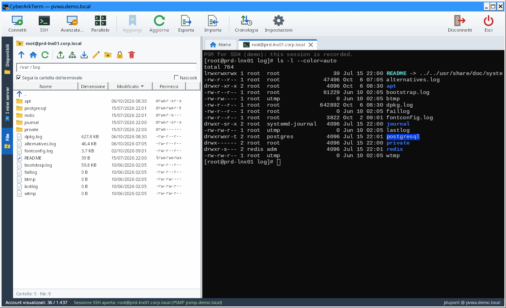
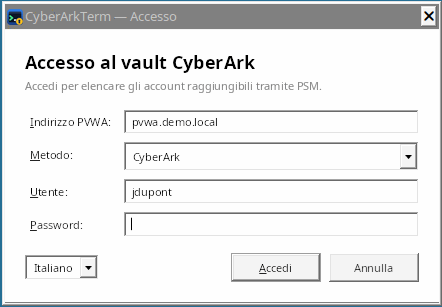
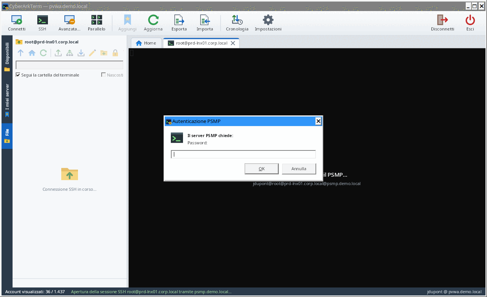
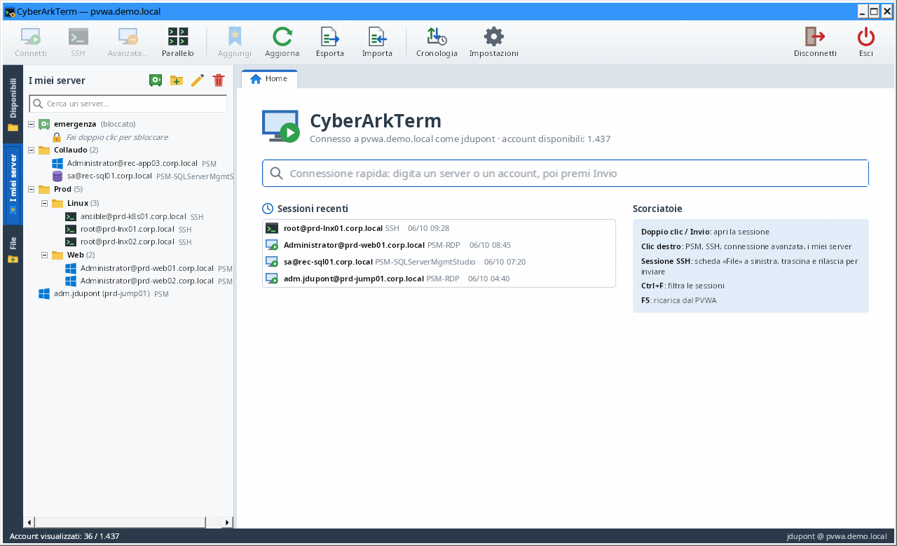
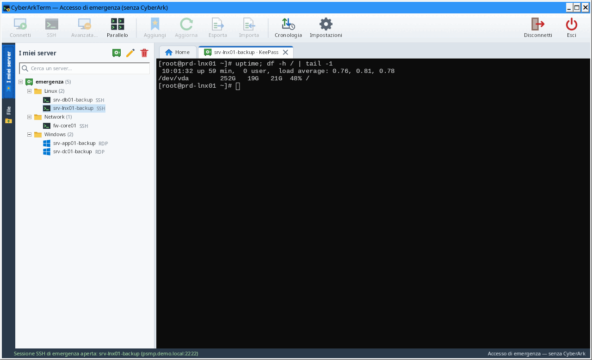
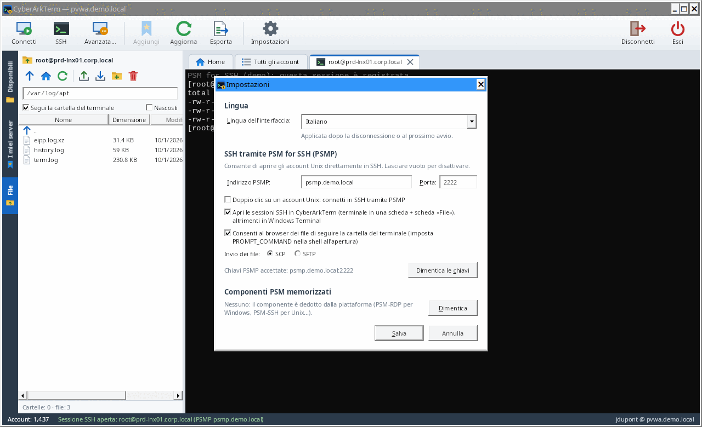

# CyberArkTerm

[Français](README.md) · [English](README.en.md) · **Italiano**

[](https://github.com/muller-camille/CyberArkTerm/actions/workflows/build.yml)
[](https://github.com/muller-camille/CyberArkTerm/releases/latest)

**Client Windows multisessione per CyberArk.** CyberArkTerm si collega al tuo PVWA, elenca gli account a cui
hai accesso e apre le sessioni con un doppio clic: desktop remoto tramite **PSM**, oppure terminale SSH
tramite **PSM for SSH (PSMP)** con un **browser dei file** integrato per inviare file al server.



> Le schermate provengono da un ambiente dimostrativo (dati fittizi).

## Indice

- [Funzionalità](#funzionalità)
- [Installazione](#installazione)
- [Primi passi](#primi-passi)
- [Scorciatoie](#scorciatoie)
- [Impostazioni e file di configurazione](#impostazioni-e-file-di-configurazione)
- [Sicurezza](#sicurezza)
- [Funzionamento tecnico](#funzionamento-tecnico)
- [Risoluzione dei problemi](#risoluzione-dei-problemi)
- [Sviluppo](#sviluppo)
- [Limiti e sviluppi futuri](#limiti-e-sviluppi-futuri)
- [Licenza](#licenza)

## Funzionalità

| | |
| --- | --- |
| **Accesso a CyberArk** | Autenticazione CyberArk, LDAP, RADIUS (challenge / OTP compresi) o Windows (sessione corrente). |
| **Disponibili** | Tutti gli account visibili nel vault, raggruppati per safe, piattaforma o tipo di destinazione, con ricerca immediata. |
| **I miei server** | I tuoi server di lavoro, organizzati in cartelle e sottocartelle, ognuno con la propria configurazione. |
| **Sessioni PSM** | Desktop remoto tramite il PSM (come il pulsante «Connect» del PVWA), in una scheda dell'applicazione: componente, macchina di destinazione, motivo, ticket. |
| **Sessioni SSH (PSMP)** | Terminale integrato in una scheda (compatibile xterm: colori, vim, less, top…), autenticazione MFA. |
| **Scheda File** | Browser SFTP del server: `ls`, navigazione, `rm`, invio di file per trascinamento in SCP, modifica nel tuo editor di testo, permessi (`chmod`), segue la cartella del terminale. |
| **Accesso di emergenza (KeePass)** | Senza CyberArk: archivi KeePass (.kdbx) in «I miei server», connessioni SSH e desktop remoto dirette, creazione e modifica delle voci, registro locale. |
| **Sessione PVWA mantenuta** | Una richiesta leggera ogni 4 minuti evita la scadenza mentre lavori (sospesa quando Windows è bloccato). |
| **Home** | Connessione rapida (digita un server, Invio), sessioni recenti. |
| **Esportazione** | Elenco degli account in CSV, apribile direttamente in Excel (separatore secondo la regione di Windows). |
| **Lingue** | Interfaccia in italiano, inglese e francese: lingua di Windows per impostazione predefinita, modificabile in qualsiasi momento. |

## Installazione

### Scaricare l'eseguibile

1. Apri l'[ultima versione](https://github.com/muller-camille/CyberArkTerm/releases/latest) nelle
   *Releases* del repository.
2. Scarica **`CyberArkTerm-<versione>-win-x64.zip`** ed estrailo (l'impronta SHA256 è in `SHA256SUMS.txt`).
3. Avvia `CyberArkTerm.exe`: un solo file, nessun runtime da installare, nessun diritto di amministratore
   richiesto.

Versioni di sviluppo: l'eseguibile di ogni compilazione è disponibile anche come artefatto
`CyberArkTerm-win-x64` nella scheda [Actions](https://github.com/muller-camille/CyberArkTerm/actions/workflows/build.yml).

L'eseguibile non è firmato: al primo avvio Windows SmartScreen può mostrare un avviso
(«Ulteriori informazioni» → «Esegui comunque»).

### Requisiti

**Postazione di lavoro**

- Windows 10 o 11 (x64).
- Il client Desktop remoto di Windows (presente di default) per le sessioni PSM: il suo controllo integrato
  per le schede, oppure `mstsc`.
- Facoltativo: Windows Terminal e il «Client OpenSSH» di Windows, solo se scegli di aprire l'SSH fuori da
  CyberArkTerm.

**Lato CyberArk**

- PVWA **v10 o superiore** (API REST `/PasswordVault/API/...`), raggiungibile in **HTTPS** con un
  certificato considerato attendibile dalla postazione.
- Permesso **List accounts** sui safe interessati: l'applicazione mostra solo ciò che l'API ti consente di
  vedere.
- PSM configurato sulle piattaforme da usare (componenti `PSM-RDP`, `PSM-SSH`…).
- Per l'SSH: un **PSM for SSH (PSMP)**, con SFTP consentito per la scheda File (e SCP per l'invio in SCP).
- Facoltativo: **MFA caching** attivato sul PVWA, per non reinserire password e MFA sul PSMP.

## Primi passi

### 1. Accedere al vault



Inserisci l'indirizzo del PVWA (`pvwa.miodominio.local` è sufficiente: `https://` e `/PasswordVault` vengono
aggiunti), scegli il metodo di autenticazione, poi nome utente e password. Se il server RADIUS pone una
domanda (codice OTP), la finestra la mostra e attende la tua risposta.

Indirizzo, metodo e nome utente vengono memorizzati; **la password mai**.

L'elenco in basso a sinistra cambia la lingua dell'interfaccia (Français, English, Italiano); la finestra si
riapre subito nella lingua scelta, conservando l'indirizzo e il nome utente inseriti.

### 2. Trovare un account: scheda «Disponibili»

- La casella di ricerca filtra su tutti i campi (server, utente, safe, piattaforma, dominio…), anche con più
  parole (`prd sql`).
- «Raggruppa per» ordina gli account per safe, piattaforma o tipo di destinazione.
- La scheda «Tutti gli account» mostra lo stesso elenco come tabella ordinabile, esportabile in CSV.
- Nella scheda Home, la **connessione rapida** trova un server mentre digiti: Invio per connetterti.

### 3. Aprire una sessione PSM (desktop remoto)

Fai doppio clic sull'account (oppure Invio, oppure il pulsante «Connetti»). CyberArkTerm richiede la
connessione al PVWA e apre il Desktop remoto sul PSM, esattamente come il pulsante «Connect» del PVWA.

La sessione si apre **in una scheda di CyberArkTerm**, con il controllo Desktop remoto di Windows (lo stesso
motore di `mstsc`):

- la risoluzione del desktop remoto segue la dimensione della scheda;
- «Schermo intero» mostra la sessione su tutto lo schermo (barra di connessione in alto per tornare, o
  `Ctrl+Alt+Pausa`);
- «Disconnetti» chiude la sessione e conserva la scheda; «Riconnetti» richiede una nuova connessione al PVWA
  (il token di una sessione PSM vale una sola volta);
- chiudere la scheda (croce o clic centrale) disconnette la sessione, dopo conferma.

Anche un componente PSM che apre un'**applicazione remota** (RemoteApp, ad esempio PSM-SSH) si mostra **nella
scheda**: la sua finestra principale occupa tutta la scheda e ne segue la dimensione; i suoi menu e finestre di
dialogo si aprono sopra, dove li mette il server. Anche una finestra a schermo intero (il client desktop remoto del
componente PSM-RDP, ad esempio) vi si mostra, alla dimensione della scheda, e la finestra principale torna quando si
chiude. Un clic nell'applicazione le dà la tastiera. Chiudere
l'applicazione termina la sessione; «Disconnetti» la chiude da qui, «Riconnetti» la riavvia. Se «Mostra nella
scheda la finestra delle applicazioni remote» è disattivata nelle Impostazioni, le sue finestre si aprono a parte,
sul desktop del computer come con `mstsc`, e la scheda ne mostra lo stato.

Con «Aprire invece le applicazioni remote PSM come desktop» (disattivata per impostazione predefinita), CyberArkTerm
prova prima ad aprirla come desktop che avvia il programma pubblicato dal PSM (`||PSMInitSession`): il server PSM
deve accettare questa modalità. Se chiude la sessione appena aperta, la scheda riapre l'applicazione come
applicazione remota (nuova richiesta al PVWA) e l'opzione viene disattivata; se la sessione termina poco dopo, la
scheda propone «Apri come applicazione remota».

La sessione si apre in **Connessione Desktop remoto** (`mstsc`) se l'opzione è disattivata nelle Impostazioni o
se il controllo Desktop remoto non è utilizzabile sul computer; la barra di stato indica il motivo.

- **Componente PSM**: dedotto dalla piattaforma (`PSM-RDP` per Windows, `PSM-SSH` per Unix e rete,
  `PSM-SQLServerMgmtStudio`, `PSM-SQLPlus`…). Seleziona «Memorizza questo componente» per conservarlo per
  tutta la piattaforma.
- **Account di dominio**: la finestra chiede la macchina di destinazione, precompilata con le macchine
  autorizzate dell'account.
- **Motivo e ticket**: se il PVWA rifiuta la richiesta (motivo obbligatorio, componente non configurato…), il
  suo messaggio viene mostrato e puoi correggere e riprovare.
- Il pulsante «Avanzata…» (o clic destro → «Connessione avanzata…») apre questa finestra su richiesta.

### 4. Aprire una sessione SSH tramite il PSMP

Imposta una volta l'indirizzo del PSMP nelle **Impostazioni**. Poi clic destro → «Connetti in SSH» (o il
pulsante «SSH»). Con l'opzione «Doppio clic su un account Unix: connetti in SSH tramite PSMP» basta un
doppio clic.

La sessione si apre **in una scheda di CyberArkTerm**, con l'identificativo PSMP standard
`<tu>@<account di destinazione>[#dominio]@<server di destinazione>`. I nomi utente che contengono spazi
(`Mario Rossi`, `Admin Locale`) sono accettati.



- **Autenticazione**: se il PVWA fornisce una chiave «MFA caching», non viene posta alcuna domanda.
  Altrimenti vengono mostrate le domande del PSMP (password, codice MFA); la password viene riutilizzata per
  le connessioni SFTP e SCP della stessa scheda, mai salvata.
- **Chiave del PSMP**: alla prima connessione ne viene mostrata l'impronta SHA256, da accettare; se in seguito
  cambia, viene mostrato un avviso.
- **Terminale**: la selezione copia, il clic destro incolla, la rotellina scorre la cronologia, AltGr funziona
  sulle tastiere internazionali. Chiudi la scheda con la croce o con un clic centrale.

### 5. Sfogliare e inviare file: scheda «File»

All'apertura di una sessione SSH, la scheda **File** appare sul lato e segue la scheda SSH attiva.

- **Barra del percorso**: percorso corrente, modificabile (digita un percorso e premi Invio). Doppio clic su
  una cartella per entrarvi, `..` per risalire, pulsanti «cartella superiore» e «cartella home».
- **Inviare file**: trascinali da Esplora file sull'elenco (o il pulsante «Invia»). Invio in **SCP** per
  impostazione predefinita (SFTP in opzione), cartelle comprese; conferma prima di sovrascrivere un file
  esistente.
- **Scaricare trascinando**: trascina file o cartelle dall'elenco verso Esplora file o il desktop. Nulla viene
  scaricato durante il trascinamento: al rilascio, una finestra mostra l'avanzamento (Annulla lo interrompe), poi
  Esplora file copia i file dove li hai rilasciati. I nomi Unix vengono resi validi per Windows (`\`, `:`, `..`,
  `CON`… sostituiti), senza mai scrivere fuori dalla cartella di rilascio; la cartella temporanea del download
  viene poi eliminata.
- **Eliminare**: selezione poi Canc (o clic destro → «Elimina (rm)»), con conferma. Le cartelle devono essere
  vuote.
- **Modificare un file**: selezionalo, poi `F4` (o clic destro → «Modifica», o il pulsante matita). Il file si
  apre nell'editor di testo scelto nelle Impostazioni (Blocco note per impostazione predefinita). A ogni
  salvataggio, CyberArkTerm propone di rinviarlo al server: invio in SFTP, permessi del file conservati. Se il
  file è cambiato sul server dopo l'apertura, un avviso chiede conferma prima di sovrascriverlo.
- **Permessi**: clic destro → «Permessi…» (o il pulsante lucchetto). Caselle lettura / scrittura / esecuzione
  per proprietario, gruppo e altri, bit speciali (setuid, setgid, sticky) e valore ottale (`644`, `1777`…), per
  uno o più elementi. Per una cartella, «Applica anche al contenuto» propaga i permessi a sottocartelle e file;
  per impostazione predefinita, l'esecuzione (x) viene data solo alle cartelle e ai file già eseguibili. I link
  simbolici non vengono seguiti e il proprietario non viene modificato.
- Inoltre: nuova cartella, download, copia del percorso, visualizzazione dei file nascosti.
- **Segui la cartella del terminale**: se la casella è selezionata, ogni `cd` nel terminale sposta il browser
  nella stessa cartella (vedi [Funzionamento tecnico](#funzionamento-tecnico)). Dopo `sudo -i` o `su`,
  riseleziona la casella al prompt della shell per riattivare il monitoraggio nella nuova shell.

### 6. Organizzare i server: scheda «I miei server»



- **Aggiungere** un account: clic destro in «Disponibili» → «Aggiungi ai miei server» e poi la cartella
  desiderata, oppure trascina l'account sulla scheda «I miei server», oppure il pulsante «Aggiungi» della
  barra degli strumenti.
- **Cartelle**: clic destro → nuova cartella o sottocartella, rinomina, elimina; trascina server e cartelle per
  spostarli.
- **Configurazione propria di ogni server** (clic destro → «Proprietà…»):

| Impostazione | Effetto |
| --- | --- |
| Nome, cartella | Visualizzazione e posizione nell'albero. |
| PSM o SSH tramite PSMP | Tipo di connessione aperto con il doppio clic. |
| Componente PSM | Componente da usare (vuoto: dedotto dalla piattaforma). |
| Macchina di destinazione | Server su cui aprire la sessione per un account di dominio. |
| Motivo predefinito | Motivo di accesso inviato automaticamente al PVWA. |
| Cartella SFTP iniziale | Il terminale **e** il browser dei file si aprono direttamente in questa cartella. |

Un server il cui account non è più visibile in CyberArk appare in grigio.

### 7. Accesso di emergenza fuori da CyberArk: archivi KeePass

Quando CyberArk non è disponibile, CyberArkTerm apre i tuoi archivi KeePass (`.kdbx`) e si connette
**direttamente** ai server, in SSH o in desktop remoto, con gli account che contengono.

> Queste connessioni **non passano dal PSM**: nessuna registrazione, nessuna regola CyberArk. Ogni apertura di
> archivio, connessione e modifica è annotata nel registro locale `%APPDATA%\CyberArkTerm\urgence.log`.



- **Senza CyberArk**: nella schermata di accesso, «Accesso di emergenza (KeePass)» apre la finestra principale
  senza PVWA (sono mostrati solo gli archivi KeePass). Con CyberArk, gli archivi compaiono anche in cima a «I miei
  server».
- **Aggiungere un archivio**: pulsante cassaforte della scheda «I miei server» (o clic destro → «Aggiungi un
  archivio KeePass…»): file `.kdbx`, nome, eventuale file chiave.
- **Sbloccare**: doppio clic sull'archivio. Password principale e/o file chiave (tutti i formati di KeePass).
  «Memorizza la password principale nel vault locale» evita di ridigitarla (vedi sotto).
- **Connettersi**: doppio clic su una voce. Il protocollo viene dal suo indirizzo (`ssh://server:22`,
  `rdp://server`, `server:3389`), da un campo «Protocol» / «Port» o da un'etichetta `ssh` / `rdp`; altrimenti
  CyberArkTerm chiede SSH o desktop remoto. La password della voce è usata direttamente (schede terminale + File
  in SSH, scheda desktop remoto in RDP); non è mai mostrata né scritta su disco.
- **Modificare l'archivio**: clic destro → «Nuova voce…», «Modifica…» (`F2`), «Elimina» (`Canc`, nel cestino
  dell'archivio). Il resto dell'archivio (allegati, campi, impostazioni) è conservato; la versione precedente di
  una voce va nella sua cronologia, come in KeePass.
- **Bloccare**: clic destro → «Blocca». Gli archivi si bloccano anche alla disconnessione, alla chiusura e al
  **blocco di Windows**.

**Vault locale**: le password principali che scegli di memorizzare sono conservate in
`%APPDATA%\CyberArkTerm\coffre-local.dat`, cifrato con una tua password (chiesta all'avvio di CyberArkTerm, «Più
tardi» per farne a meno) e legato al tuo account Windows. Gestione nelle **Impostazioni**: crea, sblocca, cambia
password, elimina.

## Scorciatoie

| Dove | Azione | Scorciatoia |
| --- | --- | --- |
| Ovunque | Ricaricare gli account dal PVWA | `F5` |
| Ovunque | Filtrare gli account | `Ctrl+F` |
| Elenchi e alberi | Aprire la sessione | Doppio clic o `Invio` |
| Ricerca | Cancellare il filtro | `Esc` |
| I miei server | Rinominare / rimuovere o eliminare | `F2` / `Canc` |
| Terminale | Copiare | Selezione con il mouse, o `Ctrl+Maiusc+C` |
| Terminale | Incollare | Clic destro, `Maiusc+Ins` o `Ctrl+Maiusc+V` |
| Terminale | Cronologia | Rotellina, `Maiusc+Pag su` / `Maiusc+Pag giù` |
| Scheda SSH o Desktop remoto | Chiudere | Croce della scheda o clic centrale |
| Scheda SSH o Desktop remoto | Riconnettere, duplicare (altra sessione sullo stesso account o sulla stessa voce), chiudere, chiudere le altre schede | Clic destro sulla scheda |
| Desktop remoto | Schermo intero / ritorno | `Ctrl+Alt+Pausa` |
| File | Aprire / modificare / cartella superiore / eliminare / aggiornare | `Invio` / `F4` / `Backspace` / `Canc` / `F5` |
| Archivio KeePass | Connettere / modificare / eliminare una voce | Doppio clic o `Invio` / `F2` / `Canc` |

## Impostazioni e file di configurazione



| Impostazione | Ruolo | Predefinito |
| --- | --- | --- |
| Lingua dell'interfaccia | Français, English, Italiano o lingua del sistema; applicata dopo la disconnessione o al prossimo avvio | lingua di Windows (inglese se non è tradotta) |
| Indirizzo e porta PSMP | Server PSM for SSH; vuoto = SSH disattivato | vuoto, 22 |
| Doppio clic Unix = SSH | Apre gli account Unix in SSH anziché in PSM | no |
| Mantenere aperta la sessione PVWA | Richiesta leggera ogni 4 minuti; sospesa quando Windows è bloccato | sì |
| Vault locale | Password principali KeePass memorizzate: crea, sblocca, cambia password, elimina | — |
| Desktop remoto in CyberArkTerm | Sessioni PSM in una scheda; altrimenti Connessione Desktop remoto (`mstsc`) | sì |
| Applicazioni remote nella scheda | Finestra principale delle applicazioni remote (RemoteApp) nella scheda, menu e finestre di dialogo sopra; altrimenti finestre a parte, sul desktop | sì |
| Applicazioni remote PSM come desktop | Componenti PSM RemoteApp aperti invece come desktop (il PSM deve accettarlo; disattivata automaticamente se lo rifiuta) | no |
| Registro di debug | Menu del pulsante Impostazioni: svolgimento delle connessioni in un file, senza segreti (vedi [Sicurezza](#sicurezza)); «Mostra il file del registro» lo apre in Esplora risorse | no |
| SSH in CyberArkTerm | Terminale e scheda File integrati; altrimenti Windows Terminal | sì |
| Segui la cartella del terminale | Consente di attivare il monitoraggio della cartella nella shell | sì |
| Invio dei file | SCP o SFTP | SCP |
| Editor di testo | Programma aperto da «Modifica» nella scheda File | Blocco note |
| Chiavi PSMP accettate | Impronte memorizzate (pulsante «Dimentica le chiavi») | — |
| Componenti memorizzati | Componente PSM scelto per piattaforma (pulsante «Dimentica») | — |

Tutte le preferenze sono salvate in `%APPDATA%\CyberArkTerm\settings.json`: lingua, indirizzo del PVWA,
metodo e nome utente di accesso, impostazioni qui sopra, «I miei server» e le loro cartelle, sessioni
recenti, posizione degli archivi KeePass e dei loro file chiave. Questo file **non contiene password, token né
chiavi private**. Per ripartire da zero, chiudi
l'applicazione ed eliminalo.

## Sicurezza

- **HTTPS obbligatorio** verso il PVWA; la convalida dei certificati non viene mai disattivata.
- **Nessun segreto su disco**: password CyberArk, token di sessione, chiave MFA e password PSMP restano in
  memoria per la durata della sessione. Disconnessione dal PVWA (`Logoff`) alla chiusura.
- Sessione PVWA aperta con `concurrentSession`: l'eventuale sessione web del PVWA non viene chiusa.
- **Sessioni Desktop remoto in una scheda**: la risposta del PVWA (token PSM monouso) resta in memoria, nulla
  viene scritto su disco. I reindirizzamenti (unità, stampanti, porte, smart card) sono attivati solo se il
  PVWA li richiede; gli appunti seguono la sua richiesta (attivi se non dice nulla).
- **File RDP per `mstsc`** (token PSM monouso) scritti in `%TEMP%\CyberArkTerm` ed eliminati dopo 60 s o alla
  chiusura.
- **Chiavi host del PSMP fissate** al primo utilizzo, con avviso in caso di modifica (lo stesso per i server
  raggiunti in accesso di emergenza).
- **Mantenimento della sessione PVWA**: evita la scadenza per inattività; non viene inviato nulla mentre Windows
  è bloccato, e l'opzione si disattiva nelle Impostazioni se la tua politica lo richiede.
- **Archivi KeePass**:
  - la password principale non è mai salvata, tranne nel vault locale se lo chiedi: Argon2id (64 MiB, 3 passate)
    poi AES-256-GCM, parametri di derivazione autenticati, il tutto protetto da DPAPI (account Windows);
  - in memoria, la chiave dell'archivio e le password delle voci restano mascherate e sono rivelate solo al
    momento della connessione; archivi bloccati alla disconnessione, alla chiusura e al blocco di Windows;
  - salvataggio sicuro: il file viene riletto, la modifica è applicata alla sua versione attuale (le modifiche
    fatte altrove sono conservate), il risultato decifrato è verificato, una copia `.bak` è conservata e il file
    è sostituito in un solo passo; una voce modificata altrove nel frattempo non viene sovrascritta;
  - desktop remoto diretto: la password è passata solo al controllo Desktop remoto (nessun file, nessun gestore
    credenziali), con autenticazione a livello di rete (NLA) e avviso se il server non è riconosciuto;
  - `urgence.log`: data, account Windows, computer, azione, archivio, voce, destinazione; mai una password.
- **Registro di debug**, disattivato per impostazione predefinita (menu del pulsante Impostazioni):
  `%LOCALAPPDATA%\CyberArkTerm\debug.log`, al massimo 5 MB più una generazione `.1`. Registra lo svolgimento delle
  connessioni PVWA, PSM, desktop remoto e SSH: indirizzi e stati delle richieste, impostazioni del file .rdp,
  eventi e codici del controllo Desktop remoto, errori. Contiene nomi di server e di account, ma **mai** password,
  token di sessione, richiesta di sessione PSM (`PSM@…` mascherata), firma, intestazione o corpo delle richieste,
  né il contenuto delle sessioni. La barra di stato lo segnala finché è attivo. Rileggilo prima di trasmetterlo,
  ed eliminalo una volta risolto il problema.
- **File modificati**: la copia locale aperta nell'editor si trova in `%TEMP%\CyberArkTerm\edit` e viene
  eliminata alla chiusura della scheda SSH; un avviso segnala le modifiche non rinviate.
- **Nessuna iniezione di comandi**: percorsi SCP e cartelle iniziali protetti tra apici per la shell remota;
  argomenti `ssh` / Windows Terminal convalidati e passati senza shell.
- Esportazione CSV protetta contro l'iniezione di formule Excel.
- Le sessioni PSM e PSMP aperte da CyberArkTerm sono sessioni CyberArk standard: vengono registrate e
  verificate dal PSM come quelle aperte dal PVWA.

Per segnalare una vulnerabilità, vedi [SECURITY.md](SECURITY.md) (segnalazione privata, nessuna issue
pubblica).

## Funzionamento tecnico

### API del PVWA utilizzate

| Chiamata | Uso |
| --- | --- |
| `POST /PasswordVault/API/auth/{CyberArk\|LDAP\|RADIUS\|Windows}/Logon` | Apertura della sessione |
| `GET /PasswordVault/API/Accounts?offset=…&limit=1000` | Elenco paginato degli account |
| `POST /PasswordVault/API/Accounts/{id}/PSMConnect` | File RDP della sessione PSM |
| `POST /PasswordVault/API/Users/Secret/SSHKeys/Cache` | Chiave SSH temporanea «MFA caching» (se attivata) |
| `GET /PasswordVault/API/Accounts?offset=0&limit=1` | Mantenimento della sessione (ogni 4 minuti) |
| `POST /PasswordVault/API/Auth/Logoff` | Chiusura della sessione |

### Archivi KeePass

Lettura e scrittura native (senza KeePass installato) dei formati **KDBX 3.1 e 4.x**: cifratura AES-256 o
ChaCha20, derivazione della chiave AES-KDF (istruzioni AES del processore) o Argon2d / Argon2id, file chiave XML
1.0 / 2.0, 32 byte, 64 caratteri esadecimali o file qualsiasi. Il file riscritto mantiene la versione, la cifratura
e la derivazione della chiave originali, con nuovi semi a ogni salvataggio. Gli archivi di test
(`tests/CyberArkTerm.Core.Tests/KeePass/Vaults`) provengono da KeePassXC e pykeepass, e i file scritti da
CyberArkTerm sono stati verificati in entrambi gli strumenti.

### Sessioni Desktop remoto

Le schede Desktop remoto ospitano il controllo ActiveX di Windows (`mstscax.dll`, la classe `MsRdpClient` più
recente disponibile). CyberArkTerm legge il file RDP restituito da `PSMConnect` e ne applica le impostazioni:
`full address`, `username`, `alternate shell` (avvio della sessione PSM), livello di autenticazione del server,
NLA (CredSSP), gateway, reindirizzamenti, audio, effetti visivi. Le chiusure di sessione e gli errori di
connessione sono spiegati nella scheda con il messaggio di Windows.

Con l'opzione «Aprire invece le applicazioni remote PSM come desktop» (disattivata per impostazione predefinita), un
componente PSM con applicazione remota viene aperto come desktop: modalità RemoteApp disattivata, e la sessione
avvia `remoteapplicationprogram` (per il PSM, `||PSMInitSession`, seguito da `remoteapplicationcmdline` se
presente), con lo stesso utente (`PSM@…`). Un server in modalità RemoteApp accetta di solito all'avvio di una
sessione solo i suoi programmi pubblicati: un PSM ha chiuso la sessione che avviava direttamente `alternate shell`
(`PSM@…`, versione 0.4.1), poi quella che avviava `||PSMInitSession`, 3,4 s dopo l'apertura della sessione
(versione 0.4.2, motivo 2, motivo esteso 12). La firma del file (`signature`) è verificata solo da `mstsc`, non dal
controllo né dal server. Se il server (e non questo computer) chiude la sessione meno di 15 s dopo l'apertura, la
scheda rifà la richiesta al PVWA, apre il file così com'è e disattiva l'opzione. Se la sessione termina più tardi
entro il primo minuto, la scheda propone «Apri come applicazione remota», che fa lo stesso.

Altrimenti (opzione disattivata, file senza `alternate shell`, o applicazione remota richiesta), per un'applicazione remota
(`remoteapplicationmode:i:1`), il controllo passa in modalità RemoteApp
(`disableremoteappcapscheck` applicato), poi avvia l'applicazione una volta aperta la sessione, una sola volta per
connessione: `remoteapplicationprogram` (per il PSM, `||PSMInitSession`) con gli argomenti
`remoteapplicationcmdline`; `remoteapplicationname` serve per la visualizzazione e `alternate shell` non viene
usato. Se il server rifiuta l'applicazione, la sessione termina con il motivo. Il desktop remoto prende la
dimensione di tutti gli schermi perché le finestre possano andare ovunque. Un test di integrazione (workflow
`rdp-integration`) apre sessioni reali sul computer di CI: un desktop in una scheda, il Blocco note come
applicazione remota, un file di applicazione remota aperto come desktop (il computer di CI, senza il ruolo Host
sessione, non avvia il programma di avvio: ne viene verificata solo la trasmissione) poi come applicazione remota,
il rifiuto del desktop (sessione chiusa lato server appena aperta: riaperta come applicazione remota), il Blocco
note mostrato nella scheda, e un'applicazione sconosciuta (messaggio di errore). I messaggi di fine sessione
riportano i codici di Windows (motivo, motivo esteso).

**Applicazione remota nella scheda.** Il controllo crea le finestre dell'applicazione in questo processo, su un
proprio thread, come finestre di primo livello (classe `RAIL_WINDOW`) che posiziona dove le mette il server, e le
segnala una per una (evento `OnRemoteWindowDisplayed`): ogni scheda sa così quali sono le sue. Ogni finestra
principale (né finestra degli strumenti, come menu e finestre di dialogo, né finestra pop-up, salvo se ha un
pulsante Riduci o Ingrandisci o copre tutto lo schermo) viene collegata al contenitore del controllo (thread della
connessione), occupa tutta la scheda e ne segue la dimensione; la scheda mostra l'ultima visibile (una finestra a
schermo intero aperta sopra, poi la principale quando si chiude); se il server la sposta o la riduce, viene rimessa
a posto.

Il controllo non comunica al server gli spostamenti fatti dal programma: sul server, la finestra resterebbe al suo
posto e alla sua dimensione d'origine, mentre il mouse è trasmesso in coordinate dello schermo (i clic finirebbero
altrove) e l'immagine è stirata alla dimensione della finestra locale. Invia la posizione di una finestra solo alla
fine di uno spostamento iniziato dal server: CyberArkTerm chiede quindi al server uno spostamento da tastiera
(comando di sistema «Sposta»), che il controllo esegue localmente, e lo termina subito (Invio); il controllo invia
allora il posto della scheda, e il server vi mette la sua finestra (posizione e dimensione). Avviene dopo il
collegamento, quando la scheda è stata spostata o ridimensionata (una volta ferma) e quando il server ha spostato la
sua finestra; solo quando CyberArkTerm è in primo piano, senza pulsanti del mouse premuti (il controllo termina lo
spostamento con un clic dove si trova il puntatore: questo viene messo un istante nell'angolo della finestra di
CyberArkTerm, fuori dalla scheda, poi torna), al massimo tre volte di seguito per lo stesso posto; una finestra ingrandita sul server
viene prima ripristinata.

Un pulsante del mouse premuto nell'applicazione le dà la tastiera (`WM_PARENTNOTIFY`), come la selezione della
scheda. Alla fine della connessione, le finestre lasciano il contenitore prima che sia distrutto; il controllo le
distrugge da sé. Il registro di debug descrive le finestre dell'applicazione (stili, posto, visibilità) e cosa ne fa
la scheda. Verificato dai test di integrazione: rendering, tastiera (testo digitato poi copiato, letto negli appunti
reindirizzati), dimensione, menu contestuale aperto sotto il puntatore, finestra tolta dalla scheda alla
disconnessione; e, con un'applicazione che scrive nel titolo la posizione di ogni clic ricevuto: clic ricevuti dove
vengono fatti (angoli della scheda), immagine in scala 1, finestra a schermo intero aperta poi chiusa, nessun tasto
Invio né clic in più ricevuti.

**Un thread per connessione desktop remoto.** Il controllo, la sua finestra e i suoi eventi vivono su un thread a
parte (STA, con il proprio ciclo di messaggi); l'interfaccia non lo attende mai. La scheda contiene una finestra del
thread dell'interfaccia, in cui quel thread colloca la finestra del controllo. Prima di rilasciare il controllo, ve
la toglie: una disconnessione o un rilascio lento non blocca più l'applicazione. Se il thread non risponde per 5 s,
la barra della scheda lo segnala, e il resto dell'applicazione resta utilizzabile. Limite: Windows condivide
tastiera e mouse tra una finestra e quelle che contiene, anche di un altro thread; un controllo bloccato
definitivamente può ancora trattenere un clic nella sua area o un cambio di focus.

### Sessioni PSMP

Ogni scheda SSH apre fino a tre connessioni al PSMP, con lo stesso identificativo
`<tu>@<account>[#dominio]@<destinazione>`: il terminale, la connessione SFTP della scheda File e una
connessione SCP al primo invio in SCP. Ognuna è una sessione PSMP, registrata dal PSM.
Gli invii al server (digitazione, dimensione del terminale) e la chiusura delle connessioni avvengono fuori dal
thread dell'interfaccia, in ordine: un server o un PSMP che non legge più non blocca l'applicazione.

### Monitoraggio della cartella del terminale

All'apertura di una sessione SSH (se l'opzione è attiva), CyberArkTerm attende che la shell del server di
destinazione mostri il prompt (fino a 60 s: il PSMP a volte impiega diversi secondi a raggiungere la
destinazione), poi le invia un comando di una riga, preceduto da uno spazio per non finire nella cronologia.
Non viene inviato nulla se hai già iniziato a digitare; il comando può essere reinviato senza effetti doppi
(casella «Segui»):

- definizione di `PROMPT_COMMAND` (bash) o `precmd` (zsh) che emette la sequenza standard **OSC 7** con la
  cartella corrente a ogni prompt;
- se è configurata una cartella iniziale, un `cd` verso quella cartella;
- cancellazione del comando digitato, perché non resti sullo schermo.

Il terminale integrato decodifica la sequenza OSC 7 e la scheda File si posiziona nella cartella indicata.

## Risoluzione dei problemi

| Sintomo | Causa probabile e soluzione |
| --- | --- |
| «Connessione TLS rifiutata: il certificato del PVWA non è considerato attendibile» | Il certificato (o l'autorità che lo ha emesso) non è nell'archivio Windows della postazione. |
| «Il PVWA deve essere raggiunto in HTTPS» | Inserisci l'indirizzo senza `http://` (o con `https://`). |
| «La sessione CyberArk è scaduta» | Timeout di inattività del PVWA superato: accedi di nuovo. |
| «Connection component … is not configured for platform …» | Scegli il componente corretto in «Connessione avanzata», seleziona «Memorizza» per la piattaforma. |
| «You must specify a reason…» | Inserisci un motivo nella finestra che si apre (o un motivo predefinito nelle proprietà del server). |
| L'account non compare | Non hai il permesso «List accounts» sul suo safe, oppure l'elenco va ricaricato (`F5`). |
| La password PSMP viene chiesta per ogni scheda | MFA caching non attivato sul PVWA: comportamento normale (una volta per scheda). |
| La scheda File indica «Connessione SFTP impossibile» | SFTP non è consentito sul PSMP o per questo account: rivolgiti al team CyberArk. |
| Il browser non segue i `cd` | La shell remota non è bash o zsh, l'opzione è disattivata nelle Impostazioni, oppure il prompt non è stato riconosciuto: riseleziona «Segui la cartella del terminale» al prompt della shell. |
| Avviso «la chiave del PSMP è cambiata» | Prosegui solo se il team CyberArk conferma una modifica del server. |
| «Password principale o file chiave errati.» | Controlla la password e il file chiave; un archivio protetto da YubiKey non è supportato. |
| L'archivio KeePass chiede la password nonostante «Memorizza» | Vault locale bloccato («Più tardi» all'avvio) o password principale cambiata altrove: digitala, viene memorizzata di nuovo. |
| «Il file del vault locale è danneggiato o è stato creato da un altro account Windows.» | Il vault locale non segue un cambio di computer o di account: eliminalo nelle Impostazioni e ricrealo. |
| «La voce … è stata modificata o eliminata nell'archivio nel frattempo» | Qualcuno ha cambiato la stessa voce altrove: l'archivio viene ricaricato, rifai la modifica. |
| La sessione PSM si apre in `mstsc` e non in una scheda | Controllo Desktop remoto non disponibile o in errore, oppure opzione disattivata: la barra di stato indica il motivo. |
| Sessione PSM di un'applicazione remota terminata subito («An internal error has occurred»…) | Il PSM rifiuta l'applicazione remota aperta come desktop: CyberArkTerm la riapre come applicazione remota e disattiva «Aprire invece le applicazioni remote PSM come desktop». Se la sessione è terminata più tardi, «Apri come applicazione remota» nella scheda. |
| Capire un errore di connessione | Impostazioni → Registro di debug, riproduci il problema, poi Impostazioni → «Mostra il file del registro». |
| Applicazione remota (RemoteApp): «non è consentita sul server» | L'applicazione richiesta non è pubblicata sul server PSM: verifica con l'amministratore CyberArk. |
| La scheda mostra «Errore del controllo Desktop remoto» | Disattiva «Apri le sessioni Desktop remoto in una scheda di CyberArkTerm» nelle Impostazioni per usare `mstsc`, e segnala il codice mostrato. |

## Sviluppo

### Struttura

| Progetto | Ruolo |
| --- | --- |
| `src/CyberArkTerm.Core` | Logica senza interfaccia, multipiattaforma: client dell'API PVWA, classificazione degli account, emulatore di terminale xterm, connessioni PSMP e browser SFTP/SCP (SSH.NET), cartelle di «I miei server», archivi KeePass (KDBX), vault locale, preferenze. |
| `src/CyberArkTerm.App` | Applicazione WPF: finestre, schede, controllo terminale, controllo Desktop remoto (schede RDP), avvio di `mstsc`, icona (`Assets`). |
| `tests/CyberArkTerm.Core.Tests` | Test xUnit di Core (falso PVWA HTTP, terminale, PSMP, cartelle, traduzioni…). |
| `tests/CyberArkTerm.App.Tests` | Test Windows dell'applicazione (vero controllo Desktop remoto, DPAPI). |

Dipendenza esterna: [SSH.NET](https://github.com/sshnet/SSH.NET) (licenza MIT).

### Traduzioni

I testi dell'interfaccia si trovano in `src/CyberArkTerm.Core/Localization/CoreStrings*.resx` e
`src/CyberArkTerm.App/Localization/Strings*.resx`: inglese nel file neutro, poi `.fr` e `.it`.
Le classi `*.Designer.cs` sono generate da Visual Studio (`PublicResXFileCodeGenerator`); un test verifica che
ogni lingua abbia tutte le chiavi, gli stessi parametri `{0}` e gli stessi tasti di scelta `_`.
Per aggiungere una lingua: copia i file `.resx` con il nuovo codice (`.de.resx`…), traducili, poi aggiungi il
codice a `UiLanguage.Supported`.

### Compilare e testare

Con l'[SDK .NET 10](https://dotnet.microsoft.com/download/dotnet/10.0):

```powershell
dotnet test CyberArkTerm.sln
dotnet run --project src/CyberArkTerm.App
```

Il progetto si compila anche su Linux o macOS (`EnableWindowsTargeting`); l'applicazione funziona solo su
Windows. I test di `tests/CyberArkTerm.App.Tests` (tra cui un test del vero controllo Desktop remoto) si
eseguono solo su Windows; altrove, esegui `dotnet test tests/CyberArkTerm.Core.Tests`.

### Pubblicare l'eseguibile

```powershell
# Autonomo (~65 MB): niente da installare sulla postazione
dotnet publish src/CyberArkTerm.App -c Release -r win-x64 -p:SelfContained=true `
  -p:PublishSingleFile=true -p:IncludeNativeLibrariesForSelfExtract=true -p:EnableCompressionInSingleFile=true -o publish

# Leggero: richiede il «.NET Desktop Runtime 10» sulla postazione
dotnet publish src/CyberArkTerm.App -c Release -r win-x64 -p:SelfContained=false -p:PublishSingleFile=true -o publish
```

La CI ([`.github/workflows/build.yml`](.github/workflows/build.yml)) esegue i test e pubblica l'eseguibile
autonomo come artefatto `CyberArkTerm-win-x64` per ogni pull request e ogni push su `main`.

### Pubblicare una versione

Da GitHub: **Actions → release → Run workflow** su `main`, indicando il numero `X.Y.Z`; oppure invia un tag
`vX.Y.Z` su `main`. Il workflow [`release.yml`](.github/workflows/release.yml) esegue i test, compila
l'eseguibile con quel numero di versione, crea il tag se non esiste e pubblica la *Release* GitHub con lo zip
e `SHA256SUMS.txt`. Le note di versione vengono lette da `docs/releases/vX.Y.Z.md` se il file esiste.

## Limiti e sviluppi futuri

**Limiti attuali**

- **Privilege Cloud** (accesso tramite CyberArk Identity) e **SAML** non sono supportati.
- L'API Accounts non indica quali componenti PSM offre una piattaforma: il componente viene dedotto, poi può
  essere memorizzato.
- Archivi KeePass: cifratura Twofish e chiavi YubiKey non supportate; nessuna creazione di archivio (crealo con
  KeePass o KeePassXC); allegati conservati ma non mostrati.
- Il monitoraggio della cartella del terminale richiede bash o zsh sul server.
- PSM Gateway (HTML5), doppio controllo (dual control) e accesso esclusivo non sono supportati.

**Sviluppi futuri**

- Eseguibile firmato e programma di installazione MSI.
- Più PVWA (profili di connessione), Privilege Cloud.

## Licenza

[MIT](LICENSE) © 2026 muller-camille
