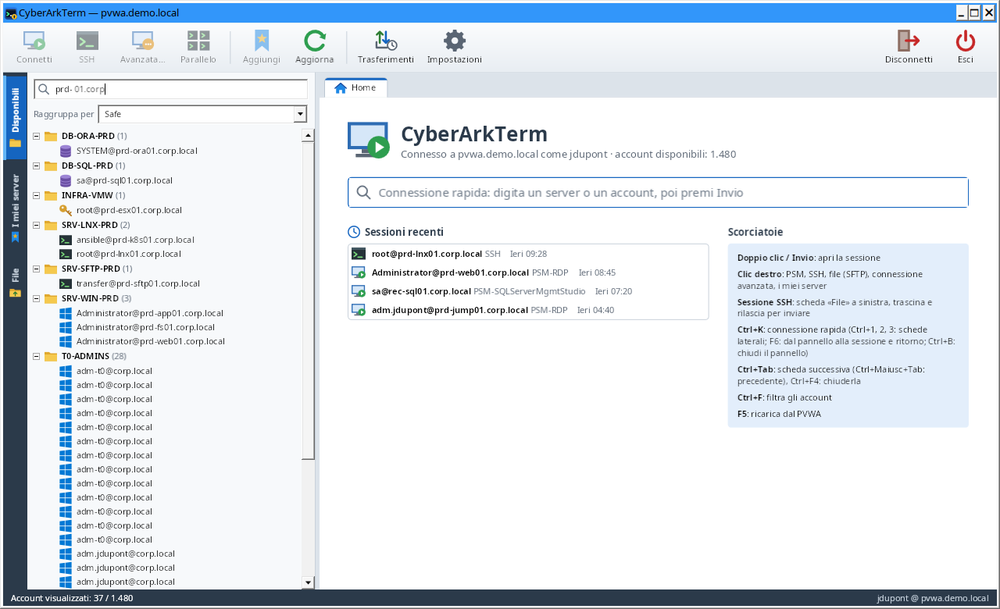
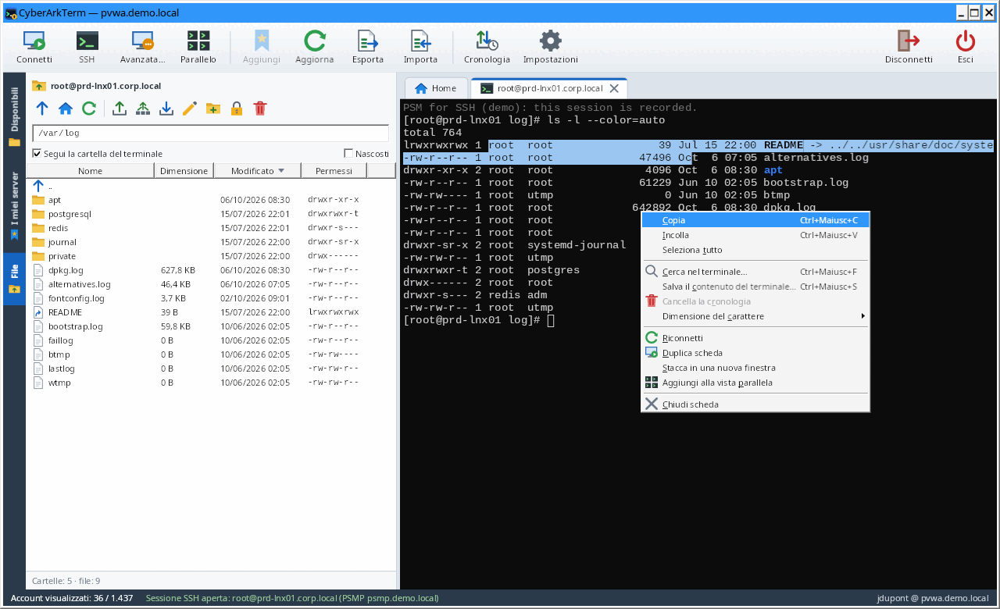

# CyberArkTerm

[Français](README.fr.md) · [English](README.md) · **Italiano**

[](https://github.com/muller-camille/CyberArkTerm/actions/workflows/build.yml)
[](https://github.com/muller-camille/CyberArkTerm/releases/latest)

**Client Windows multi-sessione per CyberArk.** CyberArkTerm accede al tuo PVWA, elenca gli account a cui hai accesso
e apre le sessioni con un doppio clic: desktop remoto tramite **PSM**, oppure un terminale SSH tramite **PSM for SSH
(PSMP)** con un **browser dei file** integrato per inviare file al server.


**[Scarica](https://github.com/muller-camille/CyberArkTerm/releases/latest)** ·
**[Guida all'uso](docs/guide.it.md)** · [Note di versione](https://github.com/muller-camille/CyberArkTerm/releases) ·
[Politica di sicurezza](SECURITY.md)

> Le schermate provengono da un ambiente dimostrativo (dati fittizi).

## Indice

- [Funzionalità](#funzionalità)
- [Installazione](#installazione)
- [Primi passi](#primi-passi)
- [Sicurezza](#sicurezza)
- [Sviluppo](#sviluppo)
- [Limiti e sviluppi futuri](#limiti-e-sviluppi-futuri)
- [Licenza](#licenza)

## Funzionalità

| | |
| --- | --- |
| **Accesso CyberArk** | Autenticazione CyberArk, LDAP, RADIUS (challenge / OTP compresi) o Windows (sessione corrente). |
| **Disponibili** | Tutti gli account visibili nel vault, raggruppati per safe, piattaforma o tipo di destinazione, con ricerca istantanea; password (CPM, copia), membri di un safe, aggiunta, modifica e importazione di account. |
| **I miei server** | I tuoi server di lavoro, organizzati in cartelle e sottocartelle, ognuno con le proprie impostazioni; esportazione, importazione ed **elenchi condivisi** su una condivisione di rete (ognuno aggiunge o rimuove, cronologia delle modifiche e delle versioni). |
| **Sessioni PSM** | Desktop remoto tramite il PSM (come il pulsante «Connect» del PVWA), in Connessione Desktop remoto di Windows: componente, macchina di destinazione, motivo, ticket. |
| **Sessioni SSH (PSMP)** | Terminale integrato in una scheda (compatibile xterm: colori, vim, less, top…), MFA, menu del clic destro, ricerca, finestre separate. |
| **Scheda File** | Browser SFTP del server: invio (SFTP, o SCP, con l'altro che subentra se il server rifiuta) e download con il trascinamento, verifica SHA-256 di ogni file, coda e cronologia dei trasferimenti, ordinamento per colonna, modifica nel tuo editor di testo, permessi, monitoraggio in tempo reale (`tail -f`), confronto, invio a più server. |
| **Vista parallela** | Fino a 8 sessioni SSH affiancate (una cartella di «I miei server» si apre con un clic), digitazione simultanea opzionale. |
| **Accesso di emergenza (KeePass)** | Senza CyberArk: archivi KeePass (.kdbx) in «I miei server», connessioni SSH e desktop remoto dirette, registro locale. |
| **Lingue** | Italiano, francese e inglese: lingua di Windows per impostazione predefinita, modificabile in qualsiasi momento. |

<table>
<tr>
<td width="50%"><br><sub>«Disponibili»: tutti gli account del vault, ricerca istantanea</sub></td>
<td width="50%"><br><sub>«I miei server»: i tuoi server in cartelle, archivi KeePass in cima</sub></td>
</tr>
<tr>
<td><br><sub>Clic destro nel terminale: copia, incolla, cerca, azioni della scheda</sub></td>
<td><br><sub>Accesso di emergenza: SSH diretto da un archivio KeePass</sub></td>
</tr>
</table>

## Installazione

### Scaricare l'eseguibile

1. Apri l'[ultima versione](https://github.com/muller-camille/CyberArkTerm/releases/latest) nelle
   *Releases* del repository.
2. Scarica **`CyberArkTerm-<versione>-win-x64.zip`** ed estrailo (l'impronta SHA256 è in `SHA256SUMS.txt`).
3. Avvia `CyberArkTerm.exe`: un solo file, nessun runtime da installare, nessun diritto di amministratore
   richiesto.

Versioni di sviluppo: l'eseguibile di ogni compilazione è disponibile anche come artefatto
`CyberArkTerm-win-x64` nella scheda [Actions](https://github.com/muller-camille/CyberArkTerm/actions/workflows/build.yml).

L'eseguibile non è firmato: al primo avvio Windows SmartScreen può mostrare un avviso
(«Ulteriori informazioni» → «Esegui comunque»).

### Aggiornare

Pulsante Impostazioni → **«Informazioni su CyberArkTerm…»**: versione, link del progetto, cartella delle impostazioni e
«Cerca ora». Se esiste una versione più recente, «Scarica e verifica» salva l'archivio nella cartella Download e lo
confronta con `SHA256SUMS.txt` della stessa versione (conservato solo se identico). Nulla viene installato
automaticamente: chiudi CyberArkTerm e sostituisci l'eseguibile; le impostazioni vengono conservate. L'opzione «Cerca
una nuova versione all'avvio» (disattivata per impostazione predefinita) fa questa ricerca al massimo una volta al
giorno e mostra un link nella barra di stato.

### Requisiti

**Postazione di lavoro**

- Windows 10 o 11 (x64).
- Il client Desktop remoto di Windows (presente di default): Connessione Desktop remoto (`mstsc`) per le sessioni
  PSM, il suo controllo integrato per il desktop remoto diretto degli archivi KeePass.
- Facoltativo: Windows Terminal e il «Client OpenSSH» di Windows, solo se scegli di aprire l'SSH fuori da
  CyberArkTerm.

**Lato CyberArk**

- PVWA **v10 o superiore** (API REST `/PasswordVault/API/...`), raggiungibile in **HTTPS** con un
  certificato considerato attendibile dalla postazione.
- Permesso **List accounts** sui safe interessati: l'applicazione mostra solo ciò che l'API ti consente di
  vedere.
- PSM configurato sulle piattaforme da usare (componenti `PSM-RDP`, `PSM-SSH`…).
- Per l'SSH: un **PSM for SSH (PSMP)**, con SFTP consentito per la scheda File (e SCP se scegli l'invio in SCP).
- Facoltativo: **MFA caching** attivato sul PVWA, per non reinserire password e MFA sul PSMP.

## Primi passi

1. **Accedere**: indirizzo del PVWA (basta `pvwa.miodominio.local`), metodo di autenticazione, utente e password.
   Indirizzo, metodo e utente vengono memorizzati; la password mai.
2. **Trovare un account** nella scheda «Disponibili»: la ricerca riguarda tutti i campi (`prd sql`). Clic destro su un
   account per la sua password (verifica, cambia, riconcilia, copia), i membri del suo safe, o per aggiungere,
   modificare e importare account.
3. **Connettersi** con un doppio clic: un account Windows apre una sessione PSM in Connessione Desktop remoto; un
   account Unix apre un terminale SSH in una scheda, tramite il PSMP impostato nelle **Impostazioni**. Clic destro nel
   terminale per copiare, incollare, cercare e le azioni della scheda.
4. **Scheda File** (accanto a una sessione SSH): sfoglia il server, trascina i file da Esplora file per inviarli, verso
   Esplora file per scaricarli. Ogni file viene verificato (SHA-256); il pulsante **Cronologia** della barra degli
   strumenti conserva ogni trasferimento e i suoi checksum. Un clic sull'intestazione di una colonna ordina l'elenco.
5. **I miei server**: organizza i server di lavoro in cartelle, ognuno con le sue impostazioni di connessione (PSM o
   SSH, componente, macchina di destinazione, cartella iniziale); apri un'intera cartella nella **vista parallela**.
6. **Accesso di emergenza**: quando CyberArk non è disponibile, «Accesso di emergenza (KeePass)» nella finestra di
   accesso apre i tuoi archivi KeePass e si connette direttamente in SSH o desktop remoto (senza registrazione del
   PSM, annotato in un registro su questo computer).

La **[guida all'uso](docs/guide.it.md)** descrive ogni scheda in dettaglio, le
[scorciatoie](docs/guide.it.md#scorciatoie), le
[impostazioni e il file di configurazione](docs/guide.it.md#impostazioni-e-file-di-configurazione), il
[funzionamento tecnico](docs/guide.it.md#funzionamento-tecnico) e la
[risoluzione dei problemi](docs/guide.it.md#risoluzione-dei-problemi).

## Sicurezza

- **HTTPS obbligatorio** verso il PVWA; la validazione del certificato non viene mai disattivata.
- **Nessun segreto su disco**: password CyberArk, token di sessione, chiave MFA e password PSMP restano in memoria; la
  sessione PVWA viene chiusa all'uscita. Il file di configurazione non contiene password, token né chiavi private.
- **Sessioni CyberArk standard**: le sessioni PSM e PSMP aperte da CyberArkTerm sono registrate e verificate dal PSM
  come quelle aperte dal PVWA.
- **Password copiate**: direttamente negli appunti di Windows, escluse dalla loro cronologia e sincronizzazione,
  cancellate dopo 20 s; mai mostrate né registrate.
- **Chiavi host del PSMP** memorizzate alla prima connessione, con un avviso se cambiano.
- **Archivi KeePass**: la password principale non viene mai salvata, tranne nel vault locale se lo chiedi (Argon2id,
  AES-256-GCM, protetto dal tuo account Windows); ogni apertura e connessione viene annotata in un registro locale.
- **Nessuna richiesta verso Internet** senza una tua azione o l'opzione di aggiornamento (disattivata per
  impostazione predefinita); un aggiornamento scaricato viene conservato solo se il suo SHA-256 corrisponde a
  `SHA256SUMS.txt`, e nulla viene installato automaticamente.
- **Registro di debug** disattivato per impostazione predefinita; non contiene mai password, token né il contenuto
  delle sessioni.

Tutti i dettagli: [guida all'uso → Sicurezza](docs/guide.it.md#sicurezza). Per segnalare una vulnerabilità, vedi
[SECURITY.md](SECURITY.md) (segnalazione privata, nessuna segnalazione pubblica).

## Sviluppo

### Struttura

| Progetto | Ruolo |
| --- | --- |
| `src/CyberArkTerm.Core` | Logica senza interfaccia, multipiattaforma: client dell'API PVWA, classificazione degli account, emulatore di terminale xterm, connessioni PSMP e browser SFTP/SCP (SSH.NET), cartelle di «I miei server», archivi KeePass (KDBX), vault locale, preferenze. |
| `src/CyberArkTerm.App` | Applicazione WPF: finestre, schede, controllo terminale, controllo Desktop remoto (schede RDP), avvio di `mstsc`, icona (`Assets`). |
| `tests/CyberArkTerm.Core.Tests` | Test xUnit di Core (falso PVWA HTTP, terminale, PSMP, cartelle, traduzioni…). |
| `tests/CyberArkTerm.App.Tests` | Test Windows dell'applicazione (vero controllo Desktop remoto, DPAPI). |

Dipendenza esterna: [SSH.NET](https://github.com/sshnet/SSH.NET) (licenza MIT).

### Traduzioni

I testi dell'interfaccia si trovano in `src/CyberArkTerm.Core/Localization/CoreStrings*.resx` e
`src/CyberArkTerm.App/Localization/Strings*.resx`: inglese nel file neutro, poi `.fr` e `.it`.
Le classi `*.Designer.cs` sono generate da Visual Studio (`PublicResXFileCodeGenerator`); un test verifica che
ogni lingua abbia tutte le chiavi, gli stessi parametri `{0}` e gli stessi tasti di scelta `_`.
Per aggiungere una lingua: copia i file `.resx` con il nuovo codice (`.de.resx`…), traducili, poi aggiungi il
codice a `UiLanguage.Supported`.

### Compilare e testare

Con l'[SDK .NET 10](https://dotnet.microsoft.com/download/dotnet/10.0):

```powershell
dotnet test CyberArkTerm.sln
dotnet run --project src/CyberArkTerm.App
```

Il progetto si compila anche su Linux o macOS (`EnableWindowsTargeting`); l'applicazione funziona solo su
Windows. I test di `tests/CyberArkTerm.App.Tests` (tra cui un test del vero controllo Desktop remoto) si
eseguono solo su Windows; altrove, esegui `dotnet test tests/CyberArkTerm.Core.Tests`.

### Pubblicare l'eseguibile

```powershell
# Autonomo (~65 MB): niente da installare sulla postazione
dotnet publish src/CyberArkTerm.App -c Release -r win-x64 -p:SelfContained=true `
  -p:PublishSingleFile=true -p:IncludeNativeLibrariesForSelfExtract=true -p:EnableCompressionInSingleFile=true -o publish

# Leggero: richiede il «.NET Desktop Runtime 10» sulla postazione
dotnet publish src/CyberArkTerm.App -c Release -r win-x64 -p:SelfContained=false -p:PublishSingleFile=true -o publish
```

La CI ([`.github/workflows/build.yml`](.github/workflows/build.yml)) esegue i test e pubblica l'eseguibile
autonomo come artefatto `CyberArkTerm-win-x64` per ogni pull request e ogni push su `main`.

### Pubblicare una versione

Da GitHub: **Actions → release → Run workflow** su `main`, indicando il numero `X.Y.Z`; oppure invia un tag
`vX.Y.Z` su `main`. Il workflow [`release.yml`](.github/workflows/release.yml) esegue i test, compila
l'eseguibile con quel numero di versione, crea il tag se non esiste e pubblica la *Release* GitHub con lo zip
e `SHA256SUMS.txt`. Le note di versione vengono lette da `docs/releases/vX.Y.Z.md` se il file esiste.

## Limiti e sviluppi futuri

**Limiti attuali**

- **Privilege Cloud** (accesso tramite CyberArk Identity) e **SAML** non sono supportati.
- L'API Accounts non indica quali componenti PSM offre una piattaforma: il componente viene dedotto, poi può
  essere memorizzato.
- Archivi KeePass: cifratura Twofish e chiavi YubiKey non supportate; nessuna creazione di archivio (crealo con
  KeePass o KeePassXC); allegati conservati ma non mostrati.
- Il monitoraggio della cartella del terminale richiede bash, zsh o tcsh sul server.
- PSM Gateway (HTML5), doppio controllo (dual control) e accesso esclusivo non sono supportati.

**Sviluppi futuri**

- Eseguibile firmato e programma di installazione MSI.
- Più PVWA (profili di connessione), Privilege Cloud.
- Altre idee, tenute per dopo: vedi [IDEAS.md](IDEAS.md).

## Licenza

[MIT](LICENSE) © 2026 muller-camille
