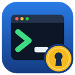

# CyberArkTerm

**Français** · [English](README.en.md) · [Italiano](README.it.md)

[](https://github.com/muller-camille/CyberArkTerm/actions/workflows/build.yml)
[](https://github.com/muller-camille/CyberArkTerm/releases/latest)

**Client Windows multi-sessions pour CyberArk.** CyberArkTerm se connecte à votre PVWA, liste les comptes
auxquels vous avez accès et ouvre vos sessions en un double-clic : bureau à distance via **PSM**, ou terminal
SSH via **PSM for SSH (PSMP)** avec un **navigateur de fichiers** intégré pour déposer des fichiers sur le
serveur.

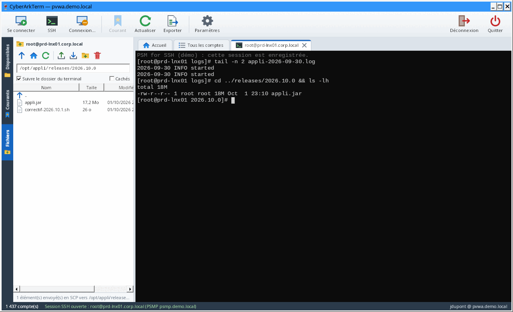

> Les captures proviennent d'un environnement de démonstration (données fictives).

## Sommaire

- [Fonctionnalités](#fonctionnalités)
- [Installation](#installation)
- [Prise en main](#prise-en-main)
- [Raccourcis](#raccourcis)
- [Paramètres et fichier de configuration](#paramètres-et-fichier-de-configuration)
- [Sécurité](#sécurité)
- [Fonctionnement technique](#fonctionnement-technique)
- [Dépannage](#dépannage)
- [Développement](#développement)
- [Limites et pistes](#limites-et-pistes)
- [Licence](#licence)

## Fonctionnalités

| | |
| --- | --- |
| **Connexion CyberArk** | Authentification CyberArk, LDAP, RADIUS (challenge / OTP compris) ou Windows (session courante). |
| **Disponibles** | Tous les comptes visibles dans le coffre, groupés par safe, plateforme ou type de cible, avec recherche instantanée. |
| **Courants** | Vos serveurs de travail, rangés en dossiers et sous-dossiers, chacun avec sa propre configuration. |
| **Sessions PSM** | Bureau à distance via le PSM (comme le bouton « Connect » du PVWA), dans un onglet de l'application : composant, machine cible, motif, ticket. |
| **Sessions SSH (PSMP)** | Terminal intégré en onglet (compatible xterm : couleurs, vim, less, top…), authentification MFA. |
| **Onglet Fichiers** | Navigateur SFTP du serveur : `ls`, navigation, `rm`, dépôt de fichiers par glisser-déposer en SCP, modification dans votre éditeur de texte, droits (`chmod`), suivi du dossier du terminal. |
| **Accès d'urgence (KeePass)** | Sans CyberArk : coffres KeePass (.kdbx) dans « Courants », connexions SSH et bureau à distance directes, création et modification des entrées, journal local. |
| **Session PVWA maintenue** | Une requête légère toutes les 4 minutes évite l'expiration pendant le travail (suspendue quand Windows est verrouillé). |
| **Accueil** | Connexion rapide (tapez un serveur, Entrée), sessions récentes. |
| **Export** | Liste des comptes en CSV, ouvrable directement dans Excel (séparateur selon la région Windows). |
| **Langues** | Interface en français, anglais et italien : langue de Windows par défaut, modifiable à tout moment. |

## Installation

### Télécharger l'exécutable

1. Ouvrez la [dernière version](https://github.com/muller-camille/CyberArkTerm/releases/latest) dans les
   *Releases* du dépôt.
2. Téléchargez **`CyberArkTerm-<version>-win-x64.zip`** et décompressez-le (l'empreinte SHA256 est dans
   `SHA256SUMS.txt`).
3. Lancez `CyberArkTerm.exe` : un seul fichier, aucun runtime à installer, aucun droit administrateur requis.

Version de développement : l'exécutable de chaque compilation est aussi disponible en artefact
`CyberArkTerm-win-x64` dans l'onglet [Actions](https://github.com/muller-camille/CyberArkTerm/actions/workflows/build.yml).

L'exécutable n'est pas signé : au premier lancement, Windows SmartScreen peut afficher un avertissement
(« Informations complémentaires » → « Exécuter quand même »).

### Prérequis

**Poste de travail**

- Windows 10 ou 11 (x64).
- Le client Bureau à distance de Windows (présent par défaut) pour les sessions PSM : son contrôle intégré pour
  les onglets, ou `mstsc`.
- Facultatif : Windows Terminal et le « Client OpenSSH » de Windows, uniquement si vous choisissez d'ouvrir
  le SSH hors de CyberArkTerm.

**Côté CyberArk**

- PVWA **v10 ou supérieur** (API REST `/PasswordVault/API/...`), joignable en **HTTPS** avec un certificat
  approuvé par le poste.
- Droit **List accounts** sur les safes concernés : l'application n'affiche que ce que l'API vous laisse voir.
- PSM configuré sur les plateformes à utiliser (composants `PSM-RDP`, `PSM-SSH`…).
- Pour le SSH : un **PSM for SSH (PSMP)**, avec SFTP autorisé pour l'onglet Fichiers (et SCP pour le dépôt
  en SCP).
- Facultatif : **MFA caching** activé sur le PVWA, pour éviter de ressaisir mot de passe et MFA au PSMP.

## Prise en main

### 1. Se connecter au coffre

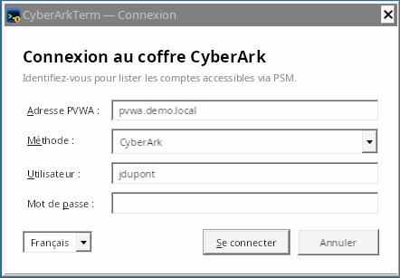

Saisissez l'adresse du PVWA (`pvwa.mondomaine.local` suffit : `https://` et `/PasswordVault` sont ajoutés),
choisissez la méthode d'authentification, puis votre identifiant et votre mot de passe. Si le serveur RADIUS
pose une question (code OTP), la fenêtre l'affiche et attend votre réponse.

L'adresse, la méthode et l'identifiant sont mémorisés ; **le mot de passe ne l'est jamais**.

La liste en bas à gauche change la langue de l'interface (Français, English, Italiano) ; la fenêtre se
rouvre aussitôt dans la langue choisie, sans perdre l'adresse ni l'identifiant saisis.

### 2. Trouver un compte : onglet « Disponibles »

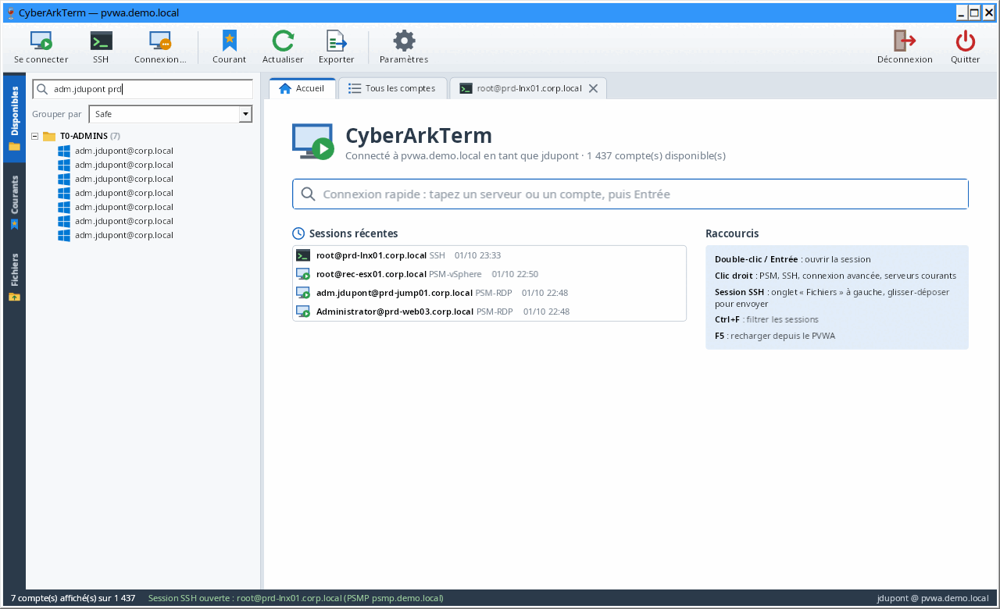

- La zone de recherche filtre sur tous les champs (serveur, utilisateur, safe, plateforme, domaine…),
  plusieurs mots possibles (`prd sql`).
- « Grouper par » range les comptes par safe, plateforme ou type de cible.
- L'onglet « Tous les comptes » présente la même liste en tableau triable, exportable en CSV.
- Sur l'accueil, la **connexion rapide** trouve un serveur au fil de la frappe : Entrée pour s'y connecter.

### 3. Ouvrir une session PSM (bureau à distance)

Double-cliquez sur le compte (ou Entrée, ou bouton « Se connecter »). CyberArkTerm demande la connexion au
PVWA et ouvre le Bureau à distance sur le PSM, exactement comme le bouton « Connect » du PVWA.

La session s'ouvre **dans un onglet de CyberArkTerm**, avec le contrôle Bureau à distance de Windows (le même
moteur que `mstsc`) :

- la résolution du bureau distant suit la taille de l'onglet ;
- « Plein écran » affiche la session sur tout l'écran (barre de connexion en haut pour revenir,
  ou `Ctrl+Alt+Pause`) ;
- « Déconnecter » ferme la session et garde l'onglet ; « Reconnecter » redemande une connexion au PVWA
  (le jeton d'une session PSM ne sert qu'une fois) ;
- fermer l'onglet (croix ou clic molette) déconnecte la session, après confirmation.

Un composant PSM en **application distante** (RemoteApp) passe aussi par le contrôle intégré : ses fenêtres
s'ouvrent à part, sur le bureau du poste comme avec `mstsc`, et l'onglet affiche son état (« Déconnecter » la
ferme, « Reconnecter » la relance).

La session s'ouvre dans la **Connexion Bureau à distance** (`mstsc`) si l'option est décochée dans les
Paramètres ou si le contrôle Bureau à distance n'est pas utilisable sur le poste ; la barre d'état indique alors
pourquoi.

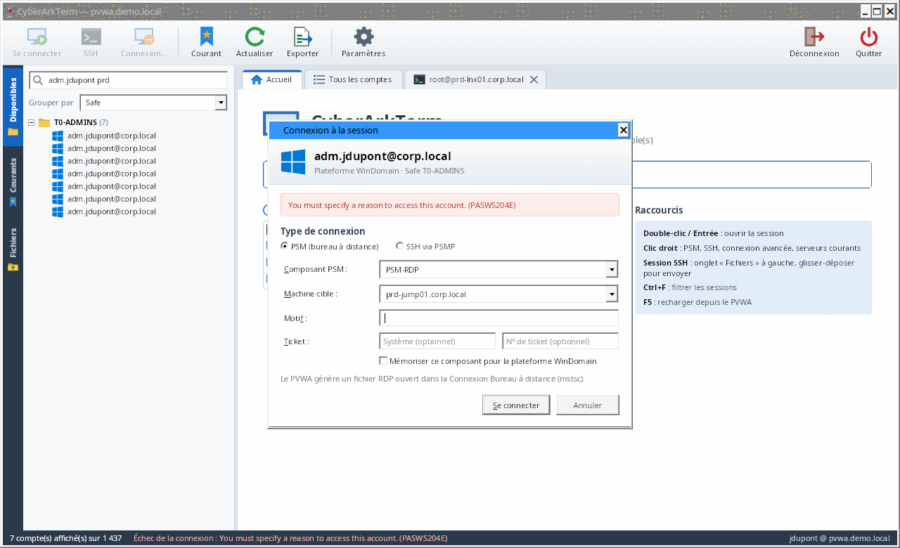

- **Composant PSM** : déduit de la plateforme (`PSM-RDP` pour Windows, `PSM-SSH` pour Unix et réseau,
  `PSM-SQLServerMgmtStudio`, `PSM-SQLPlus`…). Cochez « Mémoriser ce composant » pour le conserver pour
  toute la plateforme.
- **Comptes de domaine** : la fenêtre demande la machine cible, pré-remplie avec les machines autorisées du
  compte.
- **Motif et ticket** : si le PVWA refuse la demande (motif obligatoire, composant non configuré…), son
  message s'affiche et vous pouvez corriger puis réessayer.
- Le bouton « Connexion… » (ou clic droit → « Connexion avancée… ») ouvre cette fenêtre à la demande.

### 4. Ouvrir une session SSH via le PSMP

Renseignez une fois l'adresse du PSMP dans **Paramètres**. Ensuite, clic droit → « Se connecter en SSH »
(ou bouton « SSH »). Avec l'option « Double-clic sur un compte Unix : SSH via PSMP », le double-clic suffit.

La session s'ouvre **dans un onglet de CyberArkTerm**, avec l'identifiant PSMP standard
`<vous>@<compte cible>[#domaine]@<serveur cible>`. Les noms d'utilisateur contenant des espaces
(`Jean Dupont`, `Admin Local`) sont acceptés.

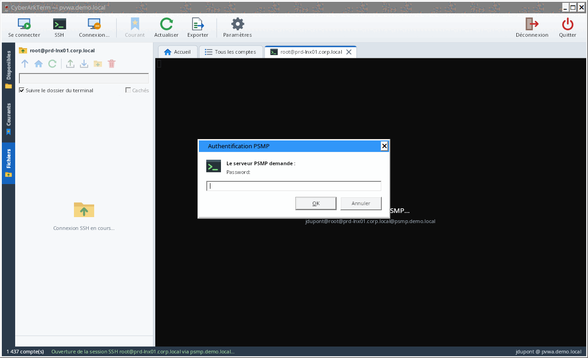

- **Authentification** : si le PVWA fournit une clé « MFA caching », aucune question n'est posée. Sinon, les
  questions du PSMP (mot de passe, code MFA) s'affichent ; le mot de passe est réutilisé pour les connexions
  SFTP et SCP du même onglet, jamais enregistré.
- **Clé du PSMP** : à la première connexion, son empreinte SHA256 est affichée et doit être acceptée ; si elle
  change ensuite, une alerte s'affiche.
- **Terminal** : la sélection copie, le clic droit colle, la molette remonte l'historique,
  AltGr fonctionne sur clavier français. Fermez l'onglet avec la croix ou un clic molette.

### 5. Parcourir et déposer des fichiers : onglet « Fichiers »

À l'ouverture d'une session SSH, l'onglet **Fichiers** s'affiche sur le côté et suit l'onglet SSH actif.

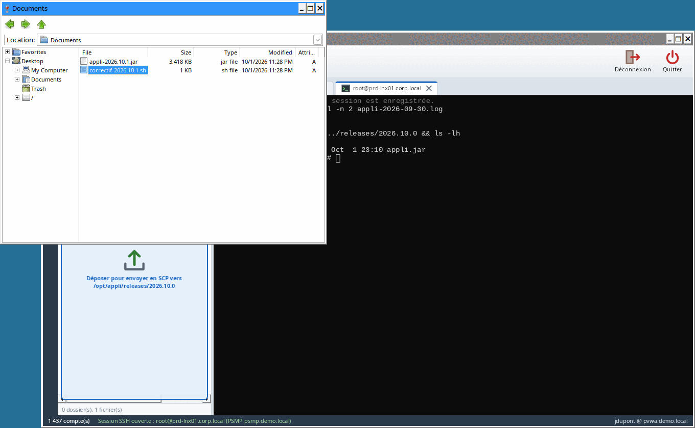

- **Barre de navigation** : chemin courant, modifiable (tapez un chemin puis Entrée). Double-clic sur un
  dossier pour y entrer, `..` pour remonter, boutons « dossier parent » et « dossier personnel ».
- **Déposer des fichiers** : glissez-les depuis l'Explorateur sur la liste (ou bouton « Envoyer »). Envoi en
  **SCP** par défaut (SFTP en option), dossiers compris ; confirmation avant d'écraser un fichier existant.
- **Supprimer** : sélection puis Suppr (ou clic droit → « Supprimer (rm) »), avec confirmation. Les dossiers
  doivent être vides.
- **Modifier un fichier** : sélection puis `F4` (ou clic droit → « Modifier », ou bouton crayon). Le fichier
  s'ouvre dans l'éditeur de texte choisi dans les Paramètres (Bloc-notes par défaut). À chaque enregistrement,
  CyberArkTerm propose de le renvoyer sur le serveur : envoi en SFTP, droits du fichier conservés. Si le
  fichier a changé sur le serveur depuis son ouverture, une alerte demande confirmation avant de l'écraser.
- **Droits** : clic droit → « Droits… » (ou bouton cadenas). Cases lecture / écriture / exécution pour le
  propriétaire, le groupe et les autres, bits spéciaux (setuid, setgid, sticky) et valeur octale (`644`,
  `1777`…), pour un ou plusieurs éléments. Pour un dossier, l'option « Appliquer aussi au contenu » propage
  les droits aux sous-dossiers et fichiers ; par défaut, l'exécution (x) n'est donnée qu'aux dossiers et aux
  fichiers déjà exécutables. Les liens symboliques ne sont pas suivis, le propriétaire n'est pas modifié.
- Aussi : nouveau dossier, téléchargement, copie du chemin, affichage des fichiers cachés.
- **Suivre le dossier du terminal** : quand la case est cochée, chaque `cd` dans le terminal déplace le
  navigateur dans le même dossier (voir [Fonctionnement technique](#fonctionnement-technique)). Après un
  `sudo -i` ou un `su`, recochez la case à l'invite du shell pour réactiver le suivi dans ce nouveau shell.

### 6. Organiser ses serveurs : onglet « Courants »

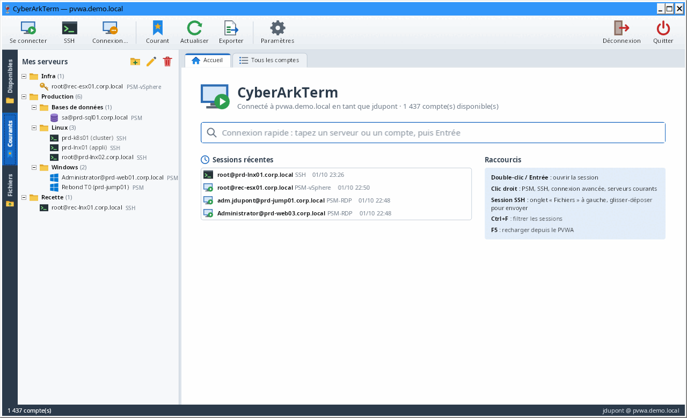

- **Ajouter** un compte : clic droit dans « Disponibles » → « Ajouter aux serveurs courants » puis le
  dossier voulu, ou glissez le compte sur l'onglet « Courants », ou bouton « Courant » de la barre d'outils.
- **Dossiers** : clic droit → nouveau dossier ou sous-dossier, renommer, supprimer ; glissez serveurs et
  dossiers pour les déplacer.
- **Configuration propre à chaque serveur** (clic droit → « Propriétés… ») :

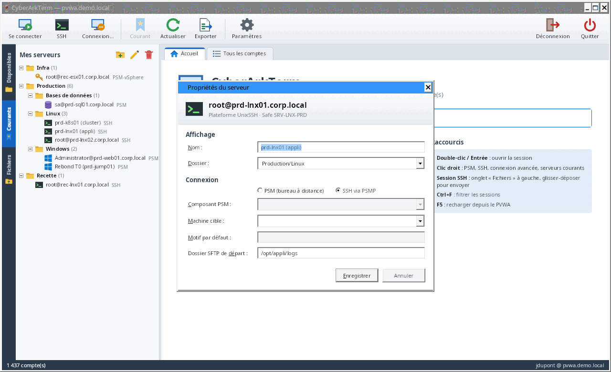

| Réglage | Effet |
| --- | --- |
| Nom, dossier | Affichage et rangement dans l'arbre. |
| PSM ou SSH via PSMP | Type de connexion ouvert au double-clic. |
| Composant PSM | Composant à utiliser (vide : déduit de la plateforme). |
| Machine cible | Serveur sur lequel ouvrir la session pour un compte de domaine. |
| Motif par défaut | Motif d'accès envoyé automatiquement au PVWA. |
| Dossier SFTP de départ | Le terminal **et** le navigateur de fichiers s'ouvrent directement dans ce dossier. |

Un serveur dont le compte n'est plus visible dans CyberArk apparaît grisé.

### 7. Accès d'urgence hors CyberArk : coffres KeePass

Quand CyberArk est indisponible, CyberArkTerm ouvre vos coffres KeePass (`.kdbx`) et se connecte **directement**
aux serveurs, en SSH ou en bureau à distance, avec les comptes qu'ils contiennent.

> Ces connexions **ne passent pas par le PSM** : ni enregistrement, ni règles CyberArk. Chaque ouverture de
> coffre, connexion et modification est notée dans le journal local `%APPDATA%\CyberArkTerm\urgence.log`.

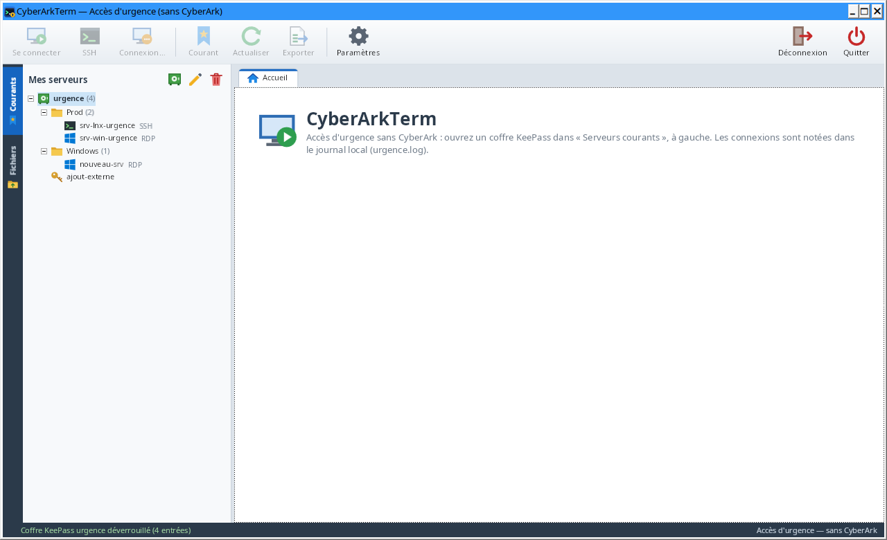

- **Sans CyberArk** : sur l'écran de connexion, « Accès d'urgence (KeePass) » ouvre la fenêtre principale sans
  PVWA (seuls les coffres KeePass y figurent). Avec CyberArk, les coffres apparaissent aussi en tête de l'onglet
  « Courants ».
- **Ajouter un coffre** : bouton coffre-fort de l'onglet « Courants » (ou clic droit → « Ajouter un coffre
  KeePass… ») : fichier `.kdbx`, nom, fichier clé éventuel.
- **Déverrouiller** : double-clic sur le coffre. Mot de passe maître et/ou fichier clé (tous les formats de
  KeePass). « Mémoriser le mot de passe maître dans le coffre local » évite de le ressaisir (voir ci-dessous).
- **Se connecter** : double-clic sur une entrée. Le protocole vient de son adresse (`ssh://serveur:22`,
  `rdp://serveur`, `serveur:3389`), d'un champ « Protocol » / « Port » ou d'une étiquette `ssh` / `rdp` ; sinon
  CyberArkTerm demande SSH ou bureau à distance. Le mot de passe de l'entrée est utilisé directement (onglet
  terminal + Fichiers en SSH, onglet bureau à distance en RDP) ; il n'est jamais affiché ni écrit sur disque.
- **Modifier le coffre** : clic droit → « Nouvelle entrée… », « Modifier… » (`F2`), « Supprimer » (`Suppr`,
  vers la corbeille du coffre). Les autres données du coffre (pièces jointes, champs, réglages) sont gardées ;
  l'ancienne version d'une entrée va dans son historique, comme dans KeePass.
- **Verrouiller** : clic droit → « Verrouiller ». Les coffres se verrouillent aussi à la déconnexion, à la
  fermeture et au **verrouillage de Windows**.

**Coffre local** : les mots de passe maîtres que vous choisissez de mémoriser sont gardés dans
`%APPDATA%\CyberArkTerm\coffre-local.dat`, chiffré avec un mot de passe à vous (demandé à l'ouverture de
CyberArkTerm, « Plus tard » pour s'en passer) et lié à votre compte Windows. Gestion dans les **Paramètres** :
créer, déverrouiller, changer le mot de passe, supprimer.

## Raccourcis

| Où | Action | Raccourci |
| --- | --- | --- |
| Partout | Recharger les comptes depuis le PVWA | `F5` |
| Partout | Filtrer les comptes | `Ctrl+F` |
| Listes et arbres | Ouvrir la session | Double-clic ou `Entrée` |
| Recherche | Effacer le filtre | `Échap` |
| Courants | Renommer / retirer ou supprimer | `F2` / `Suppr` |
| Terminal | Copier | Sélection à la souris, ou `Ctrl+Maj+C` |
| Terminal | Coller | Clic droit, `Maj+Inser` ou `Ctrl+Maj+V` |
| Terminal | Historique | Molette, `Maj+Page préc.` / `Maj+Page suiv.` |
| Onglet SSH ou Bureau à distance | Fermer | Croix de l'onglet ou clic molette |
| Bureau à distance | Plein écran / retour | `Ctrl+Alt+Pause` |
| Fichiers | Ouvrir / modifier / dossier parent / supprimer / actualiser | `Entrée` / `F4` / `Retour arrière` / `Suppr` / `F5` |
| Coffre KeePass | Se connecter / modifier / supprimer une entrée | Double-clic ou `Entrée` / `F2` / `Suppr` |

## Paramètres et fichier de configuration

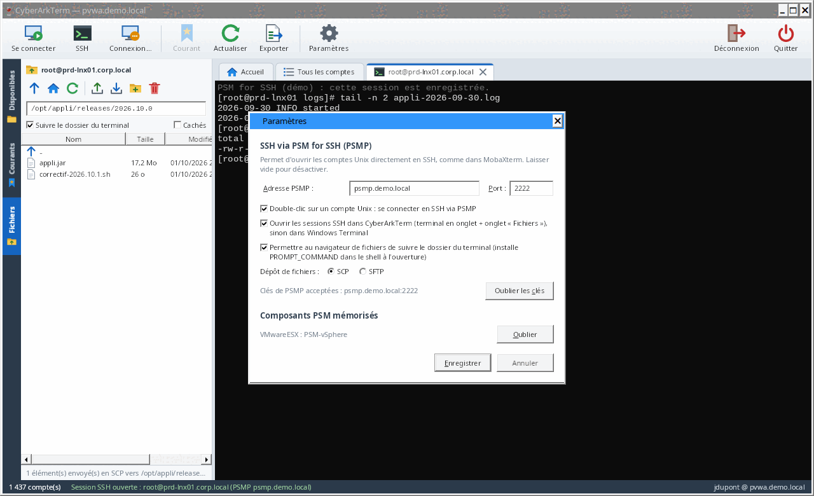

| Paramètre | Rôle | Défaut |
| --- | --- | --- |
| Langue de l'interface | Français, English, Italiano ou langue du système ; appliquée après déconnexion ou au prochain démarrage | langue de Windows (anglais si elle n'est pas traduite) |
| Garder la session PVWA ouverte | Requête légère toutes les 4 minutes ; suspendue quand Windows est verrouillé | oui |
| Coffre local | Mots de passe maîtres KeePass mémorisés : créer, déverrouiller, changer le mot de passe, supprimer | — |
| Bureau à distance dans CyberArkTerm | Sessions PSM en onglet ; sinon Connexion Bureau à distance (`mstsc`) | oui |
| Adresse et port PSMP | Serveur PSM for SSH ; vide = SSH désactivé | vide, 22 |
| Double-clic Unix = SSH | Ouvre les comptes Unix en SSH plutôt qu'en PSM | non |
| SSH dans CyberArkTerm | Terminal et onglet Fichiers intégrés ; sinon Windows Terminal | oui |
| Suivre le dossier du terminal | Autorise l'installation du suivi de dossier dans le shell | oui |
| Dépôt de fichiers | SCP ou SFTP | SCP |
| Éditeur de texte | Programme ouvert par « Modifier » dans l'onglet Fichiers | Bloc-notes |
| Clés de PSMP acceptées | Empreintes mémorisées (bouton « Oublier les clés ») | — |
| Composants mémorisés | Composant PSM choisi par plateforme (bouton « Oublier ») | — |

Toutes les préférences sont enregistrées dans `%APPDATA%\CyberArkTerm\settings.json` : langue, adresse du PVWA,
méthode et identifiant de connexion, paramètres ci-dessus, serveurs « Courants » et leurs dossiers, sessions
récentes, emplacement des coffres KeePass et de leurs fichiers clés. Ce fichier ne contient **aucun mot de passe,
jeton ni clé privée**. Pour repartir de zéro, fermez
l'application et supprimez-le.

## Sécurité

- **HTTPS obligatoire** vers le PVWA ; la validation des certificats n'est jamais désactivée.
- **Aucun secret sur disque** : mot de passe CyberArk, jeton de session, clé MFA et mot de passe PSMP restent
  en mémoire, le temps de la session. Déconnexion du PVWA (`Logoff`) à la fermeture.
- Session PVWA ouverte avec `concurrentSession` : votre session web PVWA éventuelle n'est pas fermée.
- **Sessions Bureau à distance en onglet** : la réponse du PVWA (jeton PSM à usage unique) reste en mémoire,
  rien n'est écrit sur disque. Les redirections (lecteurs, imprimantes, ports, cartes à puce) ne sont activées
  que si le PVWA les demande ; le presse-papiers suit sa demande (activé s'il n'en dit rien).
- **Fichiers RDP pour `mstsc`** (jeton PSM à usage unique) écrits dans `%TEMP%\CyberArkTerm` et supprimés
  après 60 s ou à la fermeture.
- **Clés d'hôte PSMP épinglées** au premier usage, avec alerte en cas de changement (de même pour les serveurs
  joints en accès d'urgence).
- **Maintien de la session PVWA** : il évite l'expiration par inactivité ; rien n'est envoyé tant que Windows
  est verrouillé, et l'option se désactive dans les Paramètres si votre politique l'exige.
- **Coffres KeePass** :
  - mot de passe maître jamais enregistré, sauf dans le coffre local si vous le demandez : Argon2id (64 Mio,
    3 passes) puis AES-256-GCM, réglages de dérivation authentifiés, le tout protégé par DPAPI (compte Windows) ;
  - en mémoire, clé du coffre et mots de passe des entrées restent masqués et ne sont révélés qu'au moment de la
    connexion ; coffres verrouillés à la déconnexion, à la fermeture et au verrouillage de Windows ;
  - enregistrement sûr : relecture du fichier, modification appliquée à sa version du moment (les changements
    faits ailleurs sont gardés), vérification du résultat déchiffré, copie `.bak`, remplacement en une fois ;
    une entrée modifiée ailleurs entre-temps n'est pas écrasée ;
  - bureau à distance direct : le mot de passe est transmis au seul contrôle Bureau à distance (ni fichier, ni
    gestionnaire d'identification), authentification réseau (NLA) et alerte si le serveur n'est pas reconnu ;
  - journal `urgence.log` : date, compte Windows, poste, action, coffre, entrée, cible ; jamais de mot de passe.
- **Fichiers modifiés** : la copie locale ouverte dans l'éditeur est placée dans `%TEMP%\CyberArkTerm\edit`
  et supprimée à la fermeture de l'onglet SSH ; une alerte prévient si des modifications n'ont pas été
  renvoyées.
- **Pas d'injection de commande** : chemins SCP et dossiers de départ protégés entre apostrophes pour le
  shell distant ; arguments `ssh` / Windows Terminal validés et passés sans shell.
- Export CSV protégé contre l'injection de formules Excel.
- Les sessions PSM et PSMP ouvertes par CyberArkTerm sont des sessions CyberArk standard : elles sont
  enregistrées et auditées par le PSM comme celles ouvertes depuis le PVWA.

Pour signaler une vulnérabilité, voir [SECURITY.md](SECURITY.md) (signalement privé, pas d'issue publique).

## Fonctionnement technique

### API du PVWA utilisées

| Appel | Usage |
| --- | --- |
| `POST /PasswordVault/API/auth/{CyberArk\|LDAP\|RADIUS\|Windows}/Logon` | Ouverture de session |
| `GET /PasswordVault/API/Accounts?offset=…&limit=1000` | Liste paginée des comptes |
| `POST /PasswordVault/API/Accounts/{id}/PSMConnect` | Fichier RDP de la session PSM |
| `POST /PasswordVault/API/Users/Secret/SSHKeys/Cache` | Clé SSH temporaire « MFA caching » (si activée) |
| `GET /PasswordVault/API/Accounts?offset=0&limit=1` | Maintien de la session (toutes les 4 minutes) |
| `POST /PasswordVault/API/Auth/Logoff` | Fermeture de session |

### Coffres KeePass

Lecture et écriture natives (sans KeePass installé) des formats **KDBX 3.1 et 4.x** : chiffrement AES-256 ou
ChaCha20, dérivation de clé AES-KDF (instructions AES du processeur) ou Argon2d / Argon2id, fichiers clés XML
1.0 / 2.0, 32 octets, 64 caractères hexadécimaux ou fichier quelconque. Le fichier réécrit garde la version, le
chiffrement et la dérivation de clé d'origine, avec de nouvelles graines à chaque enregistrement. Les coffres de
test (`tests/CyberArkTerm.Core.Tests/KeePass/Vaults`) viennent de KeePassXC et pykeepass, et les fichiers écrits
par CyberArkTerm ont été vérifiés dans ces deux outils.

### Sessions Bureau à distance

Les onglets Bureau à distance hébergent le contrôle ActiveX de Windows (`mstscax.dll`, classe `MsRdpClient`
la plus récente disponible). CyberArkTerm lit le fichier RDP renvoyé par `PSMConnect` et en reprend les
réglages : `full address`, `username`, `alternate shell` (lancement de la session PSM), niveau
d'authentification du serveur, NLA (CredSSP), passerelle, redirections, son, effets visuels. Les fermetures
de session et les erreurs de connexion sont expliquées dans l'onglet avec le message de Windows.

Pour une application distante (`remoteapplicationmode:i:1`), le contrôle passe en mode RemoteApp avec
`remoteapplicationprogram` (pour le PSM, `||PSMInitSession`), `remoteapplicationname`,
`remoteapplicationcmdline` et `disableremoteappcapscheck`, comme `mstsc` ; `alternate shell` ne sert pas.
Le bureau distant prend la taille de l'ensemble des écrans pour que les fenêtres puissent aller partout. Un
test d'intégration (workflow `rdp-integration`) ouvre de vraies sessions sur le poste de CI : bureau en onglet,
et Bloc-notes en application distante.

### Sessions PSMP

Chaque onglet SSH ouvre jusqu'à trois connexions au PSMP, avec le même identifiant
`<vous>@<compte>[#domaine]@<cible>` : le terminal, la connexion SFTP de l'onglet Fichiers, et une connexion
SCP au premier dépôt de fichier en SCP. Chacune est une session PSMP, enregistrée par le PSM.

### Suivi du dossier du terminal

À l'ouverture d'une session SSH (si l'option est active), CyberArkTerm attend que le shell du serveur cible
affiche son invite (jusqu'à 60 s : le PSMP met parfois plusieurs secondes à joindre la cible), puis lui envoie
une commande d'une ligne, précédée d'une espace pour ne pas entrer dans l'historique. Rien n'est envoyé si
vous avez déjà commencé à taper ; la commande peut être renvoyée sans effet en double (case « Suivre ») :

- définition de `PROMPT_COMMAND` (bash) ou `precmd` (zsh) qui émet la séquence standard **OSC 7** avec le
  dossier courant à chaque invite ;
- si un dossier de départ est configuré, un `cd` vers ce dossier ;
- effacement de la commande tapée, pour qu'elle ne reste pas à l'écran.

Le terminal intégré décode la séquence OSC 7 et l'onglet Fichiers se place dans le dossier indiqué.

## Dépannage

| Symptôme | Cause probable et solution |
| --- | --- |
| « Connexion TLS refusée : le certificat du PVWA n'est pas approuvé » | Le certificat (ou l'autorité qui l'a émis) n'est pas dans le magasin Windows du poste. |
| « Le PVWA doit être joint en HTTPS » | Saisissez l'adresse sans `http://` (ou avec `https://`). |
| « Votre session CyberArk a expiré » | Délai d'inactivité du PVWA dépassé : reconnectez-vous. |
| « Connection component … is not configured for platform … » | Choisissez le bon composant dans « Connexion avancée », cochez « Mémoriser » pour la plateforme. |
| « You must specify a reason… » | Saisissez un motif dans la fenêtre qui s'ouvre (ou un motif par défaut dans les propriétés du serveur courant). |
| Le compte n'apparaît pas | Vous n'avez pas le droit « List accounts » sur son safe, ou la liste doit être rechargée (`F5`). |
| Le mot de passe PSMP est demandé à chaque onglet | MFA caching non activé sur le PVWA : comportement normal (une fois par onglet). |
| L'onglet Fichiers indique « Connexion SFTP impossible » | SFTP n'est pas autorisé sur le PSMP ou pour ce compte : voir l'équipe CyberArk. |
| Le navigateur ne suit pas les `cd` | Le shell distant n'est pas bash ou zsh, l'option est désactivée dans les Paramètres, ou l'invite n'a pas été reconnue : recochez « Suivre le dossier du terminal » à l'invite du shell. |
| Alerte « la clé du PSMP a changé » | Ne continuez que si l'équipe CyberArk confirme un changement du serveur. |
| « Mot de passe maître ou fichier clé incorrect » | Vérifiez le mot de passe et le fichier clé ; un coffre protégé par YubiKey n'est pas pris en charge. |
| Le coffre KeePass demande le mot de passe malgré « Mémoriser » | Coffre local verrouillé (« Plus tard » au démarrage) ou mot de passe maître changé ailleurs : saisissez-le, il est remémorisé. |
| « Le fichier du coffre local est endommagé ou a été créé par un autre compte Windows » | Le coffre local ne suit pas un changement de poste ou de compte : supprimez-le dans les Paramètres et recréez-le. |
| « L'entrée … a été modifiée ou supprimée dans le coffre entre-temps » | Quelqu'un a changé la même entrée ailleurs : le coffre est rechargé, refaites la modification. |
| La session PSM s'ouvre dans `mstsc` et pas dans un onglet | Contrôle Bureau à distance indisponible ou en échec, ou option décochée : la barre d'état indique la raison. |
| Application distante (RemoteApp) : « n'est pas autorisée sur le serveur » | L'application demandée n'est pas publiée sur le serveur PSM : voyez avec l'administrateur CyberArk. |
| L'onglet affiche « Erreur du contrôle Bureau à distance » | Décochez « Ouvrir les sessions Bureau à distance dans un onglet » dans les Paramètres pour passer par `mstsc`, et signalez le code affiché. |

## Développement

### Structure

| Projet | Rôle |
| --- | --- |
| `src/CyberArkTerm.Core` | Logique sans interface, multiplateforme : client de l'API PVWA, classement des comptes, émulateur de terminal xterm, connexions PSMP et navigateur SFTP/SCP (SSH.NET), serveurs « Courants » en dossiers, coffres KeePass (KDBX), coffre local, préférences. |
| `src/CyberArkTerm.App` | Application WPF : fenêtres, onglets, contrôle terminal, contrôle Bureau à distance (onglets RDP), lancement de `mstsc`, icône (`Assets`). |
| `tests/CyberArkTerm.Core.Tests` | Tests xUnit de Core (faux PVWA HTTP, terminal, PSMP, dossiers…). |
| `tests/CyberArkTerm.App.Tests` | Tests Windows de l'application (vrai contrôle Bureau à distance, DPAPI). |

Dépendance externe : [SSH.NET](https://github.com/sshnet/SSH.NET) (licence MIT).

### Traductions

Les textes de l'interface sont dans `src/CyberArkTerm.Core/Localization/CoreStrings*.resx` et
`src/CyberArkTerm.App/Localization/Strings*.resx` : anglais dans le fichier neutre, puis `.fr` et `.it`.
Les classes `*.Designer.cs` sont générées par Visual Studio (`PublicResXFileCodeGenerator`) ; un test vérifie
que chaque langue a toutes les clés, les mêmes paramètres `{0}` et les mêmes touches d'accès `_`.
Pour ajouter une langue : copier les `.resx` avec le nouveau code (`.de.resx`…), traduire, puis ajouter le
code à `UiLanguage.Supported`.

### Compiler et tester

Avec le [SDK .NET 10](https://dotnet.microsoft.com/download/dotnet/10.0) :

```powershell
dotnet test CyberArkTerm.sln
dotnet run --project src/CyberArkTerm.App
```

Le projet compile aussi sous Linux ou macOS (`EnableWindowsTargeting`) ; l'application ne s'exécute que sous
Windows. Les tests de `tests/CyberArkTerm.App.Tests` (dont un test du vrai contrôle Bureau à distance) ne
s'exécutent que sous Windows ; ailleurs, lancez `dotnet test tests/CyberArkTerm.Core.Tests`.

### Publier l'exécutable

```powershell
# Autonome (~65 Mo) : aucun runtime à installer sur le poste
dotnet publish src/CyberArkTerm.App -c Release -r win-x64 -p:SelfContained=true `
  -p:PublishSingleFile=true -p:IncludeNativeLibrariesForSelfExtract=true -p:EnableCompressionInSingleFile=true -o publish

# Léger : nécessite le « .NET Desktop Runtime 10 » sur le poste
dotnet publish src/CyberArkTerm.App -c Release -r win-x64 -p:SelfContained=false -p:PublishSingleFile=true -o publish
```

La CI ([`.github/workflows/build.yml`](.github/workflows/build.yml)) exécute les tests et publie l'exécutable
autonome en artefact `CyberArkTerm-win-x64` pour chaque pull request et chaque push sur `main`.

### Publier une version

Depuis GitHub : **Actions → release → Run workflow** sur `main`, en indiquant le numéro `X.Y.Z` ; ou bien
poussez un tag `vX.Y.Z` sur `main`. Le workflow [`release.yml`](.github/workflows/release.yml) exécute les
tests, compile l'exécutable avec ce numéro de version, crée le tag s'il n'existe pas et publie la *Release*
GitHub avec le zip et `SHA256SUMS.txt`. Les notes de version sont lues dans `docs/releases/vX.Y.Z.md` si ce
fichier existe.

## Limites et pistes

**Limites actuelles**

- **Privilege Cloud** (connexion via CyberArk Identity) et **SAML** ne sont pas gérés.
- L'API Accounts n'indique pas quels composants PSM une plateforme propose : le composant est déduit, puis
  mémorisable.
- Coffres KeePass : chiffrement Twofish et clés YubiKey non pris en charge ; pas de création de coffre (créez-le
  avec KeePass ou KeePassXC) ; pièces jointes gardées mais non affichées.
- Le suivi du dossier du terminal nécessite bash ou zsh sur le serveur.
- PSM Gateway (HTML5), double validation (dual control) et accès exclusif ne sont pas gérés.

**Pistes**

- Exécutable signé et installateur MSI.
- Plusieurs PVWA (profils de connexion), Privilege Cloud.

## Licence

[MIT](LICENSE) © 2026 muller-camille
