# Guide d'utilisation de CyberArkTerm

**Français** · [English](guide.md) · [Italiano](guide.it.md) · [← Retour au README](../README.fr.md)

## Sommaire

- [1. Se connecter au coffre CyberArk](#1-se-connecter-au-coffre-cyberark)
- [2. Trouver un compte : onglet « Disponibles »](#2-trouver-un-compte--onglet--disponibles-)
- [3. Ouvrir une session PSM (bureau à distance)](#3-ouvrir-une-session-psm-bureau-à-distance)
- [4. Ouvrir une session SSH via le PSMP](#4-ouvrir-une-session-ssh-via-le-psmp)
- [5. Parcourir et déposer des fichiers : onglet « Fichiers »](#5-parcourir-et-déposer-des-fichiers--onglet--fichiers-)
- [6. Organiser ses serveurs : onglet « Mes serveurs »](#6-organiser-ses-serveurs--onglet--mes-serveurs-)
- [7. Accès d'urgence hors CyberArk : bases KeePass](#7-accès-durgence-hors-cyberark--bases-keepass)
- [Raccourcis](#raccourcis)
- [Paramètres et fichier de configuration](#paramètres-et-fichier-de-configuration)
- [Sécurité](#sécurité)
- [Fonctionnement technique](#fonctionnement-technique)
- [Dépannage](#dépannage)

## 1. Se connecter au coffre CyberArk

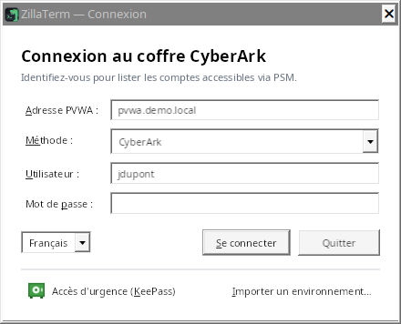

Saisissez l'adresse du PVWA (`pvwa.mondomaine.local` suffit : `https://` et `/PasswordVault` sont ajoutés),
choisissez la méthode d'authentification, puis votre identifiant et votre mot de passe. Si le serveur RADIUS pose
une question (code OTP), la fenêtre l'affiche et attend votre réponse. Pendant la saisie d'un mot de passe, l'avertissement
« Verr. Maj est activé. » s'affiche si la touche est active (de même pour les bases KeePass et le coffre local).

L'adresse, la méthode et l'identifiant sont mémorisés ; **le mot de passe ne l'est jamais**.

La liste en bas à gauche change la langue de l'interface (Français, English, Italiano) ; la fenêtre se rouvre
aussitôt dans la langue choisie, sans perdre l'adresse ni l'identifiant saisis.

### Fenêtre principale

- **Panneau de gauche** : onglets « Disponibles », « Mes serveurs » et « Fichiers » (`Ctrl+1`, `Ctrl+2`, `Ctrl+3`).
  Glissez le séparateur pour changer sa largeur ; `Ctrl+B` ou un double-clic sur le séparateur le replie (la bande
  des onglets reste : un clic sur un onglet le rouvre). `F6` passe du panneau à la session. La position et la
  taille de la fenêtre, la largeur du panneau et son état replié sont mémorisés.
- **Onglets de session** : une pastille donne l'état de la session par sa couleur et par sa forme : anneau orange
  pendant la connexion, pastille verte une fois connectée, anneau gris quand la session est terminée, pastille
  rouge en cas d'échec (le nom est alors atténué). L'infobulle donne le nom complet, l'état et le mode : « Via le
  PSMP … : session gérée par CyberArk » ou « Accès direct d'urgence (KeePass) : hors CyberArk, noté dans
  urgence.log ». Un nom trop long est tronqué ; un nom déjà ouvert est numéroté (« srv01 (2) »). Quand les onglets
  ne tiennent plus, la bande défile (molette, l'onglet choisi reste visible) et « ⌄ » les liste tous avec leur
  état. `Ctrl+Tab` / `Ctrl+Maj+Tab` : onglet suivant / précédent ; `Ctrl+F4` ou `Ctrl+Maj+W` : fermer l'onglet.
- **Fermer une session connectée** (SSH, Bureau à distance, VNC) demande confirmation, avec la case « Ne plus
  demander à la fermeture d'une session » (réglage « Confirmer avant de fermer une session connectée », Paramètres ›
  Terminal). À la déconnexion et à la sortie, une seule fenêtre récapitule ce qui sera fermé : sessions, transferts
  en cours, fichiers modifiés non renvoyés.
- **Confirmations** : les boutons disent l'action (« Supprimer le compte », « Remplacer la clé et se connecter »…),
  « Annuler » est le bouton par défaut, et le serveur, le compte ou le safe concerné est nommé. Les valeurs à
  comparer (empreintes) s'affichent en police fixe avec « Copier ». Certaines actions irréversibles (supprimer un
  compte, accepter une clé de serveur qui a changé) demandent en plus de cocher une case.
- **Boutons grisés** : leur infobulle dit ce qui manque (sélection, PSMP, session SSH pour « Parallèle »…). En accès
  d'urgence, les boutons propres à CyberArk sont masqués.
- **Barre d'état** : un message ordinaire s'efface après 10 secondes ; une erreur reste affichée jusqu'au message
  suivant. Le nombre de comptes ne s'y affiche qu'avec l'onglet « Disponibles ».

## 2. Trouver un compte : onglet « Disponibles »

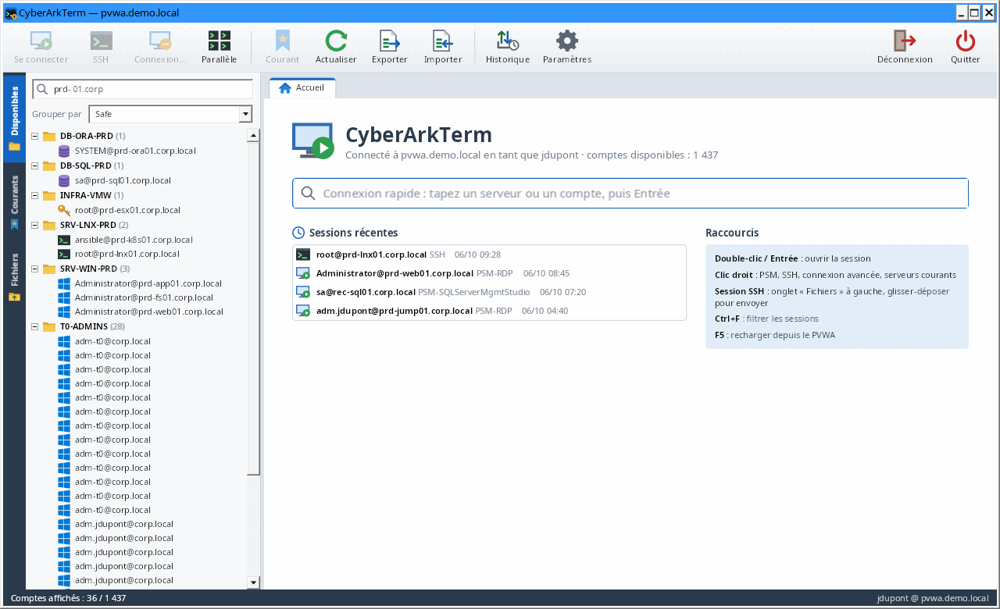

- La zone de recherche (« Filtrer les comptes… », `Ctrl+F`) filtre sur tous les champs (serveur, utilisateur, safe,
  plateforme, domaine…), plusieurs mots possibles (`prd sql`).
- À la place d'une liste vide, l'onglet dit ce qui se passe : chargement des comptes, échec du chargement avec son
  message et « Réessayer », aucun compte accessible à votre utilisateur CyberArk, ou aucun compte ne correspondant
  au filtre, avec « Effacer le filtre ».
- « Grouper par » range les comptes par safe, plateforme ou type de cible.
- Clic droit sur un compte → « Exporter les comptes affichés (CSV)… » enregistre en CSV les comptes affichés
  (filtrés par la recherche).
- **Membres d'un safe** : clic droit sur un compte (ou sur un safe quand les comptes sont groupés par safe, ou sur
  un serveur de « Mes serveurs ») → « Membres du safe ». La fenêtre liste les utilisateurs et groupes du safe avec leurs
  droits (lister, utiliser, récupérer, ajouter des comptes, modifier, supprimer, gérer les membres…), indique qui
  peut **ajouter des comptes**, et détaille tous les droits du membre sélectionné. Pendant la lecture, elle affiche
  « Chargement des membres… » ; en cas d'erreur, le message s'affiche au centre avec « Réessayer ». Le PVWA ne donne
  cette liste qu'à un compte qui a le droit « View Safe Members » sur le safe. `Ctrl+A` puis `Ctrl+C` copie le
  tableau. Avec le droit « Gérer les membres du safe », les boutons « Ajouter un membre… », « Modifier les droits… »
  (ou double-clic) et « Retirer… » gèrent les membres : nom, type (utilisateur ou groupe), annuaire (« Vault » ou le
  domaine LDAP), date de fin éventuelle et les 22 droits, regroupés comme dans le PVWA. La liste « Profil » coche
  d'un coup les droits d'un usage courant (lecture seule, utilisateur des comptes, gestionnaire des comptes,
  complet) ; les droits sensibles sont signalés et leur attribution demande confirmation ; « Modifications : +n /
  −n » résume ce qui change. Retirer un membre est confirmé (« Retirer le membre »).
- **Ajouter un compte** : clic droit sur un compte (ou sur un safe quand les comptes sont groupés par safe) →
  « Ajouter un compte dans le safe… ». Safe, plateforme, adresse et utilisateur sont obligatoires ; domaine de
  connexion, nom du compte, mot de passe, machines autorisées et gestion par le CPM sont facultatifs. Le compte
  cliqué sert de modèle (safe, plateforme, domaine) et le curseur est placé sur le premier champ obligatoire vide.
  Le compte est créé avec les droits de votre session : il faut le droit « Ajouter des comptes » sur le safe, et en
  général « Modifier le contenu des comptes » pour fournir le mot de passe. La liste est rechargée ensuite et le
  nouveau compte sélectionné.
- **Importer des comptes (CSV)** : clic droit sur un compte ou un safe → « Importer des comptes (CSV)… ». Une
  fenêtre demande le fichier (« Enregistrer un modèle… » donne un exemple), le safe et la plateforme par défaut, puis
  montre un aperçu de toutes les lignes du fichier (lignes en erreur en rouge, case « Erreurs seulement ») et les
  safes visés ; rien n'est envoyé avant le bouton « Créer N comptes ».
  Colonnes obligatoires : adresse et utilisateur (plus safe et plateforme, sinon les valeurs par défaut) ;
  facultatives : nom, domaine, mot de passe, machines autorisées, gestion CPM (oui/non), motif. Séparateur `;`, `,`
  ou tabulation, noms de colonnes en français, anglais ou italien ; un fichier produit par « Exporter les
  comptes affichés » se réimporte. Une seconde fenêtre crée ensuite les comptes ligne par ligne et affiche l'état de chacune (créé, refusé
  avec le message du PVWA, non importé, non envoyé ; « Arrêter » possible). La fermer pendant l'import demande
  confirmation : « Continuer » (par défaut) ou « Arrêter l'import » (le compte en cours est terminé, les comptes déjà
  créés restent dans le coffre CyberArk). À la fin, elle propose d'enregistrer le
  résultat en CSV (sans les mots de passe). Les mots de passe du fichier ne sont jamais affichés ; supprimez le
  fichier après l'import.
- **Modifier / supprimer un compte** : clic droit → « Modifier le compte… » (plateforme, adresse, utilisateur,
  domaine, nom, machines autorisées, gestion par le CPM ; seuls les champs changés sont envoyés) ou « Supprimer le
  compte… » : la confirmation rappelle que le compte est supprimé pour tous les utilisateurs et que son mot de passe
  ne sera plus récupérable ; il faut cocher « Je comprends que le mot de passe actuel ne sera plus récupérable ».
  Droits « Modifier les propriétés des comptes » et « Supprimer des comptes ».
- **État du mot de passe (CPM)** : l'info-bulle d'un compte indique s'il est géré par le CPM, la date du dernier
  changement, de la dernière vérification et de la dernière réconciliation ; un **⚠** signale un compte dont la
  dernière opération du CPM a échoué.
- **Clic droit → « Mot de passe »** (comptes de « Disponibles » et serveurs de « Mes serveurs ») :
  - « Vérifier (CPM) », « Changer (CPM)… », « Réconcilier (CPM)… » demandent l'opération au CPM (confirmation pour
    changer et réconcilier, boutons « Changer le mot de passe » et « Réconcilier » ; droit « Lancer les opérations
    CPM »). Le CPM la traite ensuite : `F5` pour voir le nouvel état.
  - « Copier le mot de passe… » : la fenêtre nomme le compte et son safe, et annonce que la récupération est
    inscrite dans l'audit CyberArk et que le mot de passe reste 20 secondes dans le presse-papiers. Motif et ticket
    sont facultatifs, sauf si la plateforme les exige ; « Récupérer et copier » copie le mot de passe **sans
    l'afficher**, puis la barre d'état décompte les secondes avant son effacement (droit « Récupérer les comptes »).
- Sur l'accueil, la **connexion rapide** (`Ctrl+K` ; le curseur y est au démarrage) trouve un serveur au fil de la
  frappe : Entrée pour s'y connecter. Elle dit quand aucun compte ne correspond, et n'affiche que les 50 premiers
  résultats (« 50 premiers comptes sur N : précisez la recherche. »). Les **sessions récentes** sont datées
  (« Aujourd'hui 09:28 », « Hier 18:02 ») ; clic droit → « Retirer de la liste » (ou `Suppr`) en retire une. Elles
  restent grisées tant que les comptes ne sont pas chargés depuis le PVWA (« en attente des comptes du PVWA… ») ; ce
  sont celles du PVWA où vous êtes connecté (sur un autre PVWA, le même ID de compte désigne un autre compte).

## 3. Ouvrir une session PSM (bureau à distance)

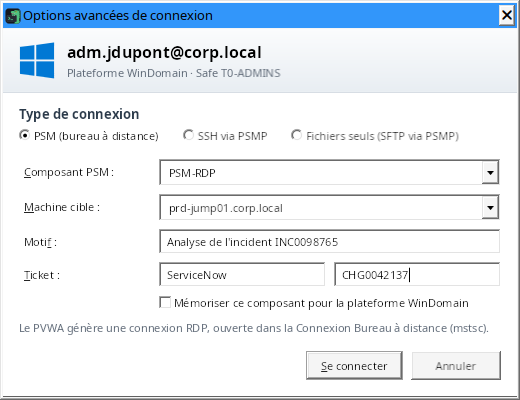

Double-cliquez sur le compte (ou Entrée, ou bouton « Se connecter ») ; un compte Unix s'ouvre en SSH via le PSMP
quand son adresse est renseignée, ou en fichiers seuls pour une plateforme « SFTP » (voir 4.), et « Connexion
avancée… » permet alors de choisir le PSM. CyberArkTerm
demande la connexion au PVWA et ouvre la session dans la **Connexion Bureau à distance** de Windows (`mstsc`),
exactement comme le bouton « Connect » du PVWA : le fichier RDP du PVWA lui est donné tel quel. Un composant en
application distante (RemoteApp) ouvre ses fenêtres sur le bureau du poste.

- **Composant PSM** : déduit de la plateforme (`PSM-RDP` pour Windows, `PSM-SSH` pour Unix et réseau,
  `PSM-SQLServerMgmtStudio`, `PSM-SQLPlus`…). Cochez « Mémoriser ce composant » pour le conserver pour toute la
  plateforme. Votre PVWA peut nommer ses composants autrement (par exemple `WIN-PSM`) : saisissez le nom que propose
  son bouton « Connect » ; la liste propose ensuite les composants déjà utilisés, celui de la plateforme en premier.
  Pour tous vos comptes Windows, réglez une fois le composant dans **Paramètres › CyberArk** (« Comptes Windows »,
  par exemple `WIN-PSM`) ; un composant mémorisé pour une plateforme reste prioritaire.
- **Comptes de domaine** : un compte enregistré pour son domaine n'a pas de serveur. Il est reconnu par sa plateforme
  de domaine, ses machines autorisées, ou son adresse : son domaine de connexion, un domaine sous lequel se trouvent
  d'autres serveurs (`corp.local` quand un compte vise `srv01.corp.local`), ou le domaine du PVWA ou du poste. Jamais
  de session vers le domaine lui-même : le serveur est toujours demandé, « Connexion avancée » compris. La fenêtre « Choisir le serveur » demande sur lequel ouvrir la session :
  la liste propose les serveurs déjà utilisés avec ce compte (sessions récentes, « Mes serveurs ») puis ses machines
  autorisées ; un compte limité à ses machines refuse les autres. « Garder ce serveur dans « Mes serveurs » », avec
  le dossier voulu, l'y ajoute après une connexion réussie, nommé `compte@serveur` (choix mémorisé pour la fois
  suivante ; la case disparaît si ce serveur y est déjà). « Avancée… » ouvre la fenêtre complète avec ce serveur.
- **Motif et ticket** : si le PVWA refuse la demande (motif obligatoire, composant non configuré…), son message
  s'affiche et vous pouvez corriger puis réessayer.
- Le bouton « Avancée… » de la barre d'outils (ou clic droit → « Connexion avancée… ») ouvre cette fenêtre à la
  demande. Le curseur est placé sur le premier champ utilisable ; en SSH ou en fichiers seuls, les champs qui ne
  servent qu'au PSM sont grisés et leur infobulle le dit ; sans composant, la fenêtre demande d'en choisir un.

## 4. Ouvrir une session SSH via le PSMP

Renseignez une fois le PSMP dans **Paramètres › CyberArk** (voir [PSMP par domaine](#psmp-par-domaine) s'il y en a
plusieurs). Le double-clic (ou Entrée) choisit alors d'après le nom de la plateforme du compte :

| Nom de la plateforme | Ouverture par défaut |
| --- | --- |
| contient « SFTP » (`UnixSFTP`, `SFTP-Partenaires`…) | **fichiers seuls** en SFTP via le PSMP (voir ci-dessous) |
| contient « SSH » (`UnixSSH`, `CiscoSSH`…), ou autre plateforme Unix | **SSH** via le PSMP |
| autre | **PSM** (bureau à distance) |

Le clic droit propose toujours les trois (l'ouverture par défaut est en gras) : « Se connecter (PSM) », « Se
connecter en SSH (PSMP) » (ou bouton « SSH ») et « Ouvrir les fichiers (SFTP, PSMP) ».

**Fichiers seuls** : une seule session PSMP SFTP, sans terminal. Un onglet montre son état ; les fichiers sont dans
l'onglet « Fichiers », avec les mêmes fonctions (transferts vérifiés, file d'attente, éditeur, comparaison, suivi en
direct, droits), sauf ce qui a besoin d'un terminal (suivi du dossier du terminal, extraction d'une archive
`.tar.gz`). Utile pour simplement déposer ou récupérer des fichiers, ou quand la plateforme autorise PSMP-SFTP mais
pas le shell. Comme toute session PSMP, elle est enregistrée et auditée par CyberArk.

La session s'ouvre **dans un onglet de CyberArkTerm**, avec l'identifiant PSMP standard `<vous>@<compte
cible>[#domaine]@<serveur cible>`. Les noms d'utilisateur contenant des espaces (`Jean Dupont`, `Admin Local`) sont
acceptés. Le panneau de gauche passe sur l'onglet « Fichiers » du serveur (s'il est replié, il le reste).

### PSMP par domaine

Avec un PSMP par domaine, déclarez-les dans **Paramètres › CyberArk** : un **PSMP par défaut** et la liste **PSMP
par domaine** (« Ajouter un PSMP », adresse, port ; le domaine servi est celui de l'adresse, modifiable). Chaque
serveur passe par le PSMP du domaine **le plus proche du sien** :

| PSMP configurés | Serveur | PSMP utilisé |
| --- | --- | --- |
| `psmp.xxx.corp.com`, `psmp.zzz.corp.com` | `srv01.xxx.corp.com` | `psmp.xxx.corp.com` |
| idem | `srv02.zzz.corp.com` | `psmp.zzz.corp.com` |
| `psmp.xxx.corp.com` seulement | `srv03.zzz.xxx.corp.com` | `psmp.xxx.corp.com` (pas de PSMP pour `zzz.xxx.corp.com`) |
| idem | `srv04.autre.org`, une adresse IP | le PSMP par défaut ; sans lui, le seul PSMP de la liste s'il n'y en a qu'un |

Sans PSMP pour un serveur (plusieurs PSMP, aucun par défaut, domaine non couvert), la connexion est refusée et la
barre d'état le dit. « Quel PSMP pour le serveur » donne la réponse avant d'enregistrer ; deux PSMP pour le même
domaine sont refusés. Seuls les PSMP de la liste reçoivent votre mot de passe CyberArk, jamais une adresse déduite d'un
nom de serveur ; la clé de chaque PSMP est vérifiée à sa première connexion. L'infobulle de l'onglet nomme le PSMP
utilisé.

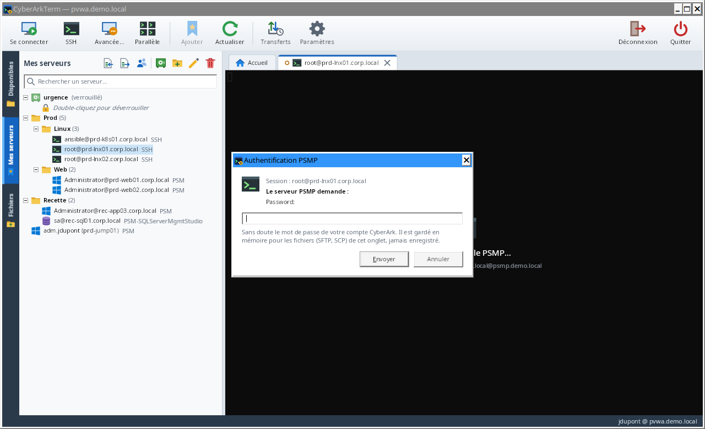 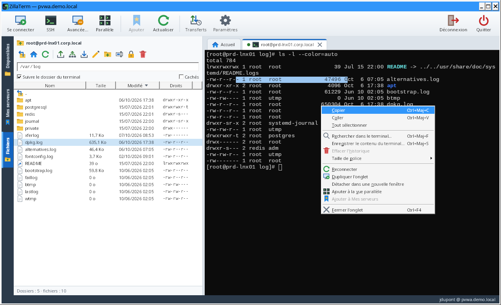

- **Authentification** : si le PVWA fournit une clé « MFA caching », aucune question n'est posée. Sinon, les
  questions du PSMP (mot de passe, code MFA) s'affichent dans une fenêtre qui nomme la session concernée, avec une
  aide selon la question : sans doute le mot de passe de votre compte CyberArk (réutilisé pour les connexions SFTP
  et SCP du même onglet, jamais enregistré), ou le code MFA (redemandé à chaque connexion).
- **Clé du PSMP** : à la première connexion, une fenêtre montre son empreinte SHA-256 en police fixe, avec
  « Copier » : comparez-la avec celle publiée par votre équipe CyberArk avant « Faire confiance et se connecter »
  (« Annuler la connexion » est le bouton par défaut). L'empreinte est ensuite mémorisée sur le poste. Si la clé
  change, un bandeau rouge avertit d'une possible interception, l'empreinte mémorisée et la nouvelle sont affichées,
  et « Remplacer la clé et se connecter » n'est possible qu'après avoir coché « J'ai confirmé ce changement avec
  l'équipe CyberArk ». Une clé refusée arrête la connexion (« Connexion annulée : la clé du serveur n'a pas été
  acceptée. »).
- **Terminal** : la sélection copie, la molette ou la barre de défilement à droite parcourt l'historique ; après
  avoir remonté, « ↓ Revenir à la fin » (ou une frappe au clavier) ramène à la fin. AltGr fonctionne sur clavier
  français. Fermez l'onglet avec la croix, un clic molette ou `Ctrl+F4` (confirmation si la session est connectée).
- **Fin de session** : un bandeau en haut du terminal donne la raison de la fin, avec « Reconnecter » ; les
  dernières lignes restent lisibles, sélectionnables et copiables.
- **Clic droit dans le terminal** (ou touche Menu du clavier) : copier, coller, tout sélectionner, rechercher,
  enregistrer le contenu, effacer l'historique (sur ce poste seulement, rien n'est envoyé au serveur), taille de
  police, et les actions de l'onglet (reconnecter, dupliquer, détacher, vue parallèle, ajouter à « Mes serveurs »,
  fermer). Pour coller d'un simple clic droit, cochez « Le clic droit dans le terminal colle le presse-papiers » dans
  les Paramètres ; Maj+clic droit ouvre alors le menu.
- **Coller plusieurs lignes** : quand le shell exécuterait les lignes une à une (pas de collage protégé, « bracketed
  paste »), une fenêtre montre les lignes et demande confirmation (« Coller », « Annuler » par défaut), avec la case
  « Ne plus avertir avant de coller plusieurs lignes » (réglage « Avertir avant de coller plusieurs lignes quand le
  shell les exécuterait une à une », Paramètres › Terminal).
- **Apparence** : palette de couleurs et taille de police dans les Paramètres (Campbell, One Half, Solarized, en
  sombre ou en clair) ; `Ctrl+molette` agrandit ou réduit un terminal, `Ctrl+0` revient à la taille par défaut.
- **Rechercher** dans le terminal, historique compris : `Ctrl+Maj+F` (ou clic droit dans le terminal ou sur
  l'onglet). Les occurrences sont surlignées ; `Entrée` remonte vers les plus anciennes, `Maj+Entrée` redescend,
  `Échap` ferme.
- **Enregistrer le contenu** du terminal (historique et écran) dans un fichier texte : `Ctrl+Maj+S` (ou clic droit
  dans le terminal ou sur l'onglet). Seulement à votre demande : le fichier peut contenir des informations
  sensibles.
- **Détacher un onglet** (autre écran) : glissez l'onglet SSH hors de la fenêtre, ou clic droit → « Détacher dans
  une nouvelle fenêtre ». Le terminal passe dans une fenêtre séparée, la session continue. L'onglet garde sa place
  (« Afficher la fenêtre », « Ramener dans l'onglet ») et l'onglet Fichiers travaille sur cette session quand il est
  sélectionné. Fermer la fenêtre séparée ramène le terminal dans son onglet, sans fermer la session. Les onglets
  Bureau à distance ne se détachent pas (utilisez « Plein écran ») ; les sessions PSM s'ouvrent déjà dans la
  Connexion Bureau à distance de Windows, une fenêtre à part.
- **Vue parallèle** (jusqu'à 8 sessions à l'écran) : bouton « Parallèle » de la barre d'outils (grisé tant
  qu'aucune session SSH n'est ouverte), ou clic droit sur un
  onglet SSH → « Ajouter à la vue parallèle ». Cochez les sessions SSH ouvertes à afficher ensemble (8 au plus) :
  elles s'affichent en grille dans l'onglet « Parallèle », côte à côte jusqu'à 3, puis sur deux lignes. Chaque
  session a son titre et son état (anneau pendant la connexion, pastille pleine ensuite) ; « ⤢ » (ou double-clic
  sur le titre) l'agrandit seule, « ✕ » la renvoie dans son onglet. La session où vous tapez a un cadre plus épais
  et la marque « ⌨ Saisie ici ». L'onglet Fichiers suit la session où vous travaillez. « Fermer la vue » rend chaque
  terminal à son onglet, sans fermer les sessions. Les sessions Bureau à distance n'y vont pas.
  - **Saisie simultanée** : bouton « Saisie simultanée » de la vue. Ce que vous tapez dans une session cochée
    (« Reçoit la saisie ») est aussi envoyé aux autres sessions cochées et connectées : la même commande sur
    plusieurs serveurs. Elle est **désactivée à chaque ouverture de la vue** ; active, le bouton passe en ambre avec
    « ACTIVE (n) », un bandeau ambre donne le nombre et le nom des sessions qui reçoivent la saisie, et un cadre
    ambre les entoure ; les sessions décochées sont atténuées et marquées « exclue ». Une session ajoutée
    pendant qu'elle est active n'est pas cochée ; ce qui est tapé dans une session décochée ne va qu'à elle. Chaque
    touche est encodée par la session qui la reçoit (les flèches fonctionnent dans un shell comme dans vim). La
    molette n'est pas recopiée, et coller plusieurs lignes dans plusieurs sessions demande confirmation.
  - **Depuis « Mes serveurs »** : clic droit sur un dossier → « Ouvrir en vue parallèle » connecte ses serveurs SSH
    (sous-dossiers compris) et les place directement dans la vue ; ou choisissez des serveurs avec `Ctrl+clic`
    (`Maj+clic` pour une suite) puis clic droit → « Ouvrir les N serveurs en vue parallèle ». Au-delà des places
    libres (8 au plus), une fenêtre demande lesquels ouvrir ; les serveurs Windows (PSM) sont laissés de côté.
    Chaque connexion reste une session PSMP distincte, avec ses questions habituelles.
  - **Fenêtre séparée** : bouton « Fenêtre séparée » de la vue, clic droit sur l'onglet « Parallèle », ou glissez
    l'onglet hors de la fenêtre. La fermer ramène la vue dans son onglet, sans fermer les sessions.
  - **Envoyer des fichiers** aux sessions de la vue : bouton « Envoyer des fichiers… » (voir l'onglet Fichiers).

## 5. Parcourir et déposer des fichiers : onglet « Fichiers »

L'onglet **Fichiers** du panneau de gauche (`Ctrl+3`) suit l'onglet SSH actif et s'affiche à l'ouverture d'une session
SSH. Il sert aussi aux sessions de fichiers seuls, qui l'affichent à leur ouverture : comptes CyberArk en
SFTP via le PSMP ([section 4](#4-ouvrir-une-session-ssh-via-le-psmp)) et
entrées KeePass SFTP, FTP, FTPS ([section 7](#7-accès-durgence-hors-cyberark--bases-keepass)).

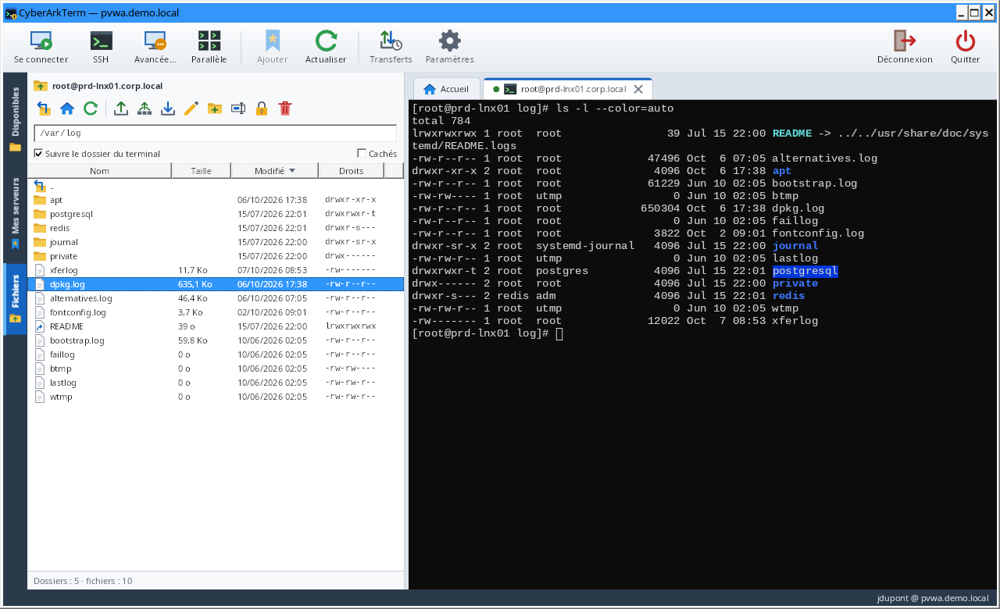

- **Pastille de l'onglet** : sur l'onglet « Fichiers », une pastille donne le nombre de transferts en cours ou en
  attente, ou « ! » pour un transfert en échec ou différent que vous n'avez pas encore vu (afficher l'onglet le
  marque vu). Le bouton de CyberArkTerm dans la barre des tâches de Windows montre aussi l'activité ou l'échec.
- **Barre de navigation** : chemin courant, modifiable (tapez un chemin puis Entrée). Double-clic sur un dossier
  pour y entrer, `..` pour remonter, boutons « dossier parent » (icône distincte de celle d'« Envoyer ») et
  « dossier personnel ».
- **Colonnes et tri** : cliquez sur l'en-tête d'une colonne (Nom, Taille, Modifié, Droits) ; un second clic inverse
  l'ordre (une flèche l'indique). La taille et la date commencent par les plus gros et les plus récents. Les dossiers
  restent en tête ; le tri est gardé d'un dossier et d'une session à l'autre. La colonne Nom prend la largeur
  laissée par les autres ; quand le panneau est étroit, la colonne Droits est masquée plutôt que coupée (elle
  revient en élargissant le panneau).
- **Boutons de la barre** : Télécharger, Modifier, Renommer, Droits et Supprimer sont grisés, comme dans le menu,
  tant que la sélection ne convient pas ; leur infobulle dit quoi choisir (« Choisissez un seul fichier (pas un
  dossier). »…).
- **Déposer des fichiers** : glissez-les depuis l'Explorateur sur la liste (ou bouton « Envoyer »). Envoi en **SFTP**
  par défaut (SCP au choix dans les Paramètres), dossiers compris. Déposés sur la ligne d'un dossier, ils vont dans
  ce dossier : la ligne est mise en surbrillance et la barre d'état indique la destination (« Déposer dans
  serveur:/chemin »). Si des éléments existent déjà sur le serveur (fichiers cachés compris, même non affichés), une
  confirmation nomme le serveur et les éléments, et propose « Remplacer », « Ignorer les existants » ou « Annuler »
  (par défaut) ; un fichier remplacé est réécrit sur place et reste incomplet si l'envoi est annulé ou échoue.
  Si le serveur refuse ce protocole pour un fichier avant de le recevoir (règle du PSMP, SFTP en lecture seule…),
  l'autre prend le relais aussitôt, sans question ni attente : la barre d'état et le bilan l'indiquent avec la
  réponse du serveur, l'historique des transferts aussi (« SCP (SFTP refusé) »). En SCP, après un refus à l'annonce d'un fichier, les
  fichiers au moins aussi gros partent directement en SFTP jusqu'à la fermeture de l'onglet.
- **Télécharger** : bouton « Télécharger » ou clic droit. Un fichier demande où l'enregistrer ; plusieurs vont dans un
  dossier choisi, avec une seule question (« Remplacer ») pour ceux qui y sont déjà. Un fichier local n'est remplacé qu'une fois son
  téléchargement complet : un téléchargement coupé ou annulé le laisse tel qu'il était. « Télécharger » ne prend
  que des fichiers : pour un dossier, la barre d'état rappelle de le glisser vers l'Explorateur ou sur le bureau.
- **Télécharger en glissant** : glissez des fichiers ou des dossiers de la liste vers l'Explorateur ou le bureau.
  Rien n'est téléchargé pendant le glissement : au dépôt, une fenêtre montre la progression (Annuler l'interrompt),
  puis l'Explorateur copie les fichiers là où vous les avez déposés. Les noms Unix sont rendus valides pour Windows
  (`\`, `:`, `..`, `CON`… remplacés), sans jamais écrire hors du dossier de dépôt ; le dossier temporaire du
  téléchargement est effacé ensuite.
- **File d'attente des transferts** : envois et téléchargements s'exécutent un par un, dans l'ordre des demandes ;
  ce qui est demandé pendant un transfert s'ajoute à la file au lieu d'être ignoré. La destination d'un envoi est le
  dossier affiché au moment du dépôt (ou le dossier sur lequel les fichiers ont été déposés), et la confirmation
  d'écrasement tient compte des envois encore en attente. Le panneau « Transferts », au-dessus de la barre d'état,
  montre chaque élément avec son serveur (en attente, avancement et fichier n/N, vérification, résultat) : ✕ retire
  un élément en attente, « Annuler » arrête celui en cours, « Tout annuler » annule tout ce qui reste. Les résultats
  restent affichés une fois les transferts finis : « ✓ terminé · SHA-256 vérifié (n/n) », « ⚠ terminé · non
  vérifié : n sur N », ou l'échec en rouge ; « Détails » sur une ligne terminée montre la somme SHA-256 de chaque
  fichier, et « Effacer les terminés » retire de la liste les transferts terminés, en échec ou annulés
  (l'historique des transferts les garde). Un
  transfert arrêté supprime le fichier en cours, incomplet (sur le serveur pour un envoi, sur le poste pour un
  téléchargement) ; les fichiers déjà transférés restent. Attention : si l'envoi remplaçait un fichier existant et
  avait commencé à l'écrire, son ancien contenu est perdu ; arrêté avant tout contenu, le fichier du serveur reste
  tel quel. En SCP, l'arrêt ne concerne que ce transfert : les éléments suivants continuent sur la
  même connexion ; un transfert qui n'avance plus (serveur qui ne lit plus) s'arrête 2 s après « Annuler » et les
  suivants partent sur une nouvelle connexion. Un fichier envoyé par SCP prend sur le serveur la date de l'envoi (comme `scp` sans `-p`, et comme en SFTP). Une
  erreur est affichée en rouge dans la file et la file continue ; à la fin, un seul bilan dans la barre d'état de
  l'onglet (trois lignes au plus, texte complet en infobulle). La navigation, la suppression, les
  droits, l'éditeur et le glisser vers l'Explorateur passent entre deux fichiers. Fermer l'onglet avec des
  transferts en cours demande confirmation (« Annuler les transferts et fermer » ou « Continuer les transferts ») ;
  à la déconnexion et à la sortie, ils figurent dans le récapitulatif.
- **Beaucoup de fichiers d'un coup : archive .tar.gz** : à partir de 200 fichiers déposés (seuil réglable, option
  « Proposer une archive .tar.gz » des Paramètres), CyberArkTerm propose de les envoyer dans une seule archive : un
  fichier à transférer et à vérifier au lieu de milliers, beaucoup plus rapide via le PSMP. L'archive est créée sur
  le poste (dans la file, annulable), envoyée et vérifiée (SHA-256), puis supprimée du poste ; chaque élément déposé
  est à la racine de l'archive (droits 0644 et 0755). Rien n'est exécuté sur le serveur : un encadré orange apparaît
  en bas de l'onglet Fichiers avec la commande d'extraction, par exemple `cd '/opt/app' && /usr/bin/gzip -dc
  './deploy.tar.gz' | tar xf - && rm -f './deploy.tar.gz'` (l'archive est supprimée du serveur une fois extraite).
  « Copier la commande », ou « Écrire dans le terminal » qui la tape à l'invite de la session sans l'exécuter :
  vérifiez-la, puis appuyez sur Entrée. L'encadré reste affiché (pour la session concernée) jusqu'à ce que vous le
  fermiez. « Envoyer les fichiers un par un » garde l'envoi habituel ; « Ne plus proposer » décoche l'option.
  - **Tous les Unix** (Red Hat 5 à 9, HP-UX 11.11 et 11.31, Solaris, AIX…) : l'archive est au format tar POSIX
    standard (ustar), lu par tous les tar, et la commande utilise `gzip` et `tar xf` séparément, sans option propre
    à GNU tar. Elle se tape dans n'importe quel shell (sh, ksh, bash, zsh, csh, tcsh).
  - **gzip** est cherché sur le serveur (par SFTP) là où chaque système l'installe : `/bin`, `/usr/bin`,
    `/usr/contrib/bin` (HP-UX), `/usr/local/bin`, `/opt/freeware/bin` (AIX), `/usr/sfw/bin` et `/opt/csw/bin`
    (Solaris). Introuvable : l'archive est envoyée sans compression (`.tar`), extraite par `tar` seul.
  - Un nom de plus de 100 caractères (hors dossiers) ou un fichier de plus de 8 Go ne tient pas dans ce format : les
    fichiers sont alors envoyés un par un, avec un message.
- **Envoyer vers plusieurs serveurs** : bouton (flèche vers trois serveurs) ou clic droit → « Envoyer vers plusieurs
  serveurs… ». Choisissez les fichiers ou dossiers, le dossier de destination (`~` = le dossier personnel du compte
  sur chaque serveur, par ex. `~/deploy`) et les sessions SSH destinataires. CyberArkTerm vérifie d'abord sur chaque
  serveur que le dossier existe et ce qui serait remplacé (une seule question pour tous), puis met en file un envoi
  par serveur : même protocole, même vérification SHA-256 sur chaque serveur, un seul bilan à la fin.
- **Comparer** : clic droit sur un fichier → « Comparer avec… » : le même chemin (ou un autre) sur un serveur dont
  une session SSH est ouverte, ou un fichier de ce poste ; avec deux fichiers sélectionnés, « Comparer les 2
  fichiers ». « Parcourir… » à côté du chemin ouvre un explorateur de l'autre serveur, sur le même dossier, fichier
  présélectionné (ou sur le plus proche dossier parent qui existe) : double-clic sur un dossier pour y entrer,
  Retour arrière pour remonter, un chemin peut aussi être tapé ; le fichier choisi remplace le chemin. L'onglet
  Fichiers de ce serveur ne change pas de dossier. Le même fichier sur le même serveur est refusé ; sans autre
  serveur ouvert, un fichier de ce poste est proposé. Les fichiers sont lus **en mémoire** (50 Mo au plus chacun), sans copie sur le poste. La fenêtre
  montre les lignes côte à côte : retirées en rouge à gauche, ajoutées en vert à droite. `F7` / `Maj+F7` :
  différence suivante / précédente ; « Ignorer les espaces » ; « Seulement les différences » ; « Enregistrer le
  diff… » au format `diff -u`. Un fichier binaire (ou de plus de 10 Mo) est comparé par sa taille et sa somme
  SHA-256. Avec un outil de comparaison choisi dans les Paramètres (WinMerge, VS Code…), « Ouvrir dans … » lui donne
  deux copies temporaires, supprimées à la fermeture de la fenêtre.
- **Historique des transferts** : bouton « Transferts » de la barre d'outils (flèches montante et descendante avec
  une horloge, à gauche de « Paramètres »), disponible même sans session. Il liste les 200 derniers envois et
  téléchargements (y compris par glisser-déposer) : date, sens, serveur, élément, destination, nombre de fichiers,
  protocole (« SCP (SFTP refusé) » quand l'autre protocole a pris le relais), résultat, écrit comme dans la file ;
  les échecs et les fichiers différents sont en rouge, et le texte d'une colonne trop étroite s'affiche en
  infobulle. Filtre « Envois » / « Téléchargements » ; « Sommes de contrôle… » (ou double-clic) montre, pour chaque
  fichier, la taille, les sommes SHA-256 et le résultat, et les copie au format de `sha256sum -c` pour revérifier
  sur le serveur ; « Ouvrir le dossier » pour un téléchargement ; « Effacer l'historique », à l'écart des autres
  boutons, demande confirmation (les fichiers eux-mêmes ne sont pas touchés).
- **Vérification des transferts (SHA-256)** : chaque fichier envoyé ou téléchargé est vérifié. À l'envoi (SCP ou
  SFTP), le fichier local est haché, puis le fichier arrivé sur le serveur est relu par SFTP et haché. Au
  téléchargement, les données reçues du serveur sont hachées, puis le fichier écrit sur le poste est relu. La barre
  d'état confirme « ✓ identique des deux côtés » ; les sommes de chaque fichier sont dans « Détails » de la file et
  dans l'historique des transferts (bouton « Transferts »). Si un fichier diffère, l'erreur est affichée et le détail s'ouvre de lui-même ; un
  téléchargement par glisser-déposer échoue plutôt que de livrer une copie fausse. Un fichier qui ne peut pas être
  relu (droits) est signalé « non vérifié ». La relecture d'un envoi double le volume échangé avec le serveur.
- **Supprimer** : sélection puis Suppr (ou clic droit → « Supprimer (rm) »), avec une confirmation qui nomme le
  serveur et rappelle qu'il n'y a pas de corbeille sur le serveur. Les dossiers doivent
  être vides. Un lien symbolique est supprimé lui-même, jamais le fichier ou le dossier vers lequel il pointe.
- **Renommer** : `F2`, clic droit → « Renommer… » ou bouton de la barre. Un fichier n'est jamais écrasé : un nom déjà
  pris est refusé avant tout envoi au serveur (en SFTP comme en FTP). « / », « . », « .. » et les caractères de
  contrôle (retour à la ligne, tabulation…) sont refusés, comme pour « Nouveau dossier ».
- **Modifier un fichier** : **double-clic** sur le fichier (ou `Entrée`, `F4`, clic droit → « Modifier », bouton
  crayon). Le fichier s'ouvre dans l'éditeur de texte choisi dans les Paramètres (Bloc-notes par défaut). Au
  double-clic, une archive, une image, un exécutable ou un document bureautique est téléchargé plutôt qu'ouvert, de
  même qu'un fichier dont les premiers octets sont binaires. À chaque enregistrement, CyberArkTerm
  propose de le renvoyer sur le serveur (« Renvoyer » ou « Pas maintenant ») : envoi en SFTP, droits du fichier
  conservés. Si le fichier a changé sur le serveur depuis son ouverture, une alerte le dit et demande confirmation
  (« Remplacer par ma version ») avant de l'écraser.
- **Suivre un fichier (tail -f)** : clic droit sur un ou plusieurs fichiers → « Suivre (tail -f) ». Une fenêtre
  montre la fin du fichier puis chaque nouvelle ligne dès qu'elle est écrite, comme `tail -f`, en lisant le fichier
  par SFTP chaque seconde : aucune commande n'est lancée sur le serveur. Un fichier tronqué ou remplacé par une
  rotation est relu depuis le début ; les 10 000 dernières lignes sont gardées.
  - **Couleurs et alertes** : erreurs (ERROR, FATAL, CRITICAL…) en rouge, avertissements (WARN) en orange ; mots
    surlignés en jaune au choix (« Surligner », séparés par des virgules). « Alerte si » (par ex. `ERROR,
    OutOfMemory, Connection refused`) : chaque nouvelle ligne qui contient l'un de ces mots est marquée, le compteur
    « ⚠ n alertes » augmente (un clic va à la ligne suivante) et le bouton de la fenêtre clignote dans la barre des
    tâches ; une notification Windows est possible, au plus une toutes les 30 s, avec le nombre de lignes et le nom
    du fichier seulement, **jamais le contenu des lignes** (elle peut s'afficher sur l'écran verrouillé). Ces
    réglages sont gardés pour les fenêtres suivantes.
  - **Vue combinée** : plusieurs fichiers sélectionnés s'ouvrent dans une seule fenêtre, et « Ajouter à une fenêtre
    de suivi » y ajoute un fichier d'un autre onglet, donc d'un autre serveur. Les lignes s'intercalent dans l'ordre
    d'arrivée, préfixées et colorées par fichier (`[root@srv01 app.log]`) ; en bas, chaque fichier a son état et un
    bouton pour arrêter de le suivre.
  - **Filtre et recherche** : filtre (comme `grep`), exclusion (comme `grep -v`), lignes de contexte (comme `grep -C
    3`), en texte simple ou en expressions régulières. Un champ de filtre ou d'exclusion rempli passe sur fond ambre,
    avec ✕ pour le vider, et la barre d'état indique « Filtre : n / N lignes affichées ». `Ctrl+F` cherche dans les
    lignes sans les filtrer (Entrée / `F3` : suivant, `Maj+F3` : précédent). Remonter dans les lignes arrête de
    suivre la fin.
  - **Coupures** : si la connexion est perdue, un repère l'indique ; quand l'onglet SSH se reconnecte (ou avec
    « Reconnecter »), le suivi reprend là où il s'était arrêté, avec les lignes écrites entre-temps. Fermer l'onglet
    arrête le suivi de ses fichiers ; la fenêtre garde les lignes reçues.
  - **Fichiers mémorisés** : sur un serveur de l'onglet « Mes serveurs », les fichiers suivis sont mémorisés (les 12
    derniers) ; à la connexion suivante, le bouton de suivi de l'onglet Fichiers les propose : « Tout suivre dans
    une fenêtre » en un clic, ou un seul.
  - **Garder une trace** : « Enregistrer… » écrit les lignes affichées dans un fichier de ce poste ; « Enregistrer
    en continu… » écrit les lignes déjà reçues puis chaque nouvelle ligne dès son arrivée, tant que la case est
    cochée ; « Repère » insère une ligne `—— 14:32:05 ——` pour retrouver un moment (avant une manipulation, par
    exemple).
  - **Connexion** : par défaut, le suivi utilise la connexion SFTP de l'onglet Fichiers ; il passe alors entre deux
    fichiers d'un transfert. L'option « Suivre les fichiers (tail -f) dans une session indépendante » des Paramètres
    lui donne sa propre connexion, une par fenêtre et par serveur : il n'attend plus les transferts, mais c'est une
    session PSMP de plus (enregistrée à part, et une validation MFA peut être demandée). Elle est fermée avec la
    fenêtre. Une connexion perdue n'est jamais rouverte en boucle.
- **Droits** : clic droit → « Droits… » (ou bouton cadenas). Cases lecture / écriture / exécution pour le
  propriétaire, le groupe et les autres, bits spéciaux (setuid, setgid, sticky) et valeur octale (`644`, `1777`…),
  pour un ou plusieurs éléments. Quand les éléments choisis n'ont pas tous les mêmes droits, une case laissée à
  l'état intermédiaire ne change pas ce droit sur chaque élément : seuls les droits modifiés sont appliqués. Pour un
  dossier, l'option « Appliquer aussi au contenu » propage les droits aux
  sous-dossiers et fichiers ; par défaut, l'exécution (x) n'est donnée qu'aux dossiers et aux fichiers déjà
  exécutables. Le bouton devient alors « Appliquer récursivement… » et une confirmation rappelle ce qui va se
  passer ; pendant la propagation, « Arrêter » dans l'onglet Fichiers l'interrompt (les éléments déjà traités gardent
  leurs nouveaux droits). Les liens symboliques ne sont pas suivis, le propriétaire n'est pas modifié.
- Aussi : nouveau dossier, téléchargement, copie du chemin, affichage des fichiers cachés.
- **Suivre le dossier du terminal** : quand la case est cochée, chaque `cd` dans le terminal déplace le navigateur
  dans le même dossier (voir [Fonctionnement technique](#fonctionnement-technique)). Après un `sudo -i` ou un `su`,
  recochez la case à l'invite du shell pour réactiver le suivi dans ce nouveau shell.

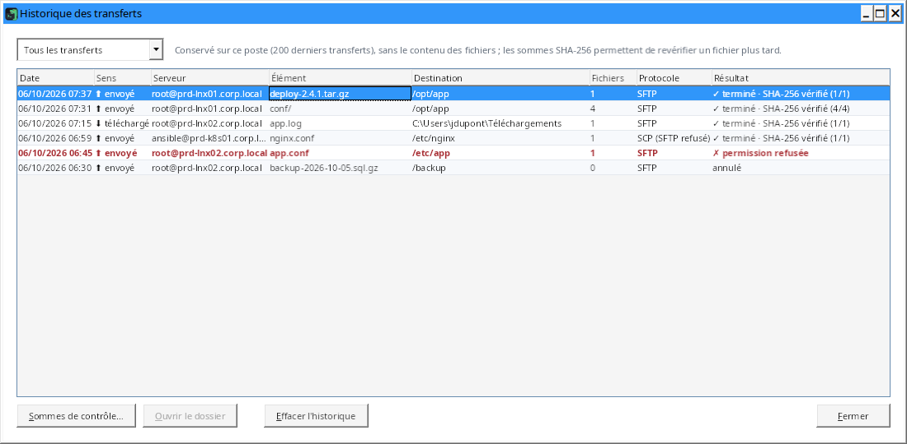

## 6. Organiser ses serveurs : onglet « Mes serveurs »

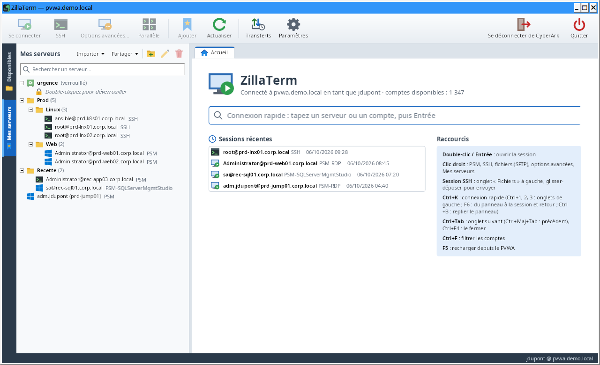

- **Ajouter** un compte : clic droit dans « Disponibles » → « Ajouter à Mes serveurs » puis le dossier voulu,
  ou glissez le compte sur l'onglet « Mes serveurs », ou bouton « Ajouter » de la barre d'outils. Pour un compte de
  domaine, le serveur est demandé (facultatif : sans serveur, il le sera à chaque connexion).
- **Ajouter une session ouverte** : clic droit sur l'onglet de la session (ou dans son terminal) → « Ajouter à Mes
  serveurs » puis le dossier voulu. Le serveur garde le type de connexion et la machine cible ; l'entrée est grisée
  s'il y est déjà.
- **Ajouter une session récente** : clic droit dans « Sessions récentes » sur l'accueil → « Ajouter à Mes
  serveurs » puis le dossier voulu. Le serveur garde le type de connexion (PSM, SSH ou fichiers seuls), le composant
  PSM et la machine cible utilisés.
- **Dossiers** : clic droit → nouveau dossier ou sous-dossier, renommer, supprimer ; glissez serveurs et dossiers
  pour les déplacer. Supprimer un dossier compte et supprime tous ses serveurs de ce PVWA, même ceux que la recherche
  masque ; ceux d'un autre PVWA restent. Retirer un serveur ou supprimer un dossier demande confirmation (les
  comptes restent dans « Disponibles »). Les boutons « Propriétés / renommer » et « Retirer le serveur ou supprimer
  le dossier », en haut de l'onglet, sont grisés tant que rien n'est sélectionné.
- **Rechercher** : champ en haut de l'onglet (ou `Ctrl+F` dans l'onglet). Il filtre les serveurs par nom, serveur,
  utilisateur, dossier, composant, machine cible, ainsi que les entrées des bases KeePass déverrouillées ; les
  dossiers des résultats sont dépliés. `Entrée` ou `↓` sélectionne le premier résultat, `Échap` efface.
- **Plusieurs serveurs à la fois** : `Ctrl+clic` ajoute ou retire un serveur (ou tous ceux d'un dossier), `Maj+clic`
  choisit une suite de serveurs ; `Échap` ou un clic simple annule. Clic droit sur l'un d'eux → « Ouvrir les N
  serveurs en vue parallèle » ou « Se connecter aux N serveurs » (un onglet chacun). Clic droit sur un dossier →
  « Ouvrir en vue parallèle » ou « Se connecter aux N serveurs ».
- **Configuration propre à chaque serveur** (clic droit → « Propriétés… ») :

| Réglage | Effet |
| --- | --- |
| Nom, dossier | Affichage et rangement dans l'arbre. |
| PSM, SSH via PSMP ou fichiers seuls (SFTP via PSMP) | Type de connexion ouvert au double-clic (au départ, d'après la plateforme). |
| Composant PSM | Composant à utiliser (vide : déduit de la plateforme). |
| Machine cible | Serveur sur lequel ouvrir la session pour un compte de domaine. |
| Motif par défaut | Motif d'accès envoyé automatiquement au PVWA. |
| Dossier SFTP de départ | Le terminal **et** le navigateur de fichiers s'ouvrent directement dans ce dossier. |

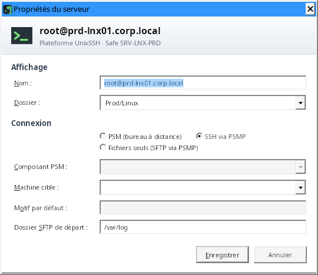

Sans PSMP dans les Paramètres, les types SSH et fichiers seuls sont grisés, comme ailleurs ; une valeur
incorrecte est signalée dans la fenêtre. Un serveur dont le compte n'est plus visible dans CyberArk apparaît grisé.

### Exporter, importer, partager

Trois boutons en haut de l'onglet, à gauche du bouton coffre-fort (bases KeePass) :

- **Exporter** enregistre « Mes serveurs » dans un fichier `.json` : dossiers (même vides), nom, compte CyberArk
  (ID), type de connexion, composant, machine cible, motif par défaut, dossier SFTP de départ. Aucun mot de passe ni
  fichier suivi. Pratique pour changer de poste ou transmettre sa liste.
- **Importer** lit un fichier exporté (ou une liste partagée) et résume avant d'ajouter : serveurs ajoutés, serveurs
  déjà présents (même compte, type, composant, machine cible et dossier : ignorés), dossiers créés, serveurs ouverts
  sur une machine cible (à vérifier : la machine vient du fichier). Rien n'est retiré ni modifié dans « Mes
  serveurs ». Un fichier créé pour un autre PVWA est refusé : ses ID de comptes y désignent d'autres comptes.
- **Listes partagées** (icône deux personnes) : une liste de serveurs dans un fichier sur un partage réseau, que
  toute l'équipe ouvre et complète.
  - « Créer une liste partagée… » : choisissez l'emplacement (partage réseau) et le nom affiché à tous ; « Ouvrir une
    liste partagée… » : ajoutez une liste créée par un collègue. Les listes ouvertes s'affichent en tête de l'onglet
    (après les bases KeePass), avec leurs dossiers ; la recherche les filtre aussi.
  - **Ajouter** : clic droit sur un serveur ou un dossier de « Mes serveurs » → « Partager dans une liste » (le
    dossier est gardé), ou glissez un serveur, un dossier ou un compte de « Disponibles » sur la liste ou l'un de ses
    dossiers (confirmation). Le motif par défaut reste personnel : il n'est jamais partagé.
  - **Retirer** : clic droit → « Retirer de la liste partagée… » (ou `Suppr`), après confirmation.
  - **Utiliser** : double-clic pour se connecter ; clic droit pour la connexion avancée, le mot de passe, les membres
    du safe ou « Copier dans Mes serveurs ». Chacun se connecte avec ses propres droits CyberArk : un compte que vous
    ne voyez pas dans le coffre CyberArk apparaît grisé. L'info-bulle montre le compte tel que CyberArk le décrit, la machine
    cible, qui a ajouté le serveur et quand.
  - **Machine cible** : un serveur partagé qui ouvre un compte de domaine sur une machine absente des machines
    autorisées du compte dans CyberArk demande confirmation à la première connexion (la liste peut être modifiée par
    quiconque a le droit d'écrire sur le partage). « Copier dans Mes serveurs » nomme ces serveurs et demande avant
    de les copier.
  - **Liste d'un autre PVWA** : une liste créée pour un autre coffre CyberArk s'affiche, mais ses serveurs ne s'ouvrent pas et
    ne se copient pas, et rien ne peut y être ajouté : connectez-vous à ce PVWA pour l'utiliser.
  - **Historique** : clic droit → « Historique des modifications… ». L'onglet « Modifications » liste qui a ajouté,
    retiré ou restauré quoi, et quand ; l'onglet « Versions » garde une copie de la liste à chaque révision (les 100
    dernières, dans le dossier `nom.versions` à côté du fichier). Sur cet onglet, « Restaurer cette version… » remet
    la liste dans cet état pour tout le monde, après confirmation ; la restauration est elle-même enregistrée, donc
    annulable.
  - Les modifications de chacun se cumulent : le fichier est relu et modifié en exclusivité (un poste qui écrit en
    même temps attend son tour), et la liste affichée se met à jour quand un collègue la modifie (`F5` la relit
    aussi). « Fermer la liste » la retire de votre onglet sans toucher au fichier.
  - Droits : ceux du partage réseau. En lecture seule, la liste reste utilisable mais ne peut pas être modifiée.

## 7. Accès d'urgence hors CyberArk : bases KeePass

Quand CyberArk est indisponible, CyberArkTerm ouvre vos bases KeePass (`.kdbx`) et se connecte **directement** aux
serveurs, en SSH, en bureau à distance ou en VNC, ou à leurs seuls fichiers (SFTP, FTP, FTPS), avec les comptes
qu'elles contiennent.

> Ces connexions **ne passent pas par le PSM** : ni enregistrement, ni règles CyberArk. Chaque ouverture de
> base, connexion et modification est notée dans le journal local `%APPDATA%\CyberArkTerm\urgence.log`.

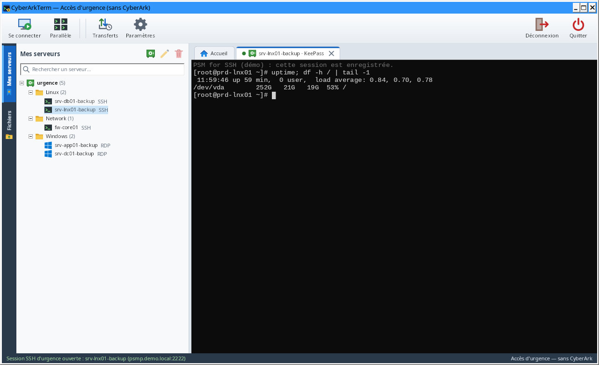

- **Sans CyberArk** : sur l'écran de connexion, « Accès d'urgence (KeePass) » ouvre la fenêtre principale sans PVWA
  (seules les bases KeePass y figurent ; l'onglet « Disponibles » et les boutons propres à CyberArk sont masqués).
  Avec CyberArk, les bases apparaissent aussi en tête de l'onglet « Mes serveurs ». L'infobulle d'un onglet de
  session ouvert depuis une base le rappelle : « Accès direct d'urgence (KeePass) : hors CyberArk, noté dans
  urgence.log ».
- **Ajouter une base** : bouton coffre-fort de l'onglet « Mes serveurs » (ou clic droit → « Ajouter une base
  KeePass… »). La fenêtre « Ajouter une base KeePass » rappelle en bandeau que ces connexions sont hors CyberArk ;
  « Parcourir… » choisit le fichier `.kdbx`, puis le nom et un fichier clé éventuel.
- **Déverrouiller** : double-clic sur la base. Mot de passe maître et/ou fichier clé (tous les formats de
  KeePass). « Mémoriser le mot de passe maître dans le coffre local » évite de le ressaisir (voir ci-dessous).
- **Se connecter** : double-clic sur une entrée. Le protocole vient de son adresse (`ssh://serveur:22`,
  `rdp://serveur`, `vnc://serveur`, `sftp://`, `ftp://`, `ftpes://`, `ftps://`, ou `serveur:3389`), d'un champ
  « Protocol » / « Port » ou d'une étiquette (`ssh`, `rdp`, `vnc`, `sftp`, `ftp`, `ftpes`, `ftps`) ; sinon
  CyberArkTerm demande le protocole. Le mot de passe de l'entrée est utilisé directement ; il n'est jamais affiché ni
  écrit sur disque.
  - **SSH** : onglet terminal + Fichiers. À la première connexion, l'empreinte de la clé du serveur est à comparer
    avec celle que donne son administrateur, dans la même fenêtre que pour le PSMP (voir
    [section 4](#4-ouvrir-une-session-ssh-via-le-psmp)).
  - **Bureau à distance** : l'onglet suit sa taille (résolution du bureau distant), propose « Plein écran »
    (`Ctrl+Alt+Pause` pour revenir), « Déconnecter » et « Reconnecter ».
  - **VNC** (`vnc://serveur`, port 5900 ; `vnc://serveur:1` désigne l'écran 1, port 5901) : bureau dans un onglet,
    ajusté à la fenêtre ou en taille réelle (« Ajuster »), boutons « Ctrl+Alt+Suppr » (après confirmation : selon
    la machine, il ouvre l'écran de sécurité ou redémarre certaines consoles de machines virtuelles), « Envoyer le
    presse-papiers » et « Copier le texte distant » : le presse-papiers n'est échangé que par ces boutons. Authentification par mot de
    passe VNC (8 caractères au plus, limite du protocole) ou sans authentification. **VNC ne chiffre rien** : un
    bandeau le rappelle ; réservez-le à un réseau de confiance.
  - **Fichiers** (`sftp://`, `ftp://`, `ftpes://` pour FTP avec TLS explicite, `ftps://` pour TLS implicite, port
    990) : un onglet d'état, sans terminal, et les fichiers dans l'onglet « Fichiers » avec les mêmes fonctions
    (transferts vérifiés par SHA-256, file d'attente, historique, éditeur, comparaison, suivi en direct, droits si
    le serveur accepte `SITE CHMOD`). Clic droit → « Ouvrir les fichiers (SFTP, FTP) » fait de même pour une entrée
    SSH, en SFTP. En `ftp://`, le chiffrement TLS est tenté d'abord ; si le serveur ne le propose pas, CyberArkTerm
    demande avant de se connecter en clair (« Se connecter sans chiffrement », une fois par session) et un bandeau le
    rappelle. `ftpes://` et `ftps://` ne passent jamais en clair. Un certificat FTPS que Windows n'approuve pas
    (auto-signé…) est montré avec son sujet, son émetteur, ses dates de validité et son empreinte SHA-256 (avec
    « Copier »), puis mémorisé pour ce serveur si vous l'acceptez ; s'il change ensuite, l'empreinte mémorisée et la
    nouvelle sont affichées, et il faut cocher « J'ai confirmé ce changement avec l'administrateur du serveur ».
- **Modifier la base** : clic droit → « Nouvelle entrée… », « Modifier… » (`F2`), « Supprimer » (`Suppr`, vers la
  corbeille de la base, après confirmation). L'adresse du serveur est obligatoire : une entrée sans adresse (ni
  dans le champ Adresse, ni dans ses champs personnalisés) n'est pas enregistrée. Les autres données de la base
  (pièces jointes, champs, réglages) sont gardées ; l'ancienne version d'une entrée va dans son historique, comme
  dans KeePass.
- **Verrouiller** : clic droit → « Verrouiller ». Les bases se verrouillent aussi à la déconnexion, à la fermeture
  et au **verrouillage de Windows**.

**Coffre local** : les mots de passe maîtres que vous choisissez de mémoriser sont gardés dans
`%APPDATA%\CyberArkTerm\coffre-local.dat`, chiffré avec un mot de passe à vous (8 caractères au moins) et lié à
votre compte Windows. Ce mot de passe est demandé au déverrouillage d'une base KeePass dont le mot de passe est
mémorisé ; « Plus tard » (proposé seulement à ce moment-là) permet de saisir plutôt le mot de passe de la base.
Si le coffre local n'est pas ouvert, la base s'ouvre quand même, et la barre d'état signale que son mot de passe
maître n'a pas été mémorisé. Gestion dans les **Paramètres**, page Sécurité : « Créer le coffre… »,
« Déverrouiller… », « Changer le mot de passe… », « Supprimer maintenant… » ; ces actions s'appliquent tout de
suite, sans « Enregistrer ». Il se verrouille à la déconnexion (« Accès d'urgence » ne rouvre ainsi jamais les
bases mémorisées sans mot de passe), à la fermeture et au verrouillage de Windows.

## Raccourcis

| Où | Action | Raccourci |
| --- | --- | --- |
| Partout | Recharger les comptes depuis le PVWA | `F5` |
| Partout | Filtrer les comptes (dans « Mes serveurs » : rechercher un serveur) | `Ctrl+F` |
| Partout | Onglet de session suivant / précédent | `Ctrl+Tab` / `Ctrl+Maj+Tab` |
| Partout | Fermer l'onglet de session | `Ctrl+F4` ou `Ctrl+Maj+W` |
| Partout | Onglets « Disponibles », « Mes serveurs », « Fichiers » du panneau de gauche | `Ctrl+1`, `Ctrl+2`, `Ctrl+3` |
| Partout | Paramètres | `Ctrl+,` |
| Hors terminal | Connexion rapide (onglet Accueil) | `Ctrl+K` |
| Hors terminal | Passer du panneau de gauche à la session et retour | `F6` |
| Hors terminal | Replier / déplier le panneau de gauche | `Ctrl+B` (ou double-clic sur le séparateur) |
| Listes et arbres | Ouvrir la session | Double-clic ou `Entrée` |
| Listes, arbres, onglets | Menu du clic droit | Touche Menu ou `Maj+F10` |
| Recherche | Effacer le filtre | `Échap` |
| Accueil | Retirer une session récente de la liste | `Suppr` |
| Mes serveurs | Renommer / retirer ou supprimer | `F2` / `Suppr` |
| Mes serveurs | Choisir plusieurs serveurs (puis clic droit pour les ouvrir ensemble) | `Ctrl+clic`, `Maj+clic` ; `Échap` annule |
| Terminal | Copier | Sélection à la souris, ou `Ctrl+Maj+C` |
| Terminal | Coller | `Maj+Inser` ou `Ctrl+Maj+V` (clic droit avec l'option des Paramètres) |
| Terminal | Menu : copier, coller, tout sélectionner, rechercher, enregistrer, effacer l'historique, police, actions de l'onglet | Clic droit ou touche Menu (Maj+clic droit avec l'option de collage) |
| Terminal | Historique | Molette, barre de défilement, `Maj+Page préc.` / `Maj+Page suiv.` ; « ↓ Revenir à la fin » |
| Terminal | Rechercher (historique compris) | `Ctrl+Maj+F`, puis `Entrée` / `Maj+Entrée` |
| Terminal | Enregistrer le contenu dans un fichier | `Ctrl+Maj+S` |
| Terminal | Taille de police / taille par défaut | `Ctrl+molette` / `Ctrl+0` |
| Comparaison | Différence suivante / précédente | `F7` / `Maj+F7` |
| Onglet SSH ou Bureau à distance | Fermer | Croix de l'onglet ou clic molette |
| Onglet SSH ou Bureau à distance | Reconnecter, dupliquer (autre session sur le même compte ou la même entrée), détacher (SSH), fermer, fermer les autres onglets | Clic droit sur l'onglet |
| Onglet SSH | Détacher dans une fenêtre séparée (autre écran) | Glisser l'onglet hors de la fenêtre |
| Onglet SSH | Ajouter à la vue parallèle, ou l'en retirer | Clic droit sur l'onglet |
| Bureau à distance | Plein écran / retour | `Ctrl+Alt+Pause` |
| Fichiers | Ouvrir le dossier ou modifier le fichier / modifier / renommer / dossier parent / supprimer / actualiser | Double-clic ou `Entrée` / `F4` / `F2` / `Retour arrière` / `Suppr` / `F5` |
| Fichiers | Trier par une colonne, puis inverser | Clic sur son en-tête |
| Base KeePass | Se connecter / modifier / supprimer une entrée | Double-clic ou `Entrée` / `F2` / `Suppr` |

Dans un terminal, `Ctrl+K`, `Ctrl+B` et `F6` sont envoyés au serveur (`F6` aux applications comme mc) ; `Ctrl+Tab`,
`Ctrl+F4`, `Ctrl+Maj+W` et `Ctrl+1/2/3` restent à CyberArkTerm.

**Clavier et accessibilité** : la barre d'outils s'atteint avec `Tab` (le focus est visible), chaque menu et chaque
fenêtre a ses touches d'accès (`Alt` + lettre soulignée, sans doublon, en français, anglais et italien), et le menu
d'un élément de « Mes serveurs » s'ouvre au même endroit par clic droit, `Maj+F10` ou la touche Menu. Les champs de
mot de passe (connexion, base KeePass, coffre local) avertissent quand Verr. Maj est activé. Les lecteurs d'écran
annoncent le nom des éléments des listes et des arbres, des boutons à icône, les messages de la barre d'état et les
erreurs de connexion. En contraste élevé, l'interface prend les couleurs système de Windows et suit leurs
changements.

## Paramètres et fichier de configuration

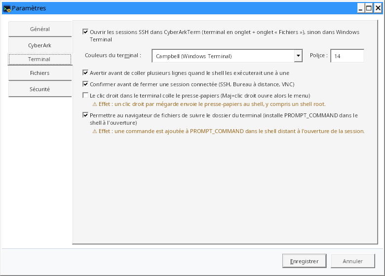

Bouton « Paramètres » de la barre d'outils → « Paramètres… » (ou `Ctrl+,`). La fenêtre, redimensionnable, est
organisée en pages : Général, CyberArk, Terminal, Fichiers, Sécurité. « Enregistrer » applique les réglages ; une
valeur incorrecte affiche la page du champ concerné, curseur dans ce champ. Les options qui ont un effet de bord le
disent sous leur case (« ⚠ Effet : … »).

| Page | Paramètre | Rôle | Défaut |
| --- | --- | --- | --- |
| Général | Langue de l'interface | Français, English, Italiano ou langue du système ; appliquée après déconnexion ou au prochain démarrage | langue de Windows (anglais si elle n'est pas traduite) |
| Général | Fichier central | Fichier d'environnement de l'équipe sur un partage réseau, relu à chaque démarrage ; ses changements sont montrés avant d'être appliqués (voir [Environnement partagé](#environnement-partagé)) | vide |
| Général | Rechercher une nouvelle version au démarrage | Une requête vers GitHub au plus une fois par jour ; lien dans la barre d'état si une version plus récente existe (la fenêtre « À propos » rappelle ce réglage) | non |
| CyberArk | Garder la session PVWA ouverte | Requête légère toutes les 4 minutes ; suspendue quand Windows est verrouillé ; ⚠ la session PVWA ne se ferme plus d'elle-même après inactivité | oui |
| CyberArk | PSMP par défaut, port | Serveur PSM for SSH ; renseigné (ou un PSMP par domaine), les comptes Unix s'ouvrent en SSH par défaut (en fichiers seuls pour une plateforme « SFTP ») ; sans aucun PSMP, SSH et SFTP sont désactivés | vide, 22 |
| CyberArk | PSMP par domaine | Autres PSMP (adresse, port, domaine servi) ; chaque serveur passe par celui du domaine le plus proche du sien (voir [PSMP par domaine](#psmp-par-domaine)) ; « Quel PSMP pour le serveur » pour vérifier | aucun |
| CyberArk | Composant des comptes Windows | Composant PSM des comptes Windows (domaine ou locaux) sans composant mémorisé pour leur plateforme, par exemple `WIN-PSM` | vide = `PSM-RDP` |
| CyberArk | Composants PSM mémorisés | Composant PSM choisi par plateforme (bouton « Oublier ») | — |
| Terminal | SSH dans CyberArkTerm | Terminal et onglet Fichiers intégrés ; sinon Windows Terminal | oui |
| Terminal | Couleurs du terminal, police | Palette (Campbell, One Half, Solarized…) et taille de police des terminaux SSH | Campbell, 14 |
| Terminal | Avertir avant de coller plusieurs lignes | Aperçu et confirmation quand le shell exécuterait les lignes une à une | oui |
| Terminal | Confirmer avant de fermer une session connectée | SSH, Bureau à distance, VNC ; « Ne plus demander » dans la confirmation décoche ce réglage | oui |
| Terminal | Le clic droit dans le terminal colle le presse-papiers | Maj+clic droit ouvre alors le menu ; ⚠ un clic droit par mégarde envoie le presse-papiers au shell | non |
| Terminal | Suivre le dossier du terminal | Autorise l'installation du suivi de dossier dans le shell ; ⚠ une commande est ajoutée à `PROMPT_COMMAND` | oui |
| Fichiers | Dépôt de fichiers | Protocole essayé d'abord (SFTP ou SCP) ; si le serveur le refuse, l'autre prend le relais | SFTP |
| Fichiers | Proposer une archive .tar.gz | Envoi en une seule archive proposé à partir de ce nombre de fichiers déposés d'un coup | oui, 200 |
| Fichiers | Suivi dans une session indépendante | Le suivi d'un fichier (tail -f) ouvre sa propre connexion SFTP (une session PSMP de plus) | non |
| Fichiers | Éditeur de texte | Programme ouvert par « Modifier » dans l'onglet Fichiers | Bloc-notes |
| Fichiers | Outil de comparaison | Programme proposé dans la fenêtre de comparaison, avec ses arguments (`{0}` = fichier de gauche, `{1}` = de droite) | aucun |
| Sécurité | Coffre local | Mots de passe maîtres KeePass mémorisés : « Créer le coffre… », « Déverrouiller… », « Changer le mot de passe… », « Supprimer maintenant… » ; ces actions s'appliquent tout de suite, sans « Enregistrer » | — |
| Sécurité | Clés de serveurs acceptées | Tableau des empreintes vérifiées et acceptées (serveur, type, empreinte) : PSMP, SSH direct et certificats FTPS des entrées KeePass. « Oublier les clés choisies » retire les lignes sélectionnées à l'enregistrement ; la clé sera redemandée à la prochaine connexion | — |
| Menu du bouton Paramètres | Journal de débogage | Déroulement des connexions dans un fichier, sans secret (voir [Sécurité](#sécurité)) ; « Afficher le fichier du journal » l'ouvre dans l'Explorateur | non |

### Environnement partagé

Pour donner CyberArkTerm à un collègue avec la configuration de l'équipe (adresse du PVWA, méthode de connexion,
PSMP par défaut et par domaine, composant des comptes Windows et composants par plateforme, listes partagées, clés
des PSMP, quelques options), sans rien de personnel ni aucun mot de passe :

1. **Exporter** : bouton « Paramètres » → « Exporter l'environnement… » enregistre `CyberArkTerm.env.json`.
2. **À côté de l'exécutable** : posez ce fichier à côté de `CyberArkTerm.exe` (par exemple dans le même zip). Au
   démarrage, s'il est nouveau ou a changé, CyberArkTerm le propose avant l'écran de connexion.
3. **Importer** : bouton « Paramètres » → « Importer un environnement… », ou « Importer un environnement… » sur
   l'écran de connexion.
4. **Fichier central** : Paramètres › Général › « Fichier central » (un fichier sur un partage réseau, qu'il est
   aussi possible d'indiquer dans l'environnement lui-même). Il est relu à chaque démarrage : quand vous le modifiez,
   chacun voit les changements au démarrage suivant.

Chaque fois, une fenêtre montre ce qui va changer (« ancienne valeur → nouvelle valeur ») et l'empreinte SHA-256 du
fichier ; « Ne pas appliquer » est le choix par défaut. Le PVWA et les PSMP reçoivent votre mot de passe CyberArk :
quand le fichier change leur adresse ou ajoute une clé de serveur, il faut cocher « J'ai vérifié… » avant
d'appliquer. Une clé de serveur déjà acceptée sur le poste n'est jamais remplacée par un fichier (elle est signalée).
Un fichier invalide (adresse en http, nom de composant incorrect…) est refusé en entier. Un fichier déjà proposé
n'est reproposé que s'il a changé. Votre identifiant, « Mes serveurs » et vos sessions récentes ne sont jamais
touchés ; les listes partagées s'ajoutent sans retirer les vôtres.

Toutes les préférences sont enregistrées dans `%APPDATA%\CyberArkTerm\settings.json` : langue, adresse du PVWA,
méthode et identifiant de connexion, paramètres ci-dessus, serveurs de « Mes serveurs », leurs dossiers et les fichiers qui
y ont été suivis (chemins), sessions récentes, emplacement des bases KeePass et de leurs fichiers clés, et des
listes partagées ouvertes, position et taille de la fenêtre, largeur et état du panneau de gauche. Ce fichier
ne contient **aucun mot de passe, jeton ni clé privée**. Pour repartir de zéro, fermez l'application et
supprimez-le. Il est d'abord écrit dans un fichier temporaire puis mis en place, le précédent étant gardé en
`settings.json.bak` : si le fichier devient illisible, il est mis de côté (jamais écrasé), la sauvegarde est reprise
et un message le signale. CyberArkTerm ne s'ouvre qu'une fois par session Windows : deux instances écraseraient
l'une l'autre leurs réglages. L'historique des transferts de l'onglet Fichiers est à côté, dans `transfers.json`
(noms et chemins des fichiers, sommes SHA-256, jamais leur contenu).

## Sécurité

- **HTTPS obligatoire** vers le PVWA ; la validation des certificats n'est jamais désactivée.
- **Aucun secret sur disque** : mot de passe CyberArk, jeton de session, clé MFA et mot de passe PSMP restent en
  mémoire, le temps de la session. Déconnexion du PVWA (`Logoff`) à la fermeture.
- Session PVWA ouverte avec `concurrentSession` : votre session web PVWA éventuelle n'est pas fermée.
- **Copie d'un mot de passe** : la réponse du PVWA est lue dans un tampon effacé ensuite et décodée sans passer par
  une chaîne ; le mot de passe est copié directement dans le presse-papiers Windows, marqué pour être exclu de
  l'historique (`Win+V`), de la synchronisation entre appareils et des outils de surveillance du presse-papiers,
  puis effacé après 20 s s'il y est encore (nouvel essai chaque seconde si une autre application garde le
  presse-papiers ouvert), ainsi qu'à la déconnexion, à la fermeture et au verrouillage de Windows. Il n'est jamais
  affiché ni écrit dans le journal de débogage. Une réponse qui n'est pas le mot de passe (page HTML de maintenance,
  redirection vers une page de connexion SSO, réponse vide) est refusée au lieu d'être copiée.
- **Ajout d'un compte** : le mot de passe saisi est lu dans le champ masqué sans passer par une chaîne, envoyé une
  seule fois au PVWA en HTTPS, puis effacé de la mémoire ; il n'est ni enregistré ni écrit dans le journal de
  débogage.
- **Dossier temporaire** : `%TEMP%\CyberArkTerm`, réservé à votre compte Windows (droits limités à vous seul) ; s'il
  appartient à un autre compte (variable TEMP pointant vers un dossier partagé), `%LOCALAPPDATA%\CyberArkTerm\Temp`
  le remplace. Les chemins ci-dessous sont relatifs à ce dossier.
- **Sessions PSM** : le fichier RDP du PVWA (jeton PSM à usage unique) est écrit dans le dossier temporaire pour
  `mstsc`, qui en vérifie la signature, puis supprimé après 60 s ou à la fermeture.
- **Saisie simultanée** (vue parallèle) : désactivée à chaque ouverture de la vue, signalée par le bouton ambre
  « ACTIVE (n) », un bandeau et un cadre ambre qui nomment les sessions concernées ; les sessions exclues sont
  marquées « exclue », une session ajoutée n'y est pas incluse d'office, et un collage
  de plusieurs lignes vers plusieurs sessions demande confirmation. Chaque session reste une session PSMP distincte,
  enregistrée comme d'habitude.
- **Collage de plusieurs lignes** dans un terminal dont le shell les exécuterait une à une : aperçu et confirmation
  avant l'envoi (réglage activé par défaut).
- **Confirmations** : boutons au verbe explicite dans la langue de l'application, « Annuler » par défaut, serveur,
  compte ou safe nommé ; la fermeture d'une session connectée est confirmée (réglage activé par défaut).
- **Comparaison de fichiers** : contenus lus en mémoire et effacés à la fermeture de la fenêtre ; seules les copies
  données à un outil externe passent par le disque (dossier temporaire, `compare`), supprimées à la fermeture de la
  fenêtre et au lancement suivant.
- **Nouvelle version** : aucune requête vers Internet sans votre action ou l'option des Paramètres (désactivée par
  défaut) ; seules les adresses du dépôt du projet sont suivies, l'archive n'est gardée que si sa somme SHA-256 est
  celle de `SHA256SUMS.txt`, et rien n'est installé ni lancé.
- **Clés d'hôte PSMP épinglées** au premier usage : l'empreinte est à comparer avant d'accepter (« Annuler la
  connexion » par défaut) ; une clé changée est signalée par un bandeau et ne remplace l'ancienne qu'après une case
  de confirmation (de même pour les serveurs joints en accès d'urgence et les certificats FTPS). Les clés acceptées
  se consultent et s'oublient dans Paramètres › Sécurité.
- **Maintien de la session PVWA** : il évite l'expiration par inactivité ; rien n'est envoyé tant que Windows est
  verrouillé, et l'option se désactive dans les Paramètres si votre politique l'exige.
- **Bases KeePass** :
  - mot de passe maître jamais enregistré, sauf dans le coffre local si vous le demandez : Argon2id (64 Mio, 3
    passes) puis AES-256-GCM, réglages de dérivation authentifiés, le tout protégé par DPAPI (compte Windows) ;
  - en mémoire, clé de la base et mots de passe des entrées restent masqués et ne sont révélés qu'au moment de la
    connexion ; bases verrouillées à la déconnexion, à la fermeture et au verrouillage de Windows ;
  - enregistrement sûr : relecture du fichier, modification appliquée à sa version du moment (les changements faits
    ailleurs sont gardés), vérification du résultat déchiffré, copie `.bak`, remplacement en une fois ; une entrée
    modifiée ailleurs entre-temps n'est pas écrasée ;
  - bureau à distance direct : le mot de passe est transmis au seul contrôle Bureau à distance (ni fichier, ni
    gestionnaire d'identification), authentification réseau (NLA) et alerte si le serveur n'est pas reconnu ;
  - VNC : le protocole ne chiffre ni l'écran, ni les frappes, ni le presse-papiers (bandeau permanent) ; le mot de
    passe n'est pas envoyé tel quel (défi-réponse du protocole) ; presse-papiers échangé seulement sur un clic ;
    taille d'écran annoncée par le serveur bornée (8 192 pixels de côté) ;
  - FTP : TLS tenté d'abord, connexion en clair seulement après votre accord (bandeau permanent), jamais pour
    `ftpes://` et `ftps://` ; sous TLS, les transferts sont chiffrés aussi (`PROT P`) ;
  - certificat FTPS : celui que Windows approuve est accepté ; sinon son empreinte SHA-256 est montrée et épinglée
    au premier accord (comme une clé d'hôte SSH), un changement est signalé ; refusé, la connexion s'arrête avant
    l'envoi de l'identifiant ;
  - noms de fichiers avec des caractères de contrôle refusés (pas d'injection de commande FTP) ;
  - journal `urgence.log` : date, compte Windows, poste, action, base, entrée, cible ; jamais de mot de passe.
    Chaque lecture du mot de passe d'une entrée y est notée, reconnexions et connexions SFTP / SCP de l'onglet
    Fichiers comprises ; si le journal ne peut pas être écrit, la connexion n'est pas ouverte.
- **Journal de débogage**, désactivé par défaut (menu du bouton Paramètres) :
  `%LOCALAPPDATA%\CyberArkTerm\debug.log`, 5 Mo au plus plus une génération `.1`. Il note le déroulement des
  connexions PVWA, PSM, Bureau à distance et SSH : adresses et statuts des requêtes, réglages du fichier .rdp,
  événements et codes du contrôle Bureau à distance, version et algorithmes du serveur SSH, erreurs ; pour chaque
  protocole d'envoi refusé, l'étape (connexion, commande scp, annonce du fichier), la réponse du serveur et le
  protocole qui a pris le relais. Il contient des noms de serveurs et de comptes, mais
  **jamais** de mot de passe, de jeton de session, de demande de session PSM (`PSM@…` masqué), de signature,
  d'en-tête ou de corps de requête, ni le contenu des sessions. La barre d'état le signale tant qu'il est actif.
  Relisez-le avant de le transmettre, et supprimez-le une fois le problème résolu.
- **Fichiers modifiés** : la copie locale ouverte dans l'éditeur est placée dans le dossier temporaire (`edit`) et
  supprimée à la fermeture de l'onglet SSH ; une alerte prévient si des modifications n'ont pas été renvoyées.
- **Pas d'injection de commande** : chemins SCP et dossiers de départ protégés entre apostrophes pour le shell
  distant ; arguments `ssh` / Windows Terminal validés et passés sans shell.
- Export CSV protégé contre l'injection de formules Excel.
- **Fichiers d'environnement** (`CyberArkTerm.env.json`) : ni mot de passe ni donnée personnelle, seuls les champs
  connus sont lus. Un fichier n'est jamais appliqué sans votre accord : changements et empreinte SHA-256 affichés,
  case à cocher quand l'adresse du PVWA ou d'un PSMP change ou qu'une clé de serveur est ajoutée. Il ne remplace
  jamais une clé de serveur déjà acceptée ; adresse du PVWA en https obligatoire ; fichier de plus de 1 Mo refusé.
- **Fichiers de serveurs et listes partagées** : ni mot de passe ni jeton, seulement des noms de serveurs, de
  comptes et de safes, des ID de comptes et les réglages de connexion (le motif par défaut n'est jamais partagé).
  Ils ne donnent aucun accès : chacun se connecte avec ses droits CyberArk, et l'info-bulle montre le compte tel
  que le coffre CyberArk le décrit. Une machine cible venue d'une liste partagée et non autorisée pour le compte par
  CyberArk est confirmée avant la première connexion. L'auteur inscrit au journal (compte CyberArk et compte
  Windows) est déclaratif : l'audit du partage réseau fait foi. Un fichier de plus de 8 Mo est refusé.
- Les sessions PSM et PSMP ouvertes par CyberArkTerm sont des sessions CyberArk standard : elles sont enregistrées
  et auditées par le PSM comme celles ouvertes depuis le PVWA.

Pour signaler une vulnérabilité, voir [SECURITY.md](../SECURITY.md) (signalement privé, pas d'issue publique).

## Fonctionnement technique

### API du PVWA utilisées

| Appel | Usage |
| --- | --- |
| `POST /PasswordVault/API/auth/{CyberArk\|LDAP\|RADIUS\|Windows}/Logon` | Ouverture de session |
| `GET /PasswordVault/API/Accounts?offset=…&limit=1000` | Liste paginée des comptes |
| `POST /PasswordVault/API/Accounts/{id}/PSMConnect` | Fichier RDP de la session PSM |
| `POST /PasswordVault/API/Accounts` | Création d'un compte dans un safe (« Ajouter un compte ») |
| `POST /PasswordVault/API/Accounts` (une fois par ligne) | Import de comptes depuis un CSV |
| `PATCH` / `DELETE /PasswordVault/API/Accounts/{id}` | Modification (seuls les champs changés) et suppression d'un compte |
| `POST /PasswordVault/API/Accounts/{id}/Verify`, `/Change`, `/Reconcile` | Opérations demandées au CPM |
| `POST /PasswordVault/API/Accounts/{id}/Password/Retrieve` | Copie du mot de passe (motif, ticket ; usage « copy » dans l'audit) |
| `POST` / `PUT` / `DELETE /PasswordVault/API/Safes/{safe}/Members[/{membre}]` | Ajout, droits et retrait d'un membre du safe |
| `GET /PasswordVault/API/Safes/{safe}/Members?offset=…&limit=1000` | Membres d'un safe et leurs droits (fenêtre « Membres du safe ») |
| `POST /PasswordVault/API/Users/Secret/SSHKeys/Cache` | Clé SSH temporaire « MFA caching » (si activée) |
| `GET /PasswordVault/API/Accounts?offset=0&limit=1` | Maintien de la session (toutes les 4 minutes) |
| `POST /PasswordVault/API/Auth/Logoff` | Fermeture de session |

### Listes partagées

Fichier JSON (`"format": "CyberArkTerm.SharedServers"`, version 1) : nom, PVWA d'origine, révision, dossiers,
serveurs (avec qui les a ajoutés et quand) et journal des modifications (les 1 000 dernières). Chaque modification
ouvre le fichier en exclusivité (les autres postes réessaient pendant 5 s), le relit, copie la révision en cours
dans `nom.versions\nom.r00012.20261006-101500.json` (révision et date de son enregistrement, 100 versions gardées),
applique la modification, augmente la révision, note qui, quand et quoi, puis réécrit le fichier (remis tel quel si
l'écriture échoue). L'affichage suit les changements du fichier (`FileSystemWatcher`) et se relit avec `F5`. L'export
de « Mes serveurs » a le même format avec `"format": "CyberArkTerm.Servers"`, sans révision ni journal.

### Bases KeePass

Lecture et écriture natives (sans KeePass installé) des formats **KDBX 3.1 et 4.x** : chiffrement AES-256 ou
ChaCha20, dérivation de clé AES-KDF (instructions AES du processeur) ou Argon2d / Argon2id, fichiers clés XML 1.0 /
2.0, 32 octets, 64 caractères hexadécimaux ou fichier quelconque. Le fichier réécrit garde la version, le
chiffrement et la dérivation de clé d'origine, avec de nouvelles graines à chaque enregistrement, celle de la
dérivation de clé comprise (comme KeePass : une clé dérivée capturée une fois ne déchiffre pas les versions
suivantes). Les bases de
test (`tests/CyberArkTerm.Core.Tests/KeePass/Vaults`) viennent de KeePassXC et pykeepass, et les fichiers écrits par
CyberArkTerm ont été vérifiés dans ces deux outils.

### Sessions VNC

Client intégré (protocole RFB 3.3, 3.7 et 3.8, RFC 6143 ; un serveur plus récent, comme RealVNC 4 ou 5, reçoit une
réponse en 3.8), sans logiciel à installer : authentification « aucune » ou « mot de passe VNC » (si le serveur
propose les deux : le mot de passe si l'entrée en a un, sinon aucune) (DES du protocole, implémenté dans CyberArkTerm car le mode FIPS de Windows peut interdire
DES), encodages Raw, CopyRect et Hextile, changement de taille d'écran, pixels 32 bits. Le clavier est transmis en
« keysyms » X11 (les caractères AltGr sont envoyés comme caractères), la molette en boutons 4 et 5.

### Sessions de fichiers FTP / FTPS

Bibliothèque FluentFTP (licence MIT). Mode passif : `PASV` en IPv4, la connexion de données allant toujours vers le
serveur lui-même (l'adresse annoncée dans la réponse est ignorée : un serveur ne peut pas faire viser une autre
machine), `EPSV` en IPv6 ; binaire, `PBSZ 0` et `PROT P` sous TLS ;
certificat vérifié par Windows, sinon épinglé (`ftps://serveur:port` parmi les clés de serveurs acceptées, dans
Paramètres › Sécurité). FTP n'a
pas de somme de contrôle standard : chaque envoi est relu depuis le serveur et comparé par SHA-256. Lecture partielle
(`REST`) pour la comparaison et le suivi en direct. Après un transfert interrompu, la connexion est rouverte et le
fichier incomplet supprimé. Un fichier remplacé est réécrit sur place : il garde ses droits. Liens symboliques : les
40 premiers d'un dossier sont résolus (un aller-retour chacun) ; au-delà, un lien s'affiche comme un fichier, et
l'ouvrir entre dans le dossier si c'en est un.

### Sessions Bureau à distance

Les sessions PSM s'ouvrent avec le fichier RDP renvoyé par `PSMConnect`, donné tel quel à la Connexion Bureau à
distance (`mstsc`) : elle en vérifie la signature et gère aussi bien le bureau que l'application distante
(RemoteApp). Le journal de débogage en note la structure (jeton, signature et arguments masqués). Les versions 0.4 à
0.6 ouvraient ces sessions dans un onglet : un PSM qui n'accepte que l'application distante n'y fonctionnait pas
bien (position et taille des fenêtres sur le serveur, souris), d'où le retour à `mstsc`.

Les onglets Bureau à distance (bureau à distance direct des bases KeePass) hébergent le contrôle ActiveX de
Windows (`mstscax.dll`, classe `MsRdpClient` la plus récente disponible), réglé comme une connexion directe :
authentification réseau (NLA), alerte si le serveur n'est pas reconnu, redirections désactivées sauf le
presse-papiers. La résolution du bureau distant suit la taille de l'onglet. Les fermetures de session et les erreurs
de connexion sont expliquées dans l'onglet avec le message et les codes de Windows (raison, raison étendue). Un test
d'intégration (workflow `rdp-integration`) ouvre une vraie session sur le poste de CI.

**Un thread par connexion Bureau à distance.** Le contrôle, sa fenêtre et ses événements vivent sur un thread à part
(STA, avec sa boucle de messages) ; l'interface ne l'attend jamais. L'onglet contient une fenêtre du thread de
l'interface, dans laquelle ce thread place la fenêtre du contrôle. Avant de libérer le contrôle, il l'en retire :
une déconnexion ou une libération qui tarde ne fige plus l'application. Si le thread ne répond plus pendant 5 s, la
barre de l'onglet le signale, et le reste de l'application reste utilisable. Limite : Windows partage le clavier et
la souris entre une fenêtre et celles qu'elle contient, même d'un autre thread ; un contrôle bloqué pour de bon peut
encore retenir un clic dans sa zone ou un changement de focus.

### Sessions PSMP

Chaque onglet SSH ouvre jusqu'à trois connexions au PSMP, avec le même identifiant
`<vous>@<compte>[#domaine]@<cible>` : le terminal, la connexion SFTP de l'onglet Fichiers, et une connexion SCP au
premier envoi en SCP (choisi dans les Paramètres, ou relais d'un envoi SFTP refusé). Chacune est une session PSMP, enregistrée par le PSM. Les envois au serveur
(frappe, taille du terminal) et la fermeture des connexions se font hors du thread de l'interface, dans l'ordre : un
serveur ou un PSMP qui ne lit plus ne fige pas l'application.

### Suivi du dossier du terminal

À l'ouverture d'une session SSH (si l'option est active), CyberArkTerm attend que le shell du serveur cible affiche
son invite (jusqu'à 60 s : le PSMP met parfois plusieurs secondes à joindre la cible), puis lui envoie une commande
d'une ligne, précédée d'une espace pour ne pas entrer dans l'historique (bash, ou zsh avec `HIST_IGNORE_SPACE`).
Rien n'est envoyé si vous avez déjà commencé à taper ; la commande peut être renvoyée sans effet en double (case
« Suivre ») :

- définition de `PROMPT_COMMAND` (bash) ou `precmd` (zsh) qui émet la séquence standard **OSC 7** avec le dossier
  courant à chaque invite ;
- avec tcsh, l'alias `cwdcmd` (seulement s'il n'est pas déjà défini), qui émet la même séquence à chaque changement
  de dossier ;
- si un dossier de départ est configuré, un `cd` vers ce dossier ;
- effacement de la commande tapée, pour qu'elle ne reste pas à l'écran.

Le terminal intégré décode la séquence OSC 7 et l'onglet Fichiers se place dans le dossier indiqué.

La commande est lisible sans erreur par tous les shells : chaque partie n'est exécutée que par la famille de shell à
laquelle elle est destinée. Avec csh, ksh, sh ou fish, le suivi n'est pas installé et rien ne reste à l'écran.

## Dépannage

| Symptôme | Cause probable et solution |
| --- | --- |
| « Connexion TLS refusée : le certificat du PVWA n'est pas approuvé » | Le certificat (ou l'autorité qui l'a émis) n'est pas dans le magasin Windows du poste. |
| « Le PVWA doit être joint en HTTPS » | Saisissez l'adresse sans `http://` (ou avec `https://`). |
| « Le PVWA n'a pas de composant de connexion « PSM-RDP » pour ce compte » (`EPVWA093E Failed to get the relevant connection component`) | La plateforme du compte utilise un composant d'un autre nom (par exemple `WIN-PSM`) : celui que propose le bouton « Connect » du PVWA, ou le nom après `/c` dans une commande `psm /u … /a … /c …`. Saisissez-le dans « Composant » ; « Mémoriser ce composant pour la plateforme » est coché pour les connexions suivantes. |
| « Votre session CyberArk a expiré » | Délai d'inactivité du PVWA dépassé : reconnectez-vous. |
| « Mot de passe » → « Copier le mot de passe… » : « Le PVWA refuse : … « Récupérer les comptes » … » | Droit manquant sur le safe, ou motif / ticket exigé par la plateforme : saisissez-le. Avec une double validation, faites la demande dans le PVWA. |
| « Vérifier / Changer / Réconcilier » : « Le PVWA refuse : … « Lancer les opérations CPM » … » | Demandez ce droit sur le safe ; « Membres du safe » montre vos droits. |
| « Ajouter un compte » : « Le PVWA refuse : votre compte doit avoir le droit « Ajouter des comptes »… » | Demandez ce droit sur le safe (et « Modifier le contenu des comptes » pour fournir le mot de passe), ou créez le compte sans mot de passe. « Membres du safe » montre vos droits. |
| « Membres du safe » : « Votre compte ne peut pas voir les membres de ce safe » | Le PVWA exige le droit « View Safe Members » sur le safe : demandez-le à un gestionnaire du safe. |
| « Connection component … is not configured for platform … » | Choisissez le bon composant dans « Connexion avancée », cochez « Mémoriser » pour la plateforme. |
| « You must specify a reason… » | Saisissez un motif dans la fenêtre qui s'ouvre (ou un motif par défaut dans les propriétés du serveur, dans « Mes serveurs »). |
| Le compte n'apparaît pas | Vous n'avez pas le droit « List accounts » sur son safe, ou la liste doit être rechargée (`F5`). |
| Le mot de passe PSMP est demandé à chaque onglet | MFA caching non activé sur le PVWA : comportement normal (une fois par onglet). |
| L'onglet Fichiers indique « Connexion SFTP impossible » | SFTP n'est pas autorisé sur le PSMP ou pour ce compte : voir l'équipe CyberArk. |
| Un envoi indique « SFTP (SCP refusé) » ou « SCP (SFTP refusé) » | Le PSMP ou le serveur a refusé ce protocole pour ce fichier : l'autre a pris le relais et le fichier a été vérifié comme d'habitude. Le bilan donne la réponse du serveur. Un PSMP qui refuse SCP pour une plateforme (erreur `118E Selected component PSMP-SCP does not contain the target settings definitions…` dans ses journaux) n'a pas le composant de connexion PSMP-SCP : votre équipe CyberArk peut l'ajouter à la plateforme, sinon les envois passent en SFTP. |
| Le navigateur ne suit pas les `cd` | Le shell distant n'est pas bash, zsh ou tcsh (ou tcsh a déjà son propre alias `cwdcmd`), l'option est désactivée dans les Paramètres, ou l'invite n'a pas été reconnue : recochez « Suivre le dossier du terminal » à l'invite du shell. |
| Alerte « La clé du PSMP a changé » | Ne continuez (case « J'ai confirmé ce changement avec l'équipe CyberArk », puis « Remplacer la clé et se connecter ») que si l'équipe CyberArk confirme un changement du serveur ; sinon, annulez et prévenez-la. |
| « Connexion annulée : la clé du serveur n'a pas été acceptée. » | La fenêtre de l'empreinte a été annulée ou fermée : reconnectez-vous et acceptez la clé après avoir comparé son empreinte. |
| « Mot de passe maître ou fichier clé incorrect » | Vérifiez le mot de passe et le fichier clé ; une base protégée par YubiKey n'est pas prise en charge. |
| La base KeePass demande le mot de passe malgré « Mémoriser » | Coffre local verrouillé (« Plus tard » au déverrouillage) ou mot de passe maître changé ailleurs : saisissez-le, il est remémorisé. |
| « Le fichier du coffre local est endommagé ou a été créé par un autre compte Windows » | Le coffre local ne suit pas un changement de poste ou de compte : supprimez-le dans les Paramètres et recréez-le. |
| « L'entrée … a été modifiée ou supprimée dans la base KeePass entre-temps » | Quelqu'un a changé la même entrée ailleurs : la base est rechargée, refaites la modification. |
| Un compte Unix s'ouvre en PSM et pas en SSH | Adresse du PSMP non renseignée dans les Paramètres, ou compte non reconnu comme Unix : clic droit → « Se connecter en SSH (PSMP) ». |
| Un compte s'ouvre en fichiers seuls et pas dans un terminal | Le nom de sa plateforme contient « SFTP » : clic droit → « Se connecter en SSH (PSMP) », ou « Propriétés… » dans « Mes serveurs » pour changer le type de connexion. |
| « La liste partagée est en cours de modification par quelqu'un d'autre » | Un autre poste écrit la liste depuis plus de 5 secondes, ou garde le fichier ouvert : réessayez dans un instant. |
| « vous n'avez pas le droit de modifier ce fichier (droits du partage réseau) » | Le partage est en lecture seule pour vous : demandez le droit d'écriture à son responsable. La liste reste utilisable. |
| Une liste partagée affiche « (illisible) » | Partage injoignable ou fichier endommagé : l'info-bulle donne l'erreur. Si le fichier est endommagé, copiez la version la plus récente du dossier `nom.versions` à sa place. |
| Comprendre un échec de connexion | Paramètres → Journal de débogage, reproduisez le problème, puis Paramètres → « Afficher le fichier du journal ». |
| Un onglet de bureau à distance direct (KeePass) affiche « Erreur du contrôle Bureau à distance » | Signalez le code affiché (si le contrôle Bureau à distance est absent du poste, la connexion passe par `mstsc`). |
| VNC : « Le serveur VNC ne propose aucune authentification prise en charge… » | Le serveur exige une authentification propre à son éditeur (compte Windows, chiffrement VeNCrypt…) : activez l'authentification « mot de passe VNC » sur le serveur. |
| VNC : « Pas de réponse VNC du serveur en 30 secondes » | Mauvais port (5900 + numéro d'écran) ou service autre que VNC à cette adresse. |
| FTP : « Le serveur FTP ne propose pas de chiffrement (TLS), exigé par cette entrée » | Le serveur n'accepte pas TLS : utilisez `ftp://` (connexion en clair après confirmation) ou SFTP s'il est disponible. |
| FTPS : la liste des fichiers ne s'affiche pas ou un transfert expire | Un pare-feu bloque les ports passifs du serveur, ou le serveur exige la reprise de session TLS sur les connexions de données (`522`, par exemple `require_ssl_reuse` de vsftpd) : voir l'administrateur du serveur. |
