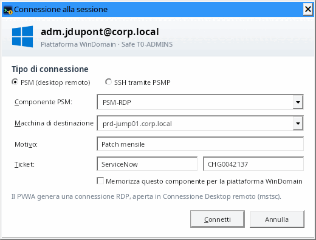
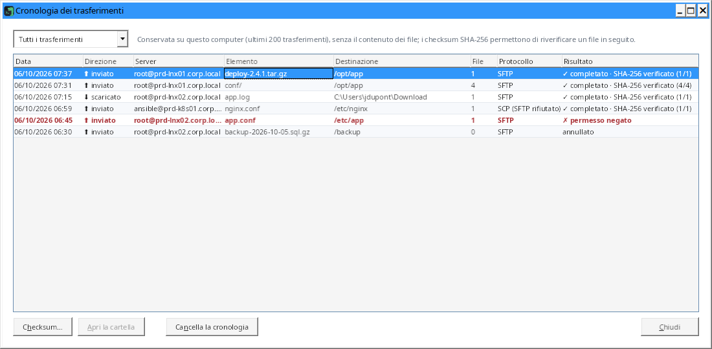
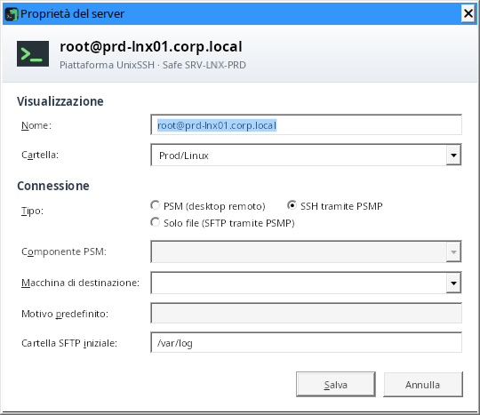
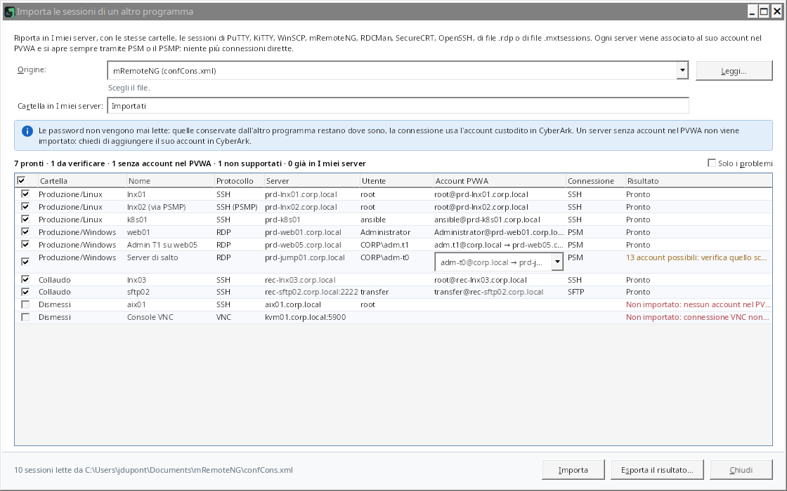

# Guida all'uso di ZillaTerm

[Français](guide.fr.md) · [English](guide.md) · **Italiano** · [← Torna al README](../README.it.md)

## Indice

- [1. Accedere al vault CyberArk](#1-accedere-al-vault-cyberark)
- [2. Trovare un account: scheda «Disponibili»](#2-trovare-un-account-scheda-disponibili)
- [3. Aprire una sessione PSM (desktop remoto)](#3-aprire-una-sessione-psm-desktop-remoto)
- [4. Aprire una sessione SSH tramite il PSMP](#4-aprire-una-sessione-ssh-tramite-il-psmp)
- [5. Sfogliare e inviare file: scheda «File»](#5-sfogliare-e-inviare-file-scheda-file)
- [6. Organizzare i server: scheda «I miei server»](#6-organizzare-i-server-scheda-i-miei-server)
- [7. Accesso di emergenza fuori da CyberArk: database KeePass](#7-accesso-di-emergenza-fuori-da-cyberark-database-keepass)
- [Scorciatoie](#scorciatoie)
- [Impostazioni e file di configurazione](#impostazioni-e-file-di-configurazione)
- [Sicurezza](#sicurezza)
- [Funzionamento tecnico](#funzionamento-tecnico)
- [Risoluzione dei problemi](#risoluzione-dei-problemi)

## 1. Accedere al vault CyberArk

Inserisci l'indirizzo del PVWA (`pvwa.miodominio.local` è sufficiente: `https://` e `/PasswordVault` vengono
aggiunti), scegli il metodo di autenticazione, poi nome utente e password. Se il server RADIUS pone una domanda
(codice OTP), la finestra la mostra e attende la tua risposta. Durante la digitazione di una password, l'avviso
«Bloc Maiusc è attivo.» compare se il tasto è attivo (lo stesso per i database KeePass e il vault locale).

Indirizzo, metodo e nome utente vengono memorizzati; **la password mai**.

L'elenco in basso a sinistra cambia la lingua dell'interfaccia (Français, English, Italiano); la finestra si riapre
subito nella lingua scelta, conservando l'indirizzo e il nome utente inseriti.

### Finestra principale

- **Pannello laterale**: schede «Disponibili», «I miei server» e «File» (`Ctrl+1`, `Ctrl+2`, `Ctrl+3`); la scheda
  «File» compare solo quando è aperta una sessione SSH o di file. Trascina il separatore per cambiarne la larghezza; `Ctrl+B` o un doppio clic sul separatore lo chiude (la striscia delle
  schede resta: un clic su una scheda lo riapre). `F6` passa dal pannello alla sessione. Posizione e dimensione
  della finestra, larghezza del pannello e il suo stato chiuso vengono memorizzati.
- **Schede di sessione**: un pallino indica lo stato della sessione con il colore e con la forma: anello arancione
  durante la connessione, pallino verde una volta connessa, anello grigio quando la sessione è terminata, pallino
  rosso in caso di errore (il nome è allora attenuato). La descrizione comandi riporta il nome completo, lo stato e
  la modalità: «Tramite il PSMP …: sessione gestita da CyberArk» o «Accesso diretto di emergenza (KeePass): fuori
  da CyberArk, annotato in urgence.log». Un nome troppo lungo viene troncato; un nome già aperto viene numerato
  («srv01 (2)»). Quando le schede non ci stanno più, la striscia scorre (rotellina, la scheda scelta resta visibile)
  e «⌄» le elenca tutte con il loro stato. `Ctrl+Tab` / `Ctrl+Maiusc+Tab`: scheda successiva / precedente;
  `Ctrl+F4` o `Ctrl+Maiusc+W`: chiudi la scheda.
- **Chiudere una sessione connessa** (SSH, desktop remoto, VNC) chiede conferma, con la casella «Non chiedere più
  alla chiusura di una sessione» (impostazione «Conferma prima di chiudere una sessione connessa», Impostazioni ›
  Terminale). Alla disconnessione e all'uscita, una sola finestra riepiloga ciò che verrà chiuso: sessioni,
  trasferimenti in corso, file modificati non rimandati.
- **Conferme**: i pulsanti dicono l'azione («Elimina l'account», «Sostituisci la chiave e connetti»…), «Annulla» è il
  pulsante predefinito, e il server, l'account o il safe interessato viene nominato. I valori da confrontare
  (impronte) sono mostrati con un carattere a spaziatura fissa, con «Copia». Alcune azioni irreversibili (eliminare
  un account, accettare una chiave di server cambiata) richiedono anche di selezionare una casella.
- **Pulsanti disattivati**: la loro descrizione comandi dice cosa manca (selezione, PSMP, sessione SSH per
  «Parallelo»…). In accesso di emergenza, i pulsanti propri di CyberArk sono nascosti.
- **Barra di stato**: un messaggio ordinario si cancella dopo 10 secondi; un errore resta visibile fino al messaggio
  successivo. Il numero di account compare solo con la scheda «Disponibili».
- **Sessione CyberArk scaduta** (timeout di inattività del PVWA): una finestra chiede la password (e la risposta
  RADIUS se serve) per accedere di nuovo, con lo stesso indirizzo, lo stesso utente e lo stesso metodo. Schede,
  sessioni aperte e trasferimenti restano come sono; l'azione che ha incontrato la scadenza viene ripetuta
  (caricamento degli account, connessione). «Più tardi» permette di lavorare senza CyberArk: F5, o la prossima azione
  CyberArk, lo propone di nuovo. Se la sessione scade mentre ZillaTerm è in secondo piano, la finestra compare quando
  ci torni.

## 2. Trovare un account: scheda «Disponibili»

- La casella di ricerca («Filtra gli account…», `Ctrl+F`) filtra su tutti i campi (server, utente, safe,
  piattaforma, dominio…), anche con più parole (`prd sql`). La ✕ in fondo alla casella (come in ogni casella di
  ricerca o di filtro) o `Esc` la svuota.
- Al posto di un elenco vuoto, la scheda dice cosa succede: caricamento degli account, caricamento non riuscito con
  il suo messaggio e «Riprova», nessun account disponibile per il tuo utente CyberArk, o nessun account
  corrispondente al filtro, con «Cancella il filtro».
- «Raggruppa per» ordina gli account per safe, piattaforma o tipo di destinazione.
- Clic destro su un account → «Esporta gli account visualizzati (CSV)…» salva in CSV gli account mostrati
  (filtrati dalla ricerca).
- **Membri di un safe**: clic destro su un account (o su un safe quando gli account sono raggruppati per safe, o su
  un server di «I miei server») → «Membri del safe». La finestra elenca gli utenti e i gruppi del safe con i loro
  diritti (elencare, usare, recuperare, aggiungere account, aggiornare, eliminare, gestire i membri…), indica chi
  può **aggiungere account** e mostra tutti i diritti del membro selezionato. Durante la lettura mostra
  «Caricamento dei membri…»; in caso di errore, il messaggio compare al centro con «Riprova». Il PVWA fornisce questo elenco solo a
  un account con il diritto «View Safe Members» sul safe. `Ctrl+A` e poi `Ctrl+C` copia la tabella. Con il diritto
  «Gestire i membri del safe», i pulsanti «Aggiungi un membro…», «Modifica i diritti…» (o doppio clic) e «Rimuovi…»
  gestiscono i membri: nome, tipo (utente o gruppo), directory («Vault» o il dominio LDAP), eventuale data di fine e
  i 22 diritti, raggruppati come nel PVWA. L'elenco «Profilo» seleziona in un colpo i diritti di un uso comune (sola
  lettura, utente degli account, gestore degli account, completo); i diritti sensibili sono segnalati e concederli
  chiede conferma; «Modifiche: +n / −n» riassume ciò che cambia. La rimozione di un membro viene confermata
  («Rimuovi il membro»).
- **Aggiungere un account**: clic destro su un account (o su un safe quando gli account sono raggruppati per safe) →
  «Aggiungi un account al safe…». Safe, piattaforma, indirizzo e utente sono obbligatori; dominio di accesso, nome
  dell'account, password, macchine consentite e gestione da parte del CPM sono facoltativi. L'account cliccato fa da
  modello (safe, piattaforma, dominio) e il cursore viene posto sul primo campo obbligatorio vuoto. L'account viene
  creato con i diritti della tua sessione: serve il diritto
  «Aggiungere account» sul safe e, in genere, «Aggiornare il contenuto degli account» per fornire la password.
  L'elenco viene poi ricaricato e il nuovo account selezionato.
- **Importare account (CSV)**: clic destro su un account o un safe → «Importa account (CSV)…». Una finestra chiede
  il file («Salva un modello…» fornisce un esempio), il safe e la piattaforma predefiniti, poi mostra un'anteprima
  di tutte le righe del file (righe con errore in rosso, casella «Solo errori») e i safe interessati; nulla viene
  inviato prima del pulsante «Crea N account». Colonne
  obbligatorie: indirizzo e utente (più safe e piattaforma, altrimenti i valori predefiniti); facoltative: nome,
  dominio, password, macchine consentite, gestione CPM (sì/no), motivo. Separatore `;`, `,` o tabulazione, nomi
  delle colonne in italiano, francese o inglese; un file prodotto da «Esporta gli account visualizzati» si può reimportare. Una seconda
  finestra crea poi gli account riga per riga e mostra lo stato di ciascuna (creato, rifiutato con il messaggio del
  PVWA, non importato, non inviato; «Interrompi» disponibile). Chiuderla durante l'importazione chiede conferma:
  «Continua» (predefinito) o «Interrompi l'importazione» (l'account in corso viene completato, gli account già creati
  restano nel vault CyberArk). Alla fine propone di salvare il risultato in CSV
  (senza le password). Le password del file non vengono mai mostrate; elimina il file dopo l'importazione.
- **Modificare / eliminare un account**: clic destro → «Modifica l'account…» (piattaforma, indirizzo, utente,
  dominio, nome, macchine consentite, gestione da parte del CPM; vengono inviati solo i campi modificati) oppure
  «Elimina l'account…»: la conferma ricorda che l'account viene eliminato per tutti gli utenti e che la sua password
  non sarà più recuperabile; occorre selezionare «Ho capito che la password attuale non sarà più recuperabile».
  Diritti «Aggiornare le proprietà degli account» ed «Eliminare account».
- **Stato della password (CPM)**: il tooltip di un account indica se è gestito dal CPM e la data dell'ultimo cambio,
  dell'ultima verifica e dell'ultima riconciliazione; un **⚠** segnala un account la cui ultima operazione del CPM
  non è riuscita.
- **Clic destro → «Password»** (account di «Disponibili» e server di «I miei server»):
  - «Verifica (CPM)», «Cambia (CPM)…», «Riconcilia (CPM)…» chiedono l'operazione al CPM (conferma per cambiare e
    riconciliare, con i pulsanti «Cambia la password» e «Riconcilia»; diritto «Avviare le operazioni CPM»). Il CPM la
    esegue poi: `F5` per vedere il nuovo stato.
  - «Copia la password…»: la finestra nomina l'account e il suo safe, e indica che il recupero viene registrato
    nell'audit CyberArk e che la password resta 20 secondi negli appunti. Motivo e ticket sono facoltativi, a meno
    che la piattaforma non li richieda; «Recupera e copia» copia la password **senza mostrarla**, poi la barra di
    stato conta alla rovescia i secondi prima della sua cancellazione (diritto «Recuperare gli account»).
- Nella scheda Home, la **connessione rapida** (`Ctrl+K`; il cursore vi si trova all'avvio) trova un server mentre
  digiti: Invio per connetterti. Dice quando nessun account corrisponde e mostra solo i primi 50 risultati («Primi 50
  account su N: precisa la ricerca.»). Le **sessioni recenti** sono datate («Oggi 09:28», «Ieri 18:02»); clic
  destro → «Rimuovi dall'elenco» (o `Canc`) ne toglie una. Restano in grigio finché gli account non sono caricati
  dal PVWA («in attesa degli account del PVWA…»); sono quelle del PVWA a cui sei connesso: su un altro PVWA lo
  stesso ID di account indica un altro account.

## 3. Aprire una sessione PSM (desktop remoto)

Fai doppio clic sull'account (oppure Invio, oppure il pulsante «Connetti»); un account Unix si apre in SSH tramite
il PSMP quando il suo indirizzo è impostato, o in soli file per una piattaforma «SFTP» (vedi 4.), e «Connessione
avanzata…» permette allora di scegliere il PSM. ZillaTerm richiede la connessione al PVWA e apre la sessione in **Connessione Desktop remoto** di Windows
(`mstsc`), esattamente come il pulsante «Connect» del PVWA: il file RDP del PVWA le viene passato così com'è. Un
componente che apre un'applicazione remota (RemoteApp) apre le sue finestre sul desktop del computer.

- **Componente PSM**: dedotto dalla piattaforma (`PSM-RDP` per Windows, `PSM-SSH` per Unix e rete,
  `PSM-SQLServerMgmtStudio`, `PSM-SQLPlus`…). Seleziona «Memorizza questo componente» per conservarlo per tutta la
  piattaforma. Il tuo PVWA può chiamare i suoi componenti in un altro modo (ad esempio `WIN-PSM`): inserisci il nome
  proposto dal suo pulsante «Connect»; l'elenco propone poi i componenti già usati, quello della piattaforma per
  primo. Per tutti i tuoi account Windows, imposta una volta il componente in **Impostazioni › CyberArk** («Account
  Windows», ad esempio `WIN-PSM`); un componente memorizzato per una piattaforma resta prioritario. I componenti per
  piattaforma si vedono e si modificano nello stesso punto («Componente per piattaforma»).
- **Account di dominio**: un account registrato per il suo dominio non ha un server. Viene riconosciuto dalla
  piattaforma di dominio, dalla limitazione alle sue macchine autorizzate o dall'indirizzo: il dominio di accesso, un
  dominio sotto cui si trovano altri server (`corp.local` quando un account punta a `srv01.corp.local`), o il dominio
  del PVWA o della postazione. Un account locale il cui dominio di accesso è il nome del server (`srv01.corp.local`,
  `SRV01`) resta un account di quel server quando un altro account della cassaforte lo punta (account locale, account
  Unix) o quando la sua piattaforma è una piattaforma di server o di postazioni («Server», «Srv», «Desktop»,
  «Workstation»). Un account che ha solo un elenco di macchine, senza esservi limitato, si apre sul proprio
  indirizzo; la macchina di destinazione resta facoltativa. Mai una sessione verso il dominio stesso: il server viene sempre chiesto, «Connessione avanzata» compresa. La finestra «Scegli il server» chiede su quale aprire la sessione:
  l'elenco propone i server già usati con questo account (sessioni recenti, «I miei server»), poi le sue macchine
  autorizzate; un account limitato alle sue macchine rifiuta le altre. «Mantieni questo server in «I miei server»»,
  con la cartella desiderata, lo aggiunge dopo una connessione riuscita, con il nome `account@server` (la scelta
  viene ricordata per la volta successiva; la casella scompare se il server è già presente). «Avanzata…» apre la
  finestra completa con questo server.
- **Motivo e ticket**: se il PVWA rifiuta la richiesta (motivo obbligatorio, componente non configurato…), il suo
  messaggio viene mostrato e puoi correggere e riprovare.
- Il pulsante «Avanzata…» della barra degli strumenti (o clic destro → «Connessione avanzata…») apre questa
  finestra su richiesta. Il cursore viene posto sul primo campo utilizzabile; in SSH o in soli file, i campi che
  servono solo al PSM sono disattivati e la loro descrizione comandi lo dice; senza componente, la finestra chiede di
  sceglierne uno.

## 4. Aprire una sessione SSH tramite il PSMP

Imposta una volta il PSMP in **Impostazioni › CyberArk** (vedi [PSMP per dominio](#psmp-per-dominio) se ne hai
diversi). Il doppio clic (o Invio) sceglie allora in base al nome della piattaforma dell'account:

| Nome della piattaforma | Apertura predefinita |
| --- | --- |
| contiene «SFTP» (`UnixSFTP`, `SFTP-Partner`…) | **solo file** in SFTP tramite il PSMP (vedi sotto) |
| contiene «SSH» (`UnixSSH`, `CiscoSSH`…), o un'altra piattaforma Unix | **SSH** tramite il PSMP |
| altro | **PSM** (desktop remoto) |

Il clic destro propone sempre le tre (l'apertura predefinita è in grassetto): «Connetti (PSM)», «Connetti in SSH
(PSMP)» (o il pulsante «SSH») e «Apri i file (SFTP, PSMP)».

**Solo file**: una sola sessione PSMP SFTP, senza terminale. Una scheda ne mostra lo stato; i file sono nella scheda
«File», con le stesse funzioni (trasferimenti verificati, coda, editor, confronto, monitoraggio in tempo reale,
permessi), tranne ciò che richiede un terminale (monitoraggio della cartella del terminale, estrazione di un archivio
`.tar.gz`). Utile per depositare o recuperare file, o quando la piattaforma consente PSMP-SFTP ma non la shell. Come
ogni sessione PSMP, è registrata e verificata da CyberArk.

La sessione si apre **in una scheda di ZillaTerm**, subito: una barra di avanzamento compare mentre ZillaTerm chiede
la chiave MFA al PVWA e si connette al PSMP (le domande su chiave del server, password o codice arrivano nel
frattempo). L'identificativo è quello PSMP standard `<tu>@<account di destinazione>[#dominio]@<server di
destinazione>`. I nomi utente che contengono spazi (`Mario Rossi`, `Admin
Locale`) sono accettati. Il pannello laterale passa alla scheda «File» del server (se è ridotto, resta ridotto).

### PSMP per dominio

Con un PSMP per dominio, dichiarali in **Impostazioni › CyberArk**: un **PSMP predefinito** e l'elenco **PSMP per
dominio** («Aggiungi un PSMP», indirizzo, porta; il dominio servito è quello dell'indirizzo, modificabile). Ogni
server passa dal PSMP del dominio **più vicino al suo**:

| PSMP configurati | Server | PSMP usato |
| --- | --- | --- |
| `psmp.xxx.corp.com`, `psmp.zzz.corp.com` | `srv01.xxx.corp.com` | `psmp.xxx.corp.com` |
| idem | `srv02.zzz.corp.com` | `psmp.zzz.corp.com` |
| solo `psmp.xxx.corp.com` | `srv03.zzz.xxx.corp.com` | `psmp.xxx.corp.com` (nessun PSMP per `zzz.xxx.corp.com`) |
| idem | `srv04.altro.org`, un indirizzo IP | il PSMP predefinito; senza, l'unico PSMP dell'elenco se ce n'è uno solo |

Senza PSMP per un server (diversi PSMP, nessuno predefinito, dominio non coperto), la connessione viene rifiutata e
la barra di stato lo dice. «Quale PSMP per il server» dà la risposta prima di salvare; due PSMP per lo stesso dominio
vengono rifiutati. Solo i PSMP dell'elenco ricevono la tua password CyberArk, mai un indirizzo dedotto dal nome di un
server; la chiave di ogni PSMP viene verificata alla sua prima connessione. Il tooltip della scheda indica il PSMP
usato.

 

- **Autenticazione**: se il PVWA fornisce una chiave «MFA caching», non viene posta alcuna domanda. Altrimenti
  le domande del PSMP (password, codice MFA) compaiono in una finestra che nomina la sessione interessata, con un
  aiuto secondo la domanda: probabilmente la password del tuo account CyberArk (riutilizzata per le connessioni
  SFTP e SCP della stessa scheda, mai salvata), o il codice MFA (richiesto a ogni connessione). Una risposta
  rifiutata viene segnalata in rosso sopra il campo con il numero del tentativo («Tentativo 2 di 3»); dopo tre rifiuti
  la connessione si ferma per non bloccare il tuo account. «Bloc Maiusc è attivo.» compare durante la digitazione.
  Quando più sessioni si aprono insieme (cartella, selezione, vista parallela), la finestra propone «Usa questa
  password anche per le altre sessioni in apertura»: se spuntata, viene chiesta una sola volta (mai per un codice
  MFA) e conservata solo in memoria fino alla loro connessione. Le password conservate per le schede vengono
  dimenticate al blocco di Windows.
- **Chiave del PSMP**: alla prima connessione, una finestra ne mostra l'impronta SHA-256 con un carattere a
  spaziatura fissa, con «Copia»: confrontala con quella pubblicata dal team CyberArk prima di «Considera attendibile
  e connetti» («Annulla la connessione» è il pulsante predefinito). L'impronta viene poi memorizzata sul computer.
  Se la chiave cambia, una fascia rossa avverte di una possibile intercettazione, vengono mostrate l'impronta
  memorizzata e quella nuova, e «Sostituisci la chiave e connetti» è possibile solo dopo aver selezionato «Ho
  confermato la modifica con il team CyberArk». Una chiave rifiutata ferma la connessione («Connessione annullata:
  la chiave del server non è stata accettata.»).
- **Terminale**: la selezione copia, la rotellina o la barra di scorrimento a destra percorre la cronologia; dopo
  essere risaliti, «↓ Torna alla fine» (o digitare) riporta alla fine. AltGr funziona sulle tastiere
  internazionali. Chiudi la scheda con la croce, con un clic centrale o con `Ctrl+F4` (conferma se la sessione è
  connessa).
- **Fine della sessione**: una fascia in cima al terminale ne indica il motivo, con «Riconnetti»; le ultime righe
  restano leggibili, selezionabili e copiabili.
- **Clic destro nel terminale** (o tasto Menu della tastiera): copia, incolla, seleziona tutto, cerca, salva il
  contenuto, cancella la cronologia (solo su questo computer, nulla viene inviato al server), dimensione del
  carattere, e le azioni della scheda (riconnetti, duplica, stacca, vista parallela, aggiungi a «I miei server»,
  chiudi). Per incollare con un semplice clic destro, spunta «Il clic destro nel terminale incolla gli appunti» nelle
  Impostazioni; Maiusc+clic destro apre allora il menu.
- **Incollare più righe**: quando la shell eseguirebbe le righe una alla volta (senza incolla protetto, «bracketed
  paste»), una finestra mostra le righe e chiede conferma («Incolla», «Annulla» predefinito), con la casella «Non
  avvisare più prima di incollare più righe» (impostazione «Avvisa prima di incollare più righe quando la shell le
  eseguirebbe una alla volta», Impostazioni › Terminale).
- **Aspetto**: tavolozza di colori e dimensione del carattere nelle Impostazioni (Campbell, One Half, Solarized,
  scuri o chiari); `Ctrl+rotellina` ingrandisce o riduce un terminale, `Ctrl+0` torna alla dimensione predefinita.
- **Cercare** nel terminale, cronologia compresa: `Ctrl+Maiusc+F` (o clic destro nel terminale o sulla scheda). Le
  occorrenze sono evidenziate; `Invio` risale verso le più vecchie, `Maiusc+Invio` riscende, `Esc` chiude.
- **Salvare il contenuto** del terminale (cronologia e schermo) in un file di testo: `Ctrl+Maiusc+S` (o clic destro
  nel terminale o sulla scheda). Solo su tua richiesta: il file può contenere informazioni sensibili.
- **Staccare una scheda** (altro schermo): trascina la scheda SSH fuori dalla finestra, o clic destro → «Stacca in
  una nuova finestra». Il terminale passa in una finestra separata e la sessione continua. La scheda mantiene il suo
  posto («Mostra la finestra», «Riporta nella scheda») e la scheda File lavora su questa sessione quando è
  selezionata. Chiudere la finestra separata riporta il terminale nella sua scheda senza chiudere la sessione. Le
  schede Desktop remoto non si staccano (usa «Schermo intero»); le sessioni PSM si aprono già in Connessione Desktop
  remoto di Windows, una finestra a parte.
- **Vista parallela** (fino a 8 sessioni sullo schermo): pulsante «Parallelo» della barra degli strumenti
  (disattivato finché non è aperta alcuna sessione SSH), o clic
  destro su una scheda SSH → «Aggiungi alla vista parallela». Seleziona le sessioni SSH aperte da mostrare insieme
  (8 al massimo): vengono disposte a griglia nella scheda «Parallelo», affiancate fino a 3, poi su due righe. Ogni
  sessione ha il suo titolo e il suo stato (anello durante la connessione, pallino pieno poi); «⤢» (o doppio clic
  sul titolo) la ingrandisce da sola, «✕» la rimanda nella sua scheda. La sessione in cui digiti ha una cornice più
  spessa e il segno «⌨ Digitazione qui». La scheda File segue la sessione in cui lavori. «Chiudi la vista»
  restituisce ogni terminale alla sua scheda senza chiudere le sessioni. Le sessioni Desktop remoto non possono
  esservi inserite.
  - **Digitazione simultanea**: pulsante «Digitazione simultanea» della vista. Ciò che digiti in una sessione
    selezionata («Riceve la digitazione») viene inviato anche alle altre sessioni selezionate e connesse: lo stesso
    comando su più server. È **disattivata a ogni apertura della vista**; quando è attiva, il pulsante diventa ambra
    con «ATTIVA (n)», una fascia ambra indica il numero e il nome delle sessioni che ricevono la digitazione, e una
    cornice ambra le circonda; le sessioni non selezionate sono attenuate e segnate «esclusa». Una
    sessione aggiunta mentre è attiva non è selezionata; ciò che viene digitato in una sessione non selezionata va
    solo a lei. Ogni tasto viene codificato dalla sessione che lo riceve (le frecce funzionano in una shell come in
    vim). La rotellina non viene copiata, e incollare più righe in più sessioni chiede conferma.
  - **Da «I miei server»**: clic destro su una cartella → «Apri nella vista parallela» connette i suoi server SSH
    (sottocartelle comprese) e li mette direttamente nella vista; oppure scegli dei server con `Ctrl+clic`
    (`Maiusc+clic` per una serie), poi clic destro → «Apri i N server nella vista parallela». Oltre i posti liberi
    (8 al massimo), una finestra chiede quali aprire; i server Windows (PSM) vengono esclusi. Ogni connessione resta
    una sessione PSMP distinta, con le sue domande abituali.
  - **Finestra separata**: pulsante «Finestra separata» della vista, clic destro sulla scheda «Parallelo», o
    trascina la scheda fuori dalla finestra. Chiuderla riporta la vista nella sua scheda senza chiudere le sessioni.
  - **Inviare file** alle sessioni della vista: pulsante «Invia file…» (vedi la scheda File).

## 5. Sfogliare e inviare file: scheda «File»

La scheda **File** del pannello laterale (`Ctrl+3`) segue la scheda SSH attiva e passa in primo piano all'apertura di
una sessione SSH; compare solo quando è aperta una sessione SSH o di file. Serve anche alle sessioni di soli file, che la mostrano alla loro apertura: account CyberArk
in SFTP tramite il PSMP ([sezione 4](#4-aprire-una-sessione-ssh-tramite-il-psmp))
e voci KeePass SFTP, FTP, FTPS ([sezione 7](#7-accesso-di-emergenza-fuori-da-cyberark-database-keepass)).

- **Contrassegno della scheda**: sulla scheda «File», un contrassegno indica il numero di trasferimenti in corso o
  in attesa, oppure «!» per un trasferimento non riuscito o diverso che non hai ancora visto (mostrare la scheda lo
  segna come visto). Anche il pulsante di ZillaTerm nella barra delle applicazioni di Windows mostra l'attività o
  l'errore. Senza sessioni aperte la scheda è nascosta: il «!» passa sul pulsante «Trasferimenti» della barra
  degli strumenti, e aprire la cronologia dei trasferimenti lo segna come visto.
- **Barra del percorso**: percorso corrente, modificabile (digita un percorso e premi Invio). Doppio clic su una
  cartella per entrarvi, `..` per risalire, pulsanti «cartella superiore» (icona diversa da quella di «Invia») e
  «cartella home».
- **Colonne e ordinamento**: clic sull'intestazione di una colonna (Nome, Dimensione, Modificato, Permessi,
  Proprietario, Gruppo); un secondo clic inverte l'ordine (lo indica una freccia). Dimensione e data partono dai più
  grandi e dai più recenti. Le cartelle restano in cima; l'ordinamento è mantenuto da una cartella e da una sessione
  all'altra. La colonna Nome prende la larghezza lasciata dalle altre; quando il pannello è stretto, le colonne Gruppo,
  Proprietario e poi Permessi vengono nascoste invece di essere tagliate (ricompaiono allargando il pannello).
- **Proprietario e Gruppo**: passando il mouse compare `proprietario:gruppo` (come per `chown`). Sono i nomi che il
  server invia con l'elenco dei file, come quelli di `ls -l`. In SFTP, se la riga che li contiene non ha la forma
  abituale (un nome con uno spazio…), ZillaTerm mostra invece i numeri (UID e GID, come `ls -n`); in FTP, le colonne
  restano vuote se il server non fornisce i nomi.
- **Pulsanti della barra**: Scarica, Modifica, Rinomina, Permessi ed Elimina sono disattivati, come nel menu, finché
  la selezione non è adatta; la loro descrizione comandi dice cosa scegliere («Seleziona un solo file (non una
  cartella).»…).
- **Inviare file**: trascinali da Esplora file sull'elenco (o il pulsante «Invia»). Invio in **SFTP** per
  impostazione predefinita (SCP a scelta nelle Impostazioni), cartelle comprese. Rilasciati sulla riga di una
  cartella, vanno in quella cartella: la riga viene evidenziata e la barra di stato indica la destinazione
  («Rilascia in server:/percorso»). Se degli elementi esistono già sul server (file nascosti compresi, anche se non
  mostrati), una conferma nomina il server e gli elementi, e propone «Sostituisci», «Salta gli esistenti» o
  «Annulla» (predefinito); un file sostituito viene riscritto sul posto e resta incompleto se l'invio viene
  annullato o non riesce. Se il server rifiuta quel protocollo per un file prima di riceverlo (regola del PSMP, SFTP in sola
  lettura…), l'altro subentra subito, senza domande né attese: la barra di stato e il riepilogo lo indicano con la
  risposta del server, e così la cronologia dei trasferimenti («SCP (SFTP rifiutato)»). In SCP, dopo un rifiuto all'annuncio di un
  file, i file grandi almeno altrettanto partono direttamente in SFTP fino alla chiusura della scheda.
- **Scaricare**: pulsante «Scarica» o clic destro. Un file chiede dove salvarlo; più file vanno in una cartella
  scelta, con una sola domanda («Sostituisci») per quelli già presenti. Un file locale viene sostituito solo a download completato: un
  download interrotto o annullato lo lascia com'era. «Scarica» prende solo file: per una cartella, la barra di stato
  ricorda di trascinarla in Esplora file o sul desktop.
- **Scaricare trascinando**: trascina file o cartelle dall'elenco verso Esplora file o il desktop. Nulla viene
  scaricato durante il trascinamento: al rilascio, una finestra mostra l'avanzamento (Annulla lo interrompe), poi
  Esplora file copia i file dove li hai rilasciati. I nomi Unix vengono resi validi per Windows (`\`, `:`, `..`,
  `CON`… sostituiti), senza mai scrivere fuori dalla cartella di rilascio; la cartella temporanea del download viene
  poi eliminata.
- **Coda dei trasferimenti**: invii e download vengono eseguiti uno alla volta, nell'ordine delle richieste; ciò che
  chiedi durante un trasferimento si aggiunge alla coda invece di essere ignorato. Un invio va nella cartella
  mostrata al momento del rilascio (o nella cartella su cui i file sono stati rilasciati), e la conferma di
  sovrascrittura tiene conto anche degli invii ancora in attesa. Il pannello «Trasferimenti», sopra la barra di
  stato, mostra ogni elemento con il suo server (in attesa, avanzamento e file n/N, verifica, risultato): ✕ rimuove
  un elemento in attesa, «Annulla» interrompe quello in corso, «Annulla tutto» annulla tutto ciò che resta. I
  risultati restano visibili a trasferimenti finiti: «✓ completato · SHA-256 verificato (n/n)», «⚠ completato · non
  verificato: n su N», o l'errore in rosso; «Dettagli» su una riga terminata mostra la somma SHA-256 di ogni file, e
  «Cancella i completati» toglie dall'elenco i trasferimenti completati, non riusciti o annullati (la cronologia dei
  trasferimenti li conserva). Un
  trasferimento interrotto elimina il file in corso, incompleto (sul server per un invio, sul computer per un
  download); i file già trasferiti restano. Attenzione: se l'invio sostituiva un file esistente e aveva iniziato a
  scriverlo, il vecchio contenuto è perso; interrotto prima di qualsiasi contenuto, il file del server resta com'era. In SCP, l'interruzione riguarda solo quel trasferimento: gli elementi successivi proseguono
  sulla stessa connessione; un trasferimento che non avanza più (server che non legge più) si ferma 2 s dopo
  «Annulla» e i successivi partono su una nuova connessione. Un file inviato via SCP prende sul server la data dell'invio (come `scp` senza `-p`, e come in
  SFTP). Un errore viene mostrato in rosso nella coda e la coda prosegue; alla fine, un unico riepilogo nella barra
  di stato della scheda (al massimo tre righe, testo completo nella descrizione comandi). Navigazione,
  eliminazione, permessi, editor e trascinamento verso Esplora file passano tra due file. Chiudere la scheda con
  trasferimenti in corso chiede conferma («Annulla i trasferimenti e chiudi» o «Continua i trasferimenti»); alla
  disconnessione e all'uscita, compaiono nel riepilogo.
- **Molti file insieme: archivio .tar.gz**: da 200 file rilasciati (soglia nelle Impostazioni, opzione «Proporre un
  archivio .tar.gz»), ZillaTerm propone di inviarli in un unico archivio: un solo file da trasferire e verificare
  invece di migliaia, molto più veloce tramite il PSMP. L'archivio viene creato sul computer (nella coda,
  annullabile), inviato e verificato (SHA-256), poi eliminato dal computer; ogni elemento rilasciato è alla radice
  dell'archivio (permessi 0644 e 0755). Nulla viene eseguito sul server: un riquadro arancione compare in fondo alla
  scheda File con il comando di estrazione, per esempio `cd '/opt/app' && /usr/bin/gzip -dc './deploy.tar.gz' | tar
  xf - && rm -f './deploy.tar.gz'` (l'archivio viene eliminato dal server dopo l'estrazione). «Copia il comando»,
  oppure «Scrivi nel terminale», che lo digita al prompt della sessione senza eseguirlo: controllalo, poi premi
  Invio. Il riquadro resta visibile (per quella sessione) finché non lo chiudi. «Invia i file uno per uno» mantiene
  l'invio abituale; «Non proporre più» disattiva l'opzione.
  - **Tutti gli Unix** (Red Hat da 5 a 9, HP-UX 11.11 e 11.31, Solaris, AIX…): l'archivio è nel formato tar POSIX
    standard (ustar), letto da tutti i tar, e il comando usa `gzip` e `tar xf` separatamente, senza opzioni proprie
    di GNU tar. Si digita in qualsiasi shell (sh, ksh, bash, zsh, csh, tcsh).
  - **gzip** viene cercato sul server (tramite SFTP) dove ogni sistema lo installa: `/bin`, `/usr/bin`,
    `/usr/contrib/bin` (HP-UX), `/usr/local/bin`, `/opt/freeware/bin` (AIX), `/usr/sfw/bin` e `/opt/csw/bin`
    (Solaris). Non trovato: l'archivio viene inviato senza compressione (`.tar`), estratto dal solo `tar`.
  - Un nome oltre 100 caratteri (cartelle escluse) o un file oltre 8 GB non rientra in questo formato: i file
    vengono allora inviati uno per uno, con un messaggio.
- **Inviare a più server**: pulsante (freccia verso tre server) o clic destro → «Invia a più server…». Scegli i file
  o le cartelle, la cartella di destinazione (`~` = la cartella personale dell'account su ogni server, ad es.
  `~/deploy`) e le sessioni SSH destinatarie. ZillaTerm verifica prima su ogni server che la cartella esista e
  cosa verrebbe sostituito (una sola domanda per tutti), poi mette in coda un invio per server: stesso protocollo,
  stessa verifica SHA-256 su ogni server, un solo riepilogo alla fine.
- **Confrontare**: clic destro su un file → «Confronta con…»: lo stesso percorso (o un altro) su un server con una
  sessione SSH aperta, o un file di questo computer; con due file selezionati, «Confronta i 2 file». «Sfoglia…»
  accanto al percorso apre un esploratore dell'altro server, sulla stessa cartella con il file preselezionato (o
  sulla cartella superiore più vicina che esiste): doppio clic su una cartella per entrarvi, Backspace per risalire,
  si può anche digitare un percorso; il file scelto sostituisce il percorso. La scheda File di quel server resta
  sulla sua cartella. Lo stesso file sullo stesso server viene rifiutato; senza altri server aperti, viene proposto
  un file di questo computer. I file vengono
  letti **in memoria** (50 MB al massimo ciascuno), senza copia sul computer. La finestra mostra le righe
  affiancate: rimosse in rosso a sinistra, aggiunte in verde a destra. `F7` / `Maiusc+F7`: differenza successiva /
  precedente; «Ignora gli spazi»; «Solo le differenze»; «Salva il diff…» nel formato `diff -u`. Un file binario (o
  oltre 10 MB) viene confrontato per dimensione e checksum SHA-256. Con uno strumento di confronto scelto nelle
  Impostazioni (WinMerge, VS Code…), «Apri in …» gli passa due copie temporanee, eliminate alla chiusura della
  finestra.
- **Cronologia dei trasferimenti**: pulsante «Trasferimenti» della barra degli strumenti (frecce su e giù con un
  orologio, a sinistra di «Impostazioni»), disponibile anche senza sessione. Elenca gli ultimi 200 invii e download
  (trascinamento compreso): data, direzione, server, elemento, destinazione, numero di file, protocollo («SCP (SFTP
  rifiutato)» quando l'altro protocollo è subentrato), risultato, scritto come nella coda; errori e file diversi
  sono in rosso, e il testo di una colonna troppo stretta compare nella descrizione comandi. Filtro
  «Invii» / «Download»; «Checksum…» (o doppio clic) mostra per ogni file la dimensione, i checksum SHA-256 e il
  risultato, e li copia nel formato di `sha256sum -c` per riverificare sul server; «Apri la cartella» per un
  download; «Cancella la cronologia», separato dagli altri pulsanti, chiede conferma (i file stessi non vengono
  toccati).
- **Verifica dei trasferimenti (SHA-256)**: ogni file inviato o scaricato viene verificato. All'invio (SCP o SFTP),
  il file locale viene sottoposto a hash, poi il file arrivato sul server viene riletto via SFTP e sottoposto a
  hash. Al download, i dati ricevuti dal server vengono sottoposti a hash, poi il file scritto sul computer viene
  riletto. La barra di stato conferma «✓ identico su entrambi i lati»; i checksum di ogni file sono in «Dettagli»
  nella coda e nella cronologia dei trasferimenti (pulsante «Trasferimenti»). Se un file è diverso, l'errore viene mostrato e il
  dettaglio si apre da solo; un download per trascinamento fallisce invece di consegnare una copia errata. Un file
  che non può essere riletto (permessi) è segnalato «non verificato». La rilettura di un invio raddoppia il volume
  scambiato con il server.
- **Eliminare**: selezione poi Canc (o clic destro → «Elimina (rm)»), con una conferma che nomina il server e
  ricorda che sul server non c'è un cestino. Le cartelle devono essere vuote.
  Un collegamento simbolico viene eliminato esso stesso, mai il file o la cartella a cui punta.
- **Rinominare**: `F2`, clic destro → «Rinomina…» o il pulsante della barra. Un file non viene mai sovrascritto: un
  nome già usato viene rifiutato prima di qualsiasi invio al server (in SFTP come in FTP). «/», «.», «..» e i
  caratteri di controllo (a capo, tabulazione…) sono rifiutati, come per «Nuova cartella». Un collegamento simbolico
  viene rinominato esso stesso, mai il file o la cartella a cui punta.
- **Modificare un file**: **doppio clic** sul file (o `Invio`, `F4`, clic destro → «Modifica», il pulsante matita).
  Il file si apre nell'editor di testo scelto nelle Impostazioni (Blocco note per impostazione predefinita). Con il
  doppio clic, un archivio, un'immagine, un eseguibile o un documento d'ufficio viene scaricato invece di essere
  aperto, come ogni file i cui primi byte sono binari. A ogni salvataggio,
  ZillaTerm propone di rinviarlo al server («Rimanda» o «Non ora»): invio in SFTP, permessi del file conservati.
  Se il file è cambiato sul server dopo l'apertura, un avviso lo dice e chiede conferma («Sostituisci con la mia
  versione») prima di sovrascriverlo.
- **Seguire un file (tail -f)**: clic destro su uno o più file → «Segui (tail -f)». Una finestra mostra la fine del
  file, poi ogni nuova riga appena viene scritta, come `tail -f`, leggendo il file via SFTP ogni secondo: nessun
  comando viene eseguito sul server. Un file troncato o sostituito da una rotazione viene riletto dall'inizio;
  vengono conservate le ultime 10.000 righe.
  - **Colori e avvisi**: errori (ERROR, FATAL, CRITICAL…) in rosso, avvisi (WARN) in arancione; parole a scelta
    evidenziate in giallo («Evidenzia», separate da virgole). «Avviso se» (ad es. `ERROR, OutOfMemory, Connection
    refused`): ogni nuova riga che contiene una di queste parole è segnata, il contatore «⚠ n avvisi» aumenta (un
    clic va alla successiva) e il pulsante della finestra lampeggia nella barra delle applicazioni; può essere
    mostrata una notifica di Windows, al massimo una ogni 30 s, con il numero di righe e il nome del file soltanto,
    **mai il contenuto delle righe** (può apparire sulla schermata di blocco). Queste impostazioni sono conservate
    per le finestre successive.
  - **Vista combinata**: più file selezionati si aprono in un'unica finestra, e «Aggiungi a una finestra di
    monitoraggio» vi aggiunge un file di un'altra scheda, quindi di un altro server. Le righe si alternano
    nell'ordine di arrivo, con prefisso e colore del file (`[root@srv01 app.log]`); in basso, ogni file ha il suo
    stato e un pulsante per smettere di seguirlo.
  - **Filtro e ricerca**: filtro (come `grep`), esclusione (come `grep -v`), righe di contesto (come `grep -C 3`),
    in testo semplice o con espressioni regolari. Un campo di filtro o di esclusione compilato passa su sfondo ambra,
    con ✕ per svuotarlo, e la barra di stato indica «Filtro: n / N righe visualizzate». `Ctrl+F` cerca nelle righe
    senza filtrarle (Invio / `F3`: successivo, `Maiusc+F3`: precedente). Scorrere verso l'alto smette di seguire la
    fine.
  - **Interruzioni**: se la connessione si perde, un segno lo indica; quando la scheda SSH si riconnette (o con
    «Riconnetti»), il monitoraggio riprende da dove si era fermato, con le righe scritte nel frattempo. Chiudere la
    scheda smette di seguire i suoi file; la finestra conserva le righe ricevute.
  - **File memorizzati**: su un server della scheda «I miei server», i file seguiti sono memorizzati (gli ultimi
    12); alla connessione successiva, il pulsante di monitoraggio della scheda File li propone: «Seguili tutti in
    una finestra» con un clic, o uno solo.
  - **Tenere traccia**: «Salva…» scrive le righe visualizzate in un file di questo computer; «Registra in continuo…»
    scrive le righe già ricevute e poi ogni nuova riga appena arriva, finché la casella è selezionata; «Segno»
    inserisce una riga `—— 14:32:05 ——` per ritrovare un momento (prima di un intervento, ad esempio).
  - **Connessione**: per impostazione predefinita, il monitoraggio usa la connessione SFTP della scheda File e passa
    tra due file di un trasferimento. L'opzione «Segui i file (tail -f) in una sessione indipendente» delle
    Impostazioni gli dà una connessione propria, una per finestra e per server: non attende più i trasferimenti, ma
    è una sessione PSMP in più (registrata separatamente, e può essere richiesta una convalida MFA). Viene chiusa
    con la finestra. Una connessione persa non viene mai riaperta in ciclo.
- **Permessi**: clic destro → «Permessi…» (o il pulsante lucchetto). Caselle lettura / scrittura / esecuzione per
  proprietario, gruppo e altri, bit speciali (setuid, setgid, sticky) e valore ottale (`644`, `1777`…), per uno o
  più elementi. Quando gli elementi scelti non hanno tutti gli stessi permessi, una casella lasciata nello stato
  intermedio non cambia quel permesso su ogni elemento: vengono applicati solo i permessi modificati. Per una
  cartella, «Applica anche al contenuto» propaga i permessi a sottocartelle e file; per
  impostazione predefinita, l'esecuzione (x) viene data solo alle cartelle e ai file già eseguibili. Il pulsante
  diventa allora «Applica ricorsivamente…» e una conferma ricorda cosa succederà; durante la propagazione,
  «Interrompi» nella scheda File la ferma (gli elementi già trattati mantengono i nuovi permessi). I link
  simbolici non vengono seguiti e il proprietario non viene modificato.
- **Filtrare**: il campo sotto il percorso mostra solo gli elementi della cartella il cui nome contiene il testo
  (`nginx`), o corrisponde a una maschera con `*` e `?` (`*.log`, `app?.conf`; più maschere separate da `;`:
  `*.log;*.gz`), senza distinguere maiuscole e minuscole. `..` resta per risalire; la barra di stato dice quanti
  elementi sono visualizzati. Si svuota quando cambi cartella; `Ctrl+F` nella scheda File, `Esc` o ✕ lo svuota,
  `Invio` o `↓` passa al primo elemento.
- Inoltre: nuova cartella, download, copia del percorso, visualizzazione dei file nascosti.
- **Segui la cartella del terminale**: se la casella è selezionata, ogni `cd` nel terminale sposta il browser nella
  stessa cartella (vedi [Funzionamento tecnico](#funzionamento-tecnico)). Dopo `sudo -i` o `su`, riseleziona la
  casella al prompt della shell per riattivare il monitoraggio nella nuova shell.

## 6. Organizzare i server: scheda «I miei server»

- **Aggiungere** un account: clic destro in «Disponibili» → «Aggiungi ai miei server» e poi la cartella desiderata,
  oppure trascina l'account sulla scheda «I miei server», oppure il pulsante «Aggiungi» della barra degli strumenti.
  Per un account di dominio viene chiesto il server (facoltativo: senza server, verrà chiesto a ogni connessione).
- **Aggiungere una sessione aperta**: clic destro sulla scheda della sessione (o nel suo terminale) → «Aggiungi ai
  miei server» e poi la cartella desiderata. Il server mantiene il tipo di connessione e la macchina di destinazione;
  la voce è disattivata se è già presente.
- **Aggiungere una connessione recente**: clic destro nelle sessioni recenti della home → «Aggiungi ai miei server»
  e poi la cartella desiderata. Il server mantiene il tipo di connessione (PSM, SSH o solo file), il componente PSM e la
  macchina di destinazione usati.
- **Cartelle**: clic destro → nuova cartella o sottocartella, rinomina, elimina; trascina server e cartelle per
  spostarli. Eliminare una cartella conta ed elimina tutti i suoi server di questo PVWA, anche quelli nascosti dalla
  ricerca; quelli di un altro PVWA restano. Rimuovere un server o eliminare una cartella chiede conferma (gli
  account restano in «Disponibili»). I pulsanti «Proprietà / rinomina» e «Rimuovi il server o elimina la cartella»,
  in cima alla scheda, sono disattivati finché non è selezionato nulla.
- **Cercare**: campo in cima alla scheda (o `Ctrl+F` nella scheda). Filtra i server per nome, server, utente,
  cartella, componente, macchina di destinazione, e le voci dei database KeePass sbloccati; le cartelle dei
  risultati vengono espanse. `Invio` o `↓` seleziona il primo risultato, `Esc` o la ✕ in fondo al campo cancella.
  Con migliaia di server, l'elenco viene filtrato appena smetti di scrivere.
- **Più server alla volta**: `Ctrl+clic` aggiunge o toglie un server (o tutti quelli di una cartella), `Maiusc+clic`
  sceglie una serie di server; `Esc` o un clic semplice annulla. Clic destro su uno di essi → «Apri i N server nella
  vista parallela» o «Connettiti ai N server» (una scheda ciascuno). Clic destro su una cartella → «Apri nella vista
  parallela» o «Connettiti ai N server».
- **Configurazione propria di ogni server** (clic destro → «Proprietà…»):

| Impostazione | Effetto |
| --- | --- |
| Nome, cartella | Visualizzazione e posizione nell'albero. |
| PSM, SSH tramite PSMP o solo file (SFTP tramite PSMP) | Tipo di connessione aperto con il doppio clic (all'inizio, in base alla piattaforma). |
| Componente PSM | Componente da usare (vuoto: dedotto dalla piattaforma). |
| Macchina di destinazione | Server su cui aprire la sessione per un account di dominio. |
| Motivo predefinito | Motivo di accesso inviato automaticamente al PVWA. |
| Cartella SFTP iniziale | Il terminale **e** il browser dei file si aprono direttamente in questa cartella. |

Senza PSMP nelle Impostazioni, i tipi SSH e solo file sono disattivati, come altrove; un valore errato
viene segnalato nella finestra. Un server il cui account non è più visibile in CyberArk appare in grigio.

### Esportare, importare, condividere

Quattro pulsanti in alto nella scheda, a sinistra del pulsante cassaforte (database KeePass):

- **Esporta** salva «I miei server» in un file `.json`: cartelle (anche vuote), nome, account CyberArk (ID), tipo di
  connessione, componente, macchina di destinazione, motivo predefinito, cartella SFTP iniziale. Nessuna password né
  file seguito. Utile per cambiare computer o passare il proprio elenco.
- **Importa** legge un file esportato (o un elenco condiviso) e riassume prima di aggiungere: server aggiunti, server
  già presenti (stesso account, tipo, componente, macchina di destinazione e cartella: ignorati), cartelle create,
  server aperti su una macchina di destinazione (da verificare: la macchina viene dal file). Niente viene rimosso o
  modificato in «I miei server». Un file creato per un altro PVWA viene rifiutato: i suoi ID di account vi indicano
  altri account.
- **Importa le sessioni di un altro programma** (icona terminale e scudo): vedi
  [sotto](#riprendere-le-sessioni-di-un-altro-programma).
- **Elenchi condivisi** (icona con due persone): un elenco di server in un file su una condivisione di rete, che tutto
  il team apre e completa.
  - «Crea un elenco condiviso…»: scegli la posizione (condivisione di rete) e il nome mostrato a tutti; «Apri un
    elenco condiviso…»: aggiungi un elenco creato da un collega. Gli elenchi aperti compaiono in cima alla scheda
    (dopo i database KeePass), con le loro cartelle; anche la ricerca li filtra.
  - **Aggiungere**: clic destro su un server o una cartella di «I miei server» → «Condividi in un elenco» (la
    cartella viene mantenuta), o trascina un server, una cartella o un account di «Disponibili» sull'elenco o su una
    sua cartella (conferma). Il motivo predefinito resta personale: non viene mai condiviso.
  - **Rimuovere**: clic destro → «Rimuovi dall'elenco condiviso…» (o `Canc`), dopo conferma.
  - **Usare**: doppio clic per connettersi; clic destro per la connessione avanzata, la password, i membri del safe o
    «Copia in I miei server». Ognuno si connette con i propri diritti CyberArk: un account che non vedi nel vault
    CyberArk appare in grigio. La descrizione comandi mostra l'account come lo descrive CyberArk, la macchina di destinazione,
    chi ha aggiunto il server e quando.
  - **Macchina di destinazione**: un server condiviso che apre un account di dominio su una macchina non presente tra
    le macchine consentite dell'account in CyberArk chiede conferma alla prima connessione (chiunque abbia diritto di
    scrittura sulla condivisione può modificare l'elenco). «Copia in I miei server» elenca questi server e chiede
    conferma prima di copiarli.
  - **Elenco di un altro PVWA**: un elenco creato per un altro vault CyberArk viene mostrato, ma i suoi server non si aprono e
    non si copiano, e non vi si può aggiungere nulla: accedi a quel PVWA per usarlo.
  - **Cronologia**: clic destro → «Cronologia delle modifiche…». La scheda «Modifiche» elenca chi ha aggiunto,
    rimosso o ripristinato cosa, e quando; la scheda «Versioni» conserva una copia dell'elenco a ogni revisione (le
    ultime 100, nella cartella `nome.versions` accanto al file). In questa scheda, «Ripristina questa versione…»
    riporta l'elenco in quello stato per tutti, dopo conferma; il ripristino viene a sua volta registrato, quindi può
    essere annullato.
  - Le modifiche di ognuno si sommano: il file viene riletto e modificato in esclusiva (un computer che scrive nello
    stesso momento attende il proprio turno), e l'elenco mostrato si aggiorna quando un collega lo modifica (`F5` lo
    rilegge anche). «Chiudi l'elenco» lo toglie dalla tua scheda senza toccare il file.
  - Diritti: quelli della condivisione di rete. In sola lettura, l'elenco resta utilizzabile ma non modificabile.

### Riprendere le sessioni di un altro programma

Per passare a ZillaTerm senza ridigitare i server, e smettere di connettersi a loro direttamente: pulsante «Importa
le sessioni di un altro programma» in alto nella scheda (icona terminale e scudo), o menu **Impostazioni** › «Importa
le sessioni di un altro programma…». Gli account del PVWA devono essere caricati.

1. **Origine**: scegli il programma, poi «Leggi…».

   | Origine | Letta da |
   | --- | --- |
   | PuTTY, KiTTY, WinSCP | il tuo registro di Windows, direttamente |
   | Esportazione del registro (`.reg`) | le sessioni PuTTY e KiTTY e i siti WinSCP che contiene (esportata da un altro computer, per esempio) |
   | KiTTY portable | la cartella di KiTTY (sottocartella `Sessions`, un file per sessione) |
   | WinSCP | il file `WinSCP.ini` (versione portable) |
   | File `.mxtsessions` o `.ini` | le sue sezioni di sessioni, con le loro cartelle |
   | mRemoteNG | `confCons.xml`; un file interamente cifrato viene rifiutato: esporta le connessioni senza quella cifratura |
   | Remote Desktop Connection Manager | il file `.rdg` (gruppi, credenziali ereditate o profili di credenziali) |
   | SecureCRT | la cartella di configurazione (`Config\Sessions`) o l'esportazione XML delle impostazioni |
   | OpenSSH | il file `config` (`%USERPROFILE%\.ssh\config`): ogni `Host` senza caratteri jolly, impostazioni prese come fa `ssh` |
   | File Desktop remoto | una cartella di file `.rdp` e le sue sottocartelle |

2. **Abbinamento**: ogni sessione viene associata a un account del PVWA.
   - Account del server stesso: stesso nome, o nome breve e nome completo (`srv01` e `srv01.corp.local`); con lo stesso
     utente se indicato. Nessuna risoluzione DNS: contano solo i nomi.
   - Di un tipo adatto: Windows per il Desktop remoto, Unix o rete per SSH; un altro tipo solo se non ce ne sono; mai
     un account di database.
   - Altrimenti, un account di dominio dello stesso utente (`CORP\admin`, `admin@corp.local`) autorizzato su quel
     server: il server diventa la sua macchina di destinazione. `CORP\admin` non indica mai l'account locale `admin`
     del server.
   - Una sessione che passava già dal PSMP (`vault@destinazione@server@psmp`) o da PSM (programma di avvio
     `psm /u account /a server /c componente` di un file `.rdp`) viene decodificata: contano l'account e il server di
     destinazione, e il componente PSM viene mantenuto.
   - Più account possibili: viene proposto il più probabile («da verificare»), ma la sessione non è selezionata;
     scegliere un account nell'elenco della colonna «Account PVWA» la seleziona (oppure selezionala per tenere quello
     proposto). Il pulsante «Importa (n)» indica quante sessioni verranno aggiunte.
3. **Connessione salvata**, mai diretta: Desktop remoto tramite PSM; SSH e file (SFTP, SCP) tramite il PSMP se ce n'è
   uno per quel server (solo file per una piattaforma «SFTP»), altrimenti tramite PSM (`PSM-WinSCP` per i file);
   Telnet tramite `PSM-Telnet`.
4. **Cartella in I miei server**: le cartelle dell'altro programma vengono ricreate sotto questa cartella («Importati»
   per impostazione predefinita; vuoto: nella radice), e ogni server mantiene il suo nome.
5. **Importa** aggiunge le sessioni selezionate e pronte. La tabella mostra poi il risultato di ogni server:
   «Importato», o «Non importato» con il motivo (nessun account nel PVWA, tipo di connessione non supportato come VNC,
   FTP o porta seriale, deselezionato). Un server già presente nella stessa cartella con lo stesso account non viene
   aggiunto due volte. «Solo i problemi» filtra la tabella.
6. **Esporta il risultato…** salva questa tabella in CSV (separatore delle impostazioni internazionali di Windows): è
   l'elenco dei server senza account, da far aggiungere in CyberArk.
7. **File degli account mancanti…** salva gli account da creare per i server rimasti senza account, pronti per
   «Importa account (CSV)» ([sezione 2](#2-trovare-un-account-scheda-disponibili)): una riga per server e utente per
   un account locale (piattaforma `WinServerLocal` per il desktop remoto, `UnixSSH` per SSH e SFTP), una riga per
   utente di dominio (piattaforma `WinDomain`, i server nelle macchine autorizzate). Completa il safe, verifica le
   piattaforme (nomi del tuo Vault), poi importalo. Nessuna password nel file.

Nessuna password viene letta, né nel registro né nei file: solo il server, la porta, il protocollo, l'utente e la
cartella. Le password conservate dall'altro programma restano dove sono: a migrazione terminata, eliminale da quello
strumento per non aggirare più CyberArk.

## 7. Accesso di emergenza fuori da CyberArk: database KeePass

Quando CyberArk non è disponibile, ZillaTerm apre i tuoi database KeePass (`.kdbx`) e si connette **direttamente**
ai server, in SSH, in desktop remoto o in VNC, o ai soli loro file (SFTP, FTP, FTPS), con gli account che
contengono.

> Queste connessioni **non passano dal PSM**: nessuna registrazione, nessuna regola CyberArk. Ogni apertura di
> database, connessione e modifica è annotata nel registro locale `%APPDATA%\ZillaTerm\urgence.log`.

- **Senza CyberArk**: nella schermata di accesso, «Accesso di emergenza (KeePass)» apre la finestra principale senza
  PVWA (sono mostrati solo i database KeePass; la scheda «Disponibili» e i pulsanti propri di CyberArk sono
  nascosti). Con CyberArk, i database compaiono anche in cima a «I miei server». La descrizione comandi di una
  scheda di sessione aperta da un database lo ricorda: «Accesso diretto di emergenza (KeePass): fuori da CyberArk,
  annotato in urgence.log».
- **Aggiungere un database**: pulsante cassaforte della scheda «I miei server» (o clic destro → «Aggiungi un
  database KeePass…»). La finestra «Aggiungi un database KeePass» ricorda in una fascia che queste connessioni sono
  fuori da CyberArk; «Sfoglia…» sceglie il file `.kdbx`, poi il nome e un eventuale file chiave.
- **Sbloccare**: doppio clic sul database. Password principale e/o file chiave (tutti i formati di KeePass).
  «Memorizza la password principale nel vault locale» evita di ridigitarla (vedi sotto).
- **Connettersi**: doppio clic su una voce. Il protocollo viene dal suo indirizzo (`ssh://server:22`,
  `rdp://server`, `vnc://server`, `sftp://`, `ftp://`, `ftpes://`, `ftps://`, o `server:3389`), da un campo
  «Protocol» / «Port» o da un'etichetta (`ssh`, `rdp`, `vnc`, `sftp`, `ftp`, `ftpes`, `ftps`); altrimenti
  ZillaTerm chiede il protocollo. La password della voce è usata direttamente; non è mai mostrata né scritta su
  disco.
  - **SSH**: schede terminale + File. Alla prima connessione, l'impronta della chiave del server va confrontata con
    quella fornita dal suo amministratore, nella stessa finestra usata per il PSMP (vedi
    [sezione 4](#4-aprire-una-sessione-ssh-tramite-il-psmp)).
  - **Desktop remoto**: la scheda ne segue la dimensione (risoluzione del desktop remoto) e propone «Schermo intero»
    (`Ctrl+Alt+Pausa` per tornare), «Disconnetti» e «Riconnetti».
  - **VNC** (`vnc://server`, porta 5900; `vnc://server:1` indica lo schermo 1, porta 5901): desktop in una scheda,
    adattato alla finestra o a dimensione reale («Adatta»), pulsanti «Ctrl+Alt+Canc» (dopo conferma: a seconda della
    macchina, apre la schermata di sicurezza o riavvia alcune console di macchine virtuali), «Invia gli appunti» e
    «Copia il testo remoto»: gli appunti sono scambiati solo tramite questi pulsanti. Autenticazione con password VNC (8
    caratteri al massimo, limite del protocollo) o senza autenticazione. **VNC non cifra nulla**: un banner lo
    ricorda; riservalo a una rete fidata.
  - **File** (`sftp://`, `ftp://`, `ftpes://` per FTP con TLS esplicito, `ftps://` per TLS implicito, porta 990):
    una scheda di stato, senza terminale, e i file nella scheda «File» con le stesse funzioni (trasferimenti
    verificati con SHA-256, coda, cronologia, editor, confronto, monitoraggio in tempo reale, permessi se il server
    accetta `SITE CHMOD`). Clic destro → «Apri i file (SFTP, FTP)» fa lo stesso per una voce SSH, in SFTP. Con
    `ftp://`, la cifratura TLS è tentata per prima; se il server non la propone, ZillaTerm chiede prima di
    connettersi in chiaro («Connetti senza cifratura», una volta per sessione) e un banner lo ricorda. `ftpes://` e
    `ftps://` non passano mai in chiaro. Un certificato FTPS che Windows non approva (autofirmato…) è mostrato con il
    soggetto, l'emittente, le date di validità e l'impronta SHA-256 (con «Copia»), poi memorizzato per quel server
    se lo accetti; se in seguito cambia, vengono mostrate l'impronta memorizzata e quella nuova, e occorre
    selezionare «Ho confermato la modifica con l'amministratore del server».
- **Modificare il database**: clic destro → «Nuova voce…», «Modifica…» (`F2`), «Elimina» (`Canc`, nel cestino
  del database, dopo conferma). L'indirizzo del server è obbligatorio: una voce senza indirizzo (né nel campo
  Indirizzo, né nei suoi campi personalizzati) non viene salvata. Il resto del database (allegati, campi,
  impostazioni) è conservato; la versione precedente di una voce va nella sua cronologia, come in KeePass.
- **Bloccare**: clic destro → «Blocca». I database si bloccano anche alla disconnessione, alla chiusura e al
  **blocco di Windows**.

**Vault locale**: le password principali che scegli di memorizzare sono conservate in
`%APPDATA%\ZillaTerm\coffre-local.dat`, cifrato con una tua password (almeno 8 caratteri) e legato al tuo account
Windows. Questa password viene chiesta quando sblocchi un database KeePass la cui password è memorizzata; «Più tardi»
(proposto solo in quel momento) permette di digitare invece la password del database. Se il vault locale non è
aperto, il database si apre comunque, e la barra di stato segnala che la sua password principale non è stata
memorizzata. Gestione nelle **Impostazioni**, pagina Sicurezza: «Crea…», «Sblocca…», «Cambia password…», «Elimina
ora…»; queste azioni si applicano subito, senza «Salva». Si blocca alla disconnessione (così «Accesso di emergenza»
non riapre mai i database memorizzati senza password), alla chiusura e al blocco di Windows.

## Scorciatoie

| Dove | Azione | Scorciatoia |
| --- | --- | --- |
| Ovunque (tranne la scheda File) | Ricaricare gli account dal PVWA | `F5` |
| Ovunque | Filtrare gli account (in «I miei server»: cercare un server; in «File»: filtrare la cartella) | `Ctrl+F` |
| Ovunque | Scheda di sessione successiva / precedente | `Ctrl+Tab` / `Ctrl+Maiusc+Tab` |
| Ovunque | Chiudere la scheda di sessione | `Ctrl+F4` o `Ctrl+Maiusc+W` |
| Ovunque | Schede «Disponibili», «I miei server», «File» del pannello laterale | `Ctrl+1`, `Ctrl+2`, `Ctrl+3` |
| Ovunque | Impostazioni | `Ctrl+,` |
| Fuori dal terminale | Connessione rapida (scheda Home) | `Ctrl+K` |
| Fuori dal terminale | Passare dal pannello laterale alla sessione e ritorno | `F6` |
| Fuori dal terminale | Chiudere / riaprire il pannello laterale | `Ctrl+B` (o doppio clic sul separatore) |
| Elenchi e alberi | Aprire la sessione | Doppio clic o `Invio` |
| Elenchi, alberi, schede | Menu del clic destro | Tasto Menu o `Maiusc+F10` |
| Ricerca | Cancellare il filtro | `Esc` o ✕ in fondo al campo |
| Home | Togliere una sessione recente dall'elenco | `Canc` |
| I miei server | Rinominare / rimuovere o eliminare | `F2` / `Canc` |
| I miei server | Scegliere più server (poi clic destro per aprirli insieme) | `Ctrl+clic`, `Maiusc+clic`; `Esc` annulla |
| Terminale | Copiare | Selezione con il mouse, o `Ctrl+Maiusc+C` |
| Terminale | Incollare | `Maiusc+Ins` o `Ctrl+Maiusc+V` (clic destro con l'opzione delle Impostazioni) |
| Terminale | Menu: copia, incolla, seleziona tutto, cerca, salva, cancella la cronologia, carattere, azioni della scheda | Clic destro o tasto Menu (Maiusc+clic destro con l'opzione di incolla) |
| Terminale | Cronologia | Rotellina, barra di scorrimento, `Maiusc+Pag su` / `Maiusc+Pag giù`; «↓ Torna alla fine» |
| Terminale | Cercare (cronologia compresa) | `Ctrl+Maiusc+F`, poi `Invio` / `Maiusc+Invio` |
| Terminale | Salvare il contenuto in un file | `Ctrl+Maiusc+S` |
| Terminale | Dimensione del carattere / predefinita | `Ctrl+rotellina` / `Ctrl+0` |
| Confronto | Differenza successiva / precedente | `F7` / `Maiusc+F7` |
| Scheda SSH o Desktop remoto | Chiudere | Croce della scheda o clic centrale |
| Scheda SSH o Desktop remoto | Riconnettere, duplicare (altra sessione sullo stesso account o sulla stessa voce), staccare (SSH), chiudere, chiudere le altre schede | Clic destro sulla scheda |
| Scheda SSH | Staccare in una finestra separata (altro schermo) | Trascinare la scheda fuori dalla finestra |
| Scheda SSH | Aggiungere alla vista parallela, o toglierla | Clic destro sulla scheda |
| Desktop remoto | Schermo intero / ritorno | `Ctrl+Alt+Pausa` |
| File | Aprire la cartella o modificare il file / modificare / rinominare / cartella superiore / eliminare / aggiornare | Doppio clic o `Invio` / `F4` / `F2` / `Backspace` / `Canc` / `F5` |
| File | Ordinare per una colonna, poi invertire | Clic sulla sua intestazione |
| Database KeePass | Connettere / modificare / eliminare una voce | Doppio clic o `Invio` / `F2` / `Canc` |

In un terminale, `Ctrl+K`, `Ctrl+B` e `F6` vengono inviati al server (`F6` alle applicazioni come mc); `Ctrl+Tab`,
`Ctrl+F4`, `Ctrl+Maiusc+W` e `Ctrl+1/2/3` restano a ZillaTerm.

**Tastiera e accessibilità**: la barra degli strumenti si raggiunge con `Tab` (il focus è visibile), ogni menu e
ogni finestra ha i suoi tasti di scelta (`Alt` + lettera sottolineata, senza doppioni, in italiano, francese e
inglese), e il menu di un elemento di «I miei server» si apre nello stesso punto con il clic destro, `Maiusc+F10` o
il tasto Menu. I campi password (accesso, database KeePass, vault locale) avvisano quando Bloc Maiusc è attivo. Le
utilità per la lettura dello schermo annunciano il nome degli elementi di elenchi e alberi e dei pulsanti con
icona, i messaggi della barra di stato e gli errori di connessione. In contrasto elevato, l'interfaccia usa i colori
di sistema di Windows e ne segue i cambiamenti.

## Impostazioni e file di configurazione

Pulsante Impostazioni della barra degli strumenti → «Impostazioni…» (o `Ctrl+,`). La finestra, ridimensionabile, è
organizzata in pagine: Generale, CyberArk, Terminale, File, Sicurezza. «Salva» applica le impostazioni; un valore
errato mostra la pagina del campo interessato, con il cursore nel campo. Le opzioni con un effetto collaterale lo
dicono sotto la loro casella («⚠ Effetto: …»).

| Pagina | Impostazione | Ruolo | Predefinito |
| --- | --- | --- | --- |
| Generale | Lingua dell'interfaccia | Français, English, Italiano o lingua del sistema; applicata dopo la disconnessione o al prossimo avvio | lingua di Windows (inglese se non è tradotta) |
| Generale | File centrale | File di ambiente del team su una condivisione di rete, riletto a ogni avvio; le sue modifiche vengono mostrate prima di essere applicate (vedi [Ambiente condiviso](#ambiente-condiviso)) | vuoto |
| Generale | Cercare una nuova versione all'avvio | Una richiesta a GitHub al massimo una volta al giorno; un link nella barra di stato se esiste una versione più recente (la finestra «Informazioni» ricorda questa impostazione) | no |
| CyberArk | Mantenere aperta la sessione PVWA | Richiesta leggera ogni 4 minuti mentre usi il computer; sospesa quando Windows è bloccato o dopo 15 minuti senza tastiera né mouse (la sessione PVWA scade allora secondo il suo timeout di inattività) | sì |
| CyberArk | PSMP predefinito, porta | Server PSM for SSH; se impostato (o un PSMP per dominio), gli account Unix si aprono in SSH per impostazione predefinita (in soli file per una piattaforma «SFTP»); senza alcun PSMP, SSH e SFTP sono disattivati | vuoto, 22 |
| CyberArk | PSMP per dominio | Altri PSMP (indirizzo, porta, dominio servito); ogni server passa da quello del dominio più vicino al suo (vedi [PSMP per dominio](#psmp-per-dominio)); «Quale PSMP per il server» per verificare | nessuno |
| CyberArk | Componente degli account Windows | Componente PSM degli account Windows (di dominio o locali) senza componente memorizzato per la loro piattaforma, ad esempio `WIN-PSM` | vuoto = `PSM-RDP` |
| CyberArk | Componente per piattaforma | Tabella Piattaforma (ID del PVWA, ad esempio `WinDomain`) / Componente PSM: «Aggiungi un componente», «Rimuovi la riga», celle modificabili; ha la precedenza sul componente degli account Windows. «Memorizza questo componente per la piattaforma» (finestra di connessione) vi aggiunge una riga | vuoto |
| Terminale | SSH in ZillaTerm | Terminale e scheda File integrati; altrimenti Windows Terminal | sì |
| Terminale | Colori del terminale, carattere | Tavolozza (Campbell, One Half, Solarized…) e dimensione del carattere dei terminali SSH | Campbell, 14 |
| Terminale | Avvisa prima di incollare più righe | Anteprima e conferma quando la shell eseguirebbe le righe una alla volta | sì |
| Terminale | Conferma prima di chiudere una sessione connessa | SSH, desktop remoto, VNC; «Non chiedere più» nella conferma deseleziona questa impostazione | sì |
| Terminale | Il clic destro nel terminale incolla gli appunti | Maiusc+clic destro apre allora il menu; ⚠ un clic destro involontario invia gli appunti alla shell | no |
| Terminale | Segui la cartella del terminale | Consente di attivare il monitoraggio della cartella nella shell; ⚠ un comando viene aggiunto a `PROMPT_COMMAND` | sì |
| File | Invio dei file | Protocollo provato per primo (SFTP o SCP); se il server lo rifiuta, subentra l'altro | SFTP |
| File | Proporre un archivio .tar.gz | Invio in un unico archivio proposto a partire da questo numero di file rilasciati insieme | sì, 200 |
| File | Monitoraggio in una sessione indipendente | Seguire un file (tail -f) apre una propria connessione SFTP (una sessione PSMP in più) | no |
| File | Editor di testo | Programma aperto da «Modifica» nella scheda File | Blocco note |
| File | Strumento di confronto | Programma proposto nella finestra di confronto, con i suoi argomenti (`{0}` = file di sinistra, `{1}` = di destra) | nessuno |
| Sicurezza | Vault locale | Password principali KeePass memorizzate: «Crea…», «Sblocca…», «Cambia password…», «Elimina ora…»; queste azioni si applicano subito, senza «Salva» | — |
| Sicurezza | Chiavi dei server accettate | Tabella delle impronte verificate e accettate (server, tipo, impronta): PSMP, SSH diretto e certificati FTPS delle voci KeePass. «Dimentica le chiavi scelte» rimuove le righe selezionate al salvataggio; la chiave verrà richiesta di nuovo alla prossima connessione | — |
| Menu del pulsante Impostazioni | Registro di debug | Svolgimento delle connessioni in un file, senza segreti (vedi [Sicurezza](#sicurezza)); «Mostra il file del registro» lo apre in Esplora risorse | no |

### Ambiente condiviso

Per dare ZillaTerm a un collega con la configurazione del team (indirizzo del PVWA, metodo di accesso, PSMP
predefinito e per dominio, componente degli account Windows e componenti per piattaforma, elenchi condivisi, chiavi
dei PSMP, alcune opzioni), senza niente di personale né alcuna password:

1. **Esportare**: pulsante «Impostazioni» → «Esporta l'ambiente…» salva `ZillaTerm.env.json`.
2. **Accanto all'eseguibile**: metti questo file accanto a `ZillaTerm.exe` (ad esempio nello stesso zip).
   All'avvio, se è nuovo o è cambiato, ZillaTerm lo propone prima della schermata di accesso.
3. **Importare**: pulsante «Impostazioni» → «Importa un ambiente…», oppure «Importa un ambiente…» nella schermata di
   accesso.
4. **File centrale**: Impostazioni › Generale › «File centrale» (un file su una condivisione di rete, che si può anche
   indicare nell'ambiente stesso). Viene riletto a ogni avvio: quando lo modifichi, ognuno vede le modifiche
   all'avvio successivo. Una condivisione irraggiungibile (postazione fuori VPN) non rallenta l'avvio: oltre 5
   secondi il file viene ignorato e riletto all'avvio successivo.

Ogni volta una finestra mostra cosa cambierà («valore precedente → nuovo valore») e l'impronta SHA-256 del file;
«Non applicare» è la scelta predefinita. Il PVWA e i PSMP ricevono la tua password CyberArk: quando il file cambia
il loro indirizzo, aggiunge una chiave di server o un elenco condiviso su un server di rete (Windows vi si autentica a
ogni avvio; il server viene indicato), bisogna spuntare «Ho verificato…» prima di applicare. Una chiave di server già
accettata sul computer non viene mai sostituita da un file (viene segnalata). Vengono riprese solo le chiavi dei PSMP
(quelli del computer o del file): quella di un altro server, ad esempio di accesso di emergenza, viene ignorata e si
verifica alla sua prima connessione. Un file non valido
(indirizzo in http, nome di componente errato…) viene rifiutato per intero. Un file già proposto viene riproposto solo
se è cambiato. Un'impostazione vuota sul computer che esporta non viene esportata: non cancella nulla su quello che
importa. I percorsi (elenchi condivisi, file centrale) sono completi: `C:\…` o `\\server\…`.
Il tuo nome utente, «I miei server» e le tue sessioni recenti non vengono mai toccati; gli elenchi
condivisi si aggiungono senza togliere i tuoi.

Tutte le preferenze sono salvate in `%APPDATA%\ZillaTerm\settings.json`: lingua, indirizzo del PVWA, metodo e
nome utente di accesso, impostazioni qui sopra, «I miei server», le loro cartelle e i file seguiti su di essi
(percorsi), sessioni recenti, posizione dei database KeePass e dei loro file chiave, e degli elenchi condivisi
aperti, posizione e dimensione della finestra, larghezza e stato del pannello laterale. Questo file **non contiene
password, token né chiavi private**. Per ripartire da zero, chiudi l'applicazione ed eliminalo. Viene scritto
prima in un file temporaneo e poi messo al suo posto, mantenendo il precedente come `settings.json.bak`: se il file
diventa illeggibile, viene messo da parte (mai sovrascritto), si riprende il backup e un messaggio lo segnala.
ZillaTerm si apre una sola volta per sessione di Windows: due istanze si sovrascriverebbero a vicenda le
impostazioni. La cronologia dei
trasferimenti della scheda File è accanto, in `transfers.json` (nomi e percorsi dei file, checksum SHA-256, mai il
loro contenuto).

### Passaggio da CyberArkTerm a ZillaTerm

CyberArkTerm ora si chiama ZillaTerm. Al primo avvio di `ZillaTerm.exe`, la cartella `%APPDATA%\CyberArkTerm`
(impostazioni, «I miei server», vault locale, cronologia dei trasferimenti, registro dell'accesso di emergenza) viene
copiata in `%APPDATA%\ZillaTerm`; la vecchia cartella viene conservata: eliminala, insieme a `CyberArkTerm.exe`, una
volta passato a ZillaTerm. Un file `CyberArkTerm.env.json` accanto all'eseguibile viene ancora letto, gli elenchi
condivisi restano leggibili dalle due versioni e le password principali del vault locale restano accessibili. La
vecchia cartella temporanea (`%TEMP%\CyberArkTerm`) viene svuotata nei successivi avvii (file più vecchi di un giorno).
Le due versioni non possono essere aperte contemporaneamente. CyberArkTerm segnala la prima versione di ZillaTerm ma non
può scaricarla da solo (repository rinominato): scaricala una volta dalla pagina delle versioni.

## Sicurezza

- **HTTPS obbligatorio** verso il PVWA; la convalida dei certificati non viene mai disattivata. Un reindirizzamento
  del PVWA non viene mai seguito (la tua password partirebbe verso l'indirizzo indicato): viene segnalato con
  quell'indirizzo. L'indirizzo del PVWA può contenere solo il nome del server, una porta e un percorso: un «nome@»
  davanti al server (che farebbe raggiungere un server diverso da quello mostrato), uno spazio, una «\» o una lettera
  non ASCII vengono rifiutati.
- **Nomi dei file del server**: i caratteri invisibili (inversione della direzione di scrittura, spazio a larghezza
  zero, caratteri di controllo) compaiono come «�» nell'elenco e nelle conferme, e diventano «_» nel nome del file
  scaricato, perché un nome non possa imitarne un altro («.exe» mostrato come «.pdf»). I file speciali (un
  dispositivo come `/dev/zero`, una named pipe, un socket) non vengono né aperti né scaricati, e vengono ignorati nel
  download di una cartella.
- **Nessun segreto su disco**: password CyberArk, token di sessione, chiave MFA e password PSMP restano in memoria
  per la durata della sessione. Password PSMP conservate e chiave MFA dimenticate al blocco di Windows; la chiave MFA
  viene cancellata dopo ogni connessione e rimossa dal PVWA alla disconnessione (`Logoff`), fatta alla chiusura.
- Sessione PVWA aperta con `concurrentSession`: l'eventuale sessione web del PVWA non viene chiusa.
- **Copia di una password**: la risposta del PVWA viene letta in un buffer cancellato subito dopo e decodificata
  senza passare da una stringa; la password va direttamente negli appunti di Windows, contrassegnata per essere
  esclusa dalla cronologia (`Win+V`), dalla sincronizzazione tra dispositivi e dagli strumenti di monitoraggio degli
  appunti, poi cancellata dopo 20 s se è ancora presente (nuovo tentativo ogni secondo se un'altra applicazione
  tiene aperti gli appunti), oltre che alla disconnessione, alla chiusura e al blocco di Windows. Non viene mai
  mostrata né scritta nel registro di debug. Una risposta che non è la password (pagina HTML di manutenzione,
  reindirizzamento verso una pagina di accesso SSO, risposta vuota) viene rifiutata invece di essere copiata.
- **Importazione delle sessioni di un altro programma**: vengono letti solo il server, la porta, il protocollo,
  l'utente e la cartella, mai una password; file XML letti senza DTD né risorse esterne, dimensione limitata. Ogni
  server importato si apre tramite PSM o il PSMP con un account del PVWA, mai direttamente; un server senza account
  non viene importato.
- **Aggiunta di un account**: la password viene letta dal campo mascherato senza passare da una stringa, inviata una
  sola volta al PVWA in HTTPS, poi cancellata dalla memoria; non viene né salvata né scritta nel registro di debug.
- **Cartella temporanea**: `%TEMP%\ZillaTerm`, riservata al vostro account Windows (permessi limitati a voi
  soli); se appartiene a un altro account (variabile TEMP che punta a una cartella condivisa), viene usata
  `%LOCALAPPDATA%\ZillaTerm\Temp`. I percorsi qui sotto sono relativi a questa cartella.
- **Sessioni PSM**: il file RDP del PVWA (token PSM monouso) viene scritto nella cartella temporanea per `mstsc`, che
  ne verifica la firma, poi eliminato dopo 60 s o alla chiusura.
- **Digitazione simultanea** (vista parallela): disattivata a ogni apertura della vista, segnalata dal pulsante
  ambra «ATTIVA (n)», da una fascia e da una cornice ambra che nominano le sessioni interessate; le sessioni escluse
  sono segnate «esclusa», una sessione aggiunta non vi è inclusa d'ufficio, e
  incollare più righe in più sessioni chiede conferma. Ogni sessione resta una sessione PSMP distinta, registrata
  come di consueto.
- **Incollare più righe** in un terminale la cui shell le eseguirebbe una alla volta: anteprima e conferma prima
  dell'invio (impostazione attiva per impostazione predefinita).
- **Conferme**: pulsanti con un verbo esplicito nella lingua dell'applicazione, «Annulla» predefinito, server,
  account o safe nominato; la chiusura di una sessione connessa viene confermata (impostazione attiva per
  impostazione predefinita).
- **Confronto di file**: contenuti letti in memoria e cancellati alla chiusura della finestra; solo le copie date a
  uno strumento esterno passano dal disco (cartella temporanea, `compare`), eliminate alla chiusura della finestra e
  all'avvio successivo.
- **Nuova versione**: nessuna richiesta verso Internet senza una tua azione o l'opzione delle Impostazioni
  (disattivata per impostazione predefinita); vengono seguiti solo gli indirizzi del repository del progetto,
  l'archivio viene conservato solo se il suo checksum SHA-256 è quello di `SHA256SUMS.txt` della stessa versione (il
  che rileva un download incompleto o danneggiato, non una versione pubblicata da qualcuno che avesse preso il
  controllo del repository), e nulla viene installato né avviato.
- **Chiavi host del PSMP fissate** al primo utilizzo: l'impronta va confrontata prima di accettare («Annulla la
  connessione» predefinito); una chiave cambiata è segnalata da una fascia e sostituisce la vecchia solo dopo aver
  selezionato una casella di conferma (lo stesso per i server raggiunti in accesso di emergenza e per i certificati
  FTPS). Le chiavi accettate si consultano e si dimenticano in Impostazioni › Sicurezza.
- **Mantenimento della sessione PVWA**: evita la scadenza mentre lavori; non viene inviato nulla mentre Windows è
  bloccato né dopo 15 minuti senza tastiera né mouse, e l'opzione si disattiva nelle Impostazioni se la tua politica
  lo richiede.
- **Database KeePass**:
  - la password principale non è mai salvata, tranne nel vault locale se lo chiedi: Argon2id (64 MiB, 3 passate) poi
    AES-256-GCM, parametri di derivazione autenticati, il tutto protetto da DPAPI (account Windows);
  - in memoria, la chiave del database e le password delle voci restano mascherate e sono rivelate solo al momento
    della connessione; database bloccati alla disconnessione, alla chiusura e al blocco di Windows;
  - salvataggio sicuro: il file viene riletto, la modifica è applicata alla sua versione attuale (le modifiche fatte
    altrove sono conservate), il risultato decifrato è verificato, una copia `.bak` è conservata e il file è
    sostituito in un solo passo; una voce modificata altrove nel frattempo non viene sovrascritta;
  - desktop remoto diretto: la password è passata solo al controllo Desktop remoto (nessun file, nessun gestore
    credenziali), con autenticazione a livello di rete (NLA) e avviso se il server non è riconosciuto;
  - VNC: il protocollo non cifra né lo schermo, né i tasti, né gli appunti (banner permanente); la password non è
    inviata così com'è (sfida-risposta del protocollo); gli appunti sono scambiati solo con un clic; la dimensione
    dello schermo annunciata dal server è limitata (8.192 pixel per lato);
  - FTP: TLS tentato per primo, connessione in chiaro solo dopo il tuo consenso (banner permanente), mai per
    `ftpes://` e `ftps://`; con TLS, anche i trasferimenti sono cifrati (`PROT P`);
  - certificato FTPS: quello che Windows approva è accettato; altrimenti la sua impronta SHA-256 è mostrata e
    fissata al primo consenso (come una chiave host SSH), un cambiamento è segnalato; rifiutato, la connessione si
    ferma prima dell'invio del nome utente;
  - nomi di file con caratteri di controllo rifiutati (nessuna iniezione di comandi FTP);
  - `urgence.log`: data, account Windows, computer, azione, database, voce, destinazione; mai una password. Ogni
    lettura della password di una voce vi è annotata, riconnessioni e connessioni SFTP / SCP della scheda File
    comprese; se il registro non può essere scritto, la connessione non viene aperta.
- **Registro di debug**, disattivato per impostazione predefinita (menu del pulsante Impostazioni):
  `%LOCALAPPDATA%\ZillaTerm\debug.log`, al massimo 5 MB più una generazione `.1`. Registra lo svolgimento delle
  connessioni PVWA, PSM, desktop remoto e SSH: indirizzi e stati delle richieste, impostazioni del file .rdp, eventi
  e codici del controllo Desktop remoto, versione e algoritmi del server SSH, errori; per ogni protocollo di invio
  rifiutato, il passo (connessione, comando scp, annuncio del file), la risposta del server e il protocollo
  subentrato. Contiene nomi di server e di account, ma **mai** password, token di
  sessione, richiesta di sessione PSM (`PSM@…` mascherata), firma, intestazione o corpo delle richieste, né il
  contenuto delle sessioni. La barra di stato lo segnala finché è attivo. Rileggilo prima di trasmetterlo, ed
  eliminalo una volta risolto il problema.
- **File modificati**: la copia locale aperta nell'editor si trova nella cartella temporanea (`edit`) e viene eliminata
  alla chiusura della scheda SSH; un avviso segnala le modifiche non rinviate.
- **Nessuna iniezione di comandi**: percorsi SCP e cartelle iniziali protetti tra apici per la shell remota;
  argomenti `ssh` / Windows Terminal convalidati e passati senza shell.
- Esportazione CSV protetta contro l'iniezione di formule Excel.
- **File di ambiente** (`ZillaTerm.env.json`): nessuna password né dato personale, vengono letti solo i campi noti.
  Un file non viene mai applicato senza il tuo consenso: modifiche e impronta SHA-256 mostrate, una casella da
  spuntare quando cambia l'indirizzo del PVWA o di un PSMP, o viene aggiunta una chiave di server o un elenco su un
  server di rete. Non sostituisce mai una chiave di server già accettata e porta solo chiavi di PSMP; indirizzo del PVWA in https obbligatorio; un file oltre 1 MB viene rifiutato.
- **File di server ed elenchi condivisi**: nessuna password né token, solo nomi di server, account e safe, ID degli
  account e impostazioni di connessione (il motivo predefinito non viene mai condiviso). Non danno alcun accesso:
  ognuno si connette con i propri diritti CyberArk, e la descrizione comandi mostra l'account come lo descrive il
  vault CyberArk. Una macchina di destinazione proveniente da un elenco condiviso e non consentita per l'account da CyberArk
  viene confermata prima della prima connessione. L'autore annotato nel registro (account CyberArk e account
  Windows) è dichiarativo: fa fede l'audit della condivisione di rete. Un file di oltre 8 MB viene rifiutato.
- Le sessioni PSM e PSMP aperte da ZillaTerm sono sessioni CyberArk standard: vengono registrate e verificate dal
  PSM come quelle aperte dal PVWA.

Per segnalare una vulnerabilità, vedi [SECURITY.md](../SECURITY.md) (segnalazione privata, nessuna issue pubblica).

## Funzionamento tecnico

### API del PVWA utilizzate

| Chiamata | Uso |
| --- | --- |
| `POST /PasswordVault/API/auth/{CyberArk\|LDAP\|RADIUS\|Windows}/Logon` | Apertura della sessione |
| `GET /PasswordVault/API/Accounts?offset=…&limit=1000` | Elenco paginato degli account |
| `POST /PasswordVault/API/Accounts/{id}/PSMConnect` | File RDP della sessione PSM |
| `POST /PasswordVault/API/Accounts` | Creazione di un account in un safe («Aggiungi un account») |
| `POST /PasswordVault/API/Accounts` (una volta per riga) | Importazione di account da un CSV |
| `PATCH` / `DELETE /PasswordVault/API/Accounts/{id}` | Modifica (solo i campi cambiati) ed eliminazione di un account |
| `POST /PasswordVault/API/Accounts/{id}/Verify`, `/Change`, `/Reconcile` | Operazioni richieste al CPM |
| `POST /PasswordVault/API/Accounts/{id}/Password/Retrieve` | Copia della password (motivo, ticket; uso «copy» nell'audit) |
| `POST` / `PUT` / `DELETE /PasswordVault/API/Safes/{safe}/Members[/{membro}]` | Aggiunta, diritti e rimozione di un membro del safe |
| `GET /PasswordVault/API/Safes/{safe}/Members?offset=…&limit=1000` | Membri di un safe e i loro diritti (finestra «Membri del safe») |
| `POST /PasswordVault/API/Users/Secret/SSHKeys/Cache` | Chiave SSH temporanea «MFA caching» (se attivata) |
| `GET /PasswordVault/API/Accounts?offset=0&limit=1` | Mantenimento della sessione (ogni 4 minuti) |
| `POST /PasswordVault/API/Auth/Logoff` | Chiusura della sessione |

### Elenchi condivisi

File JSON (`"format": "CyberArkTerm.SharedServers"`, versione 1): nome, PVWA di origine, revisione, cartelle,
server (con chi li ha aggiunti e quando) e registro delle modifiche (le ultime 1.000). Ogni modifica apre il file
in esclusiva (gli altri computer riprovano per 5 s), lo rilegge, copia la revisione corrente in
`nome.versions\nome.r00012.20261006-101500.json` (revisione e data del suo salvataggio, 100 versioni conservate),
applica la modifica, aumenta la revisione, annota chi, quando e cosa, poi riscrive il file (rimesso com'era se la
scrittura fallisce). La visualizzazione segue le modifiche del file (`FileSystemWatcher`, ripreso da solo un minuto dopo un'interruzione della condivisione o della VPN, poi l'elenco viene riletto) e lo rilegge con `F5`.
L'esportazione di «I miei server» ha lo stesso formato con `"format": "CyberArkTerm.Servers"`, senza revisione né
registro.

### Database KeePass

Lettura e scrittura native (senza KeePass installato) dei formati **KDBX 3.1 e 4.x**: cifratura AES-256 o ChaCha20,
derivazione della chiave AES-KDF (istruzioni AES del processore) o Argon2d / Argon2id, file chiave XML 1.0 / 2.0, 32
byte, 64 caratteri esadecimali o file qualsiasi. Il file riscritto mantiene la versione, la cifratura e la
derivazione della chiave originali, con nuovi semi a ogni salvataggio, compreso quello della derivazione della chiave
(come KeePass: una chiave derivata catturata una volta non decifra le versioni successive). I database di test
(`tests/ZillaTerm.Core.Tests/KeePass/Vaults`) provengono da KeePassXC e pykeepass, e i file scritti da
ZillaTerm sono stati verificati in entrambi gli strumenti.

### Sessioni VNC

Client integrato (protocollo RFB 3.3, 3.7 e 3.8, RFC 6143; a un server più recente, come RealVNC 4 o 5, si risponde
in 3.8), nulla da installare: autenticazione «nessuna» o «password VNC» (se il server le propone entrambe: la password
se la voce ne ha una, altrimenti nessuna) (DES del protocollo, implementato in ZillaTerm perché la modalità FIPS di Windows può vietare DES),
codifiche Raw, CopyRect e Hextile, cambio di dimensione dello schermo, pixel a 32 bit. La tastiera è inviata come
«keysym» X11 (i caratteri AltGr sono inviati come caratteri), la rotellina come pulsanti 4 e 5.

### Sessioni di file FTP / FTPS

Libreria FluentFTP (licenza MIT). Modalità passiva: `PASV` in IPv4, con la connessione dati sempre verso il server
stesso (l'indirizzo indicato nella risposta viene ignorato: un server non può farla puntare verso un'altra macchina),
`EPSV` in IPv6; binaria, `PBSZ 0` e `PROT P` con TLS;
certificato verificato da Windows, altrimenti fissato (`ftps://server:porta` tra le chiavi dei server accettate,
in Impostazioni › Sicurezza). FTP non ha una somma di controllo standard: ogni invio è riletto dal server e confrontato con
SHA-256. Lettura parziale (`REST`) per il confronto e il monitoraggio in tempo reale. Dopo un trasferimento
interrotto, la connessione è riaperta e il file incompleto eliminato. Un file sostituito viene riscritto sul posto:
conserva i suoi permessi. Collegamenti simbolici: i primi 40 di una cartella vengono risolti (un'andata e ritorno
ciascuno); oltre, un collegamento appare come un file, e aprirlo entra nella cartella se è una cartella.

### Sessioni Desktop remoto

Le sessioni PSM si aprono con il file RDP restituito da `PSMConnect`, passato così com'è a Connessione Desktop
remoto (`mstsc`): ne verifica la firma e gestisce sia il desktop sia l'applicazione remota (RemoteApp). Il registro
di debug ne annota la struttura (token, firma e argomenti mascherati). Le versioni dalla 0.4 alla 0.6 aprivano
queste sessioni in una scheda: un PSM che accetta solo l'applicazione remota non vi funzionava bene (posizione e
dimensione delle finestre sul server, mouse), da qui il ritorno a `mstsc`.

Le schede Desktop remoto (desktop remoto diretto dei database KeePass) ospitano il controllo ActiveX di Windows
(`mstscax.dll`, la classe `MsRdpClient` più recente disponibile), impostato come una connessione diretta:
autenticazione a livello di rete (NLA), avviso se il server non è riconosciuto, reindirizzamenti disattivati tranne
gli appunti. La risoluzione del desktop remoto segue la dimensione della scheda. Le chiusure di sessione e gli
errori di connessione sono spiegati nella scheda con il messaggio e i codici di Windows (motivo, motivo esteso). Un
test di integrazione (workflow `rdp-integration`) apre una vera sessione sul computer di CI.

**Un thread per connessione desktop remoto.** Il controllo, la sua finestra e i suoi eventi vivono su un thread a
parte (STA, con il proprio ciclo di messaggi); l'interfaccia non lo attende mai. La scheda contiene una finestra del
thread dell'interfaccia, in cui quel thread colloca la finestra del controllo. Prima di rilasciare il controllo, ve
la toglie: una disconnessione o un rilascio lento non blocca più l'applicazione. Se il thread non risponde per 5 s,
la barra della scheda lo segnala, e il resto dell'applicazione resta utilizzabile. Limite: Windows condivide
tastiera e mouse tra una finestra e quelle che contiene, anche di un altro thread; un controllo bloccato
definitivamente può ancora trattenere un clic nella sua area o un cambio di focus.

### Sessioni PSMP

Ogni scheda SSH apre fino a tre connessioni al PSMP, con lo stesso identificativo
`<tu>@<account>[#dominio]@<destinazione>`: il terminale, la connessione SFTP della scheda File e una connessione SCP
al primo invio in SCP (scelto nelle Impostazioni, o subentrato a un invio SFTP rifiutato). Ognuna è una sessione PSMP, registrata dal PSM. Gli invii al server (digitazione, dimensione
del terminale) e la chiusura delle connessioni avvengono fuori dal thread dell'interfaccia, in ordine: un server o
un PSMP che non legge più non blocca l'applicazione.

### Monitoraggio della cartella del terminale

All'apertura di una sessione SSH (se l'opzione è attiva), ZillaTerm attende che la shell del server di
destinazione mostri il prompt (fino a 60 s: il PSMP a volte impiega diversi secondi a raggiungere la destinazione),
poi le invia un comando di una riga, preceduto da uno spazio per non finire nella cronologia (bash, o zsh con
`HIST_IGNORE_SPACE`). Non viene inviato nulla se hai già iniziato a digitare; il comando può essere reinviato senza
effetti doppi (casella «Segui»):

- definizione di `PROMPT_COMMAND` (bash) o `precmd` (zsh) che emette la sequenza standard **OSC 7** con la cartella
  corrente a ogni prompt;
- con tcsh, l'alias `cwdcmd` (solo se non è già definito), che emette la stessa sequenza a ogni cambio di cartella;
- se è configurata una cartella iniziale, un `cd` verso quella cartella;
- un marcatore privato alla fine (`ESC ] 6973 ; BEL`): quando arriva, ZillaTerm cancella da sé il comando digitato e
  la sua eco, dalla riga del prompt in giù, qualunque sia il numero di righe che il server ha usato. Il marcatore non
  ha effetto se ZillaTerm non ha appena inviato il comando. Mentre ZillaTerm lo attende (al massimo 3 secondi), ciò che
  digiti viene trattenuto, poi inviato subito dopo la cancellazione: ciò che digiti resta sempre visibile. La registrazione PSM mostra comunque il comando, come
  tutto ciò che viene digitato nella sessione.

Il terminale integrato decodifica la sequenza OSC 7 e la scheda File si posiziona nella cartella indicata.

Tutte le shell leggono il comando senza errori: ogni parte viene eseguita solo dalla famiglia di shell a cui è
destinata. Non legge nessuna variabile che potrebbe non esistere: un profilo che attiva `set -u` (`set -o nounset`)
non lo interrompe. Con csh, ksh, sh o fish il monitoraggio non viene installato e sullo schermo non resta nulla.

## Risoluzione dei problemi

| Sintomo | Causa probabile e soluzione |
| --- | --- |
| «Il PVWA non ha un componente di connessione «PSM-RDP» per questo account» (`EPVWA093E Failed to get the relevant connection component`) | La piattaforma dell'account usa un componente con un altro nome (ad esempio `WIN-PSM`): quello proposto dal pulsante «Connect» del PVWA, o il nome dopo `/c` in un comando `psm /u … /a … /c …`. Inseriscilo in «Componente»; «Memorizza questo componente per la piattaforma» è selezionata per le connessioni successive. |
| «Connessione TLS rifiutata: il certificato del PVWA non è considerato attendibile» | Il certificato (o l'autorità che lo ha emesso) non è nell'archivio Windows della postazione. |
| «Il PVWA deve essere raggiunto in HTTPS» | Inserisci l'indirizzo senza `http://` (o con `https://`). |
| Finestra «Sessione CyberArk scaduta» | Timeout di inattività del PVWA superato: inserisci la password per accedere di nuovo; schede, sessioni e trasferimenti restano aperti. |
| «Password» → «Copia la password…»: «Il PVWA rifiuta: … «Recuperare gli account» …» | Diritto mancante sul safe, o motivo / ticket richiesto dalla piattaforma: inseriscilo. Con la doppia convalida, fai la richiesta nel PVWA. |
| «Verifica / Cambia / Riconcilia»: «Il PVWA rifiuta: … «Avviare le operazioni CPM» …» | Chiedi questo diritto sul safe; «Membri del safe» mostra i tuoi diritti. |
| «Aggiungi un account»: «Il PVWA rifiuta: il tuo account deve avere il diritto «Aggiungere account»…» | Chiedi questo diritto sul safe (e «Aggiornare il contenuto degli account» per fornire la password), oppure crea l'account senza password. «Membri del safe» mostra i tuoi diritti. |
| «Membri del safe»: «Il tuo account non può vedere i membri di questo safe» | Il PVWA richiede il diritto «View Safe Members» sul safe: chiedilo a un gestore del safe. |
| «Connection component … is not configured for platform …» | Scegli il componente corretto in «Connessione avanzata», seleziona «Memorizza» per la piattaforma. |
| «You must specify a reason…» | Inserisci un motivo nella finestra che si apre (o un motivo predefinito nelle proprietà del server, in «I miei server»). |
| L'account non compare | Non hai il permesso «List accounts» sul suo safe, oppure l'elenco va ricaricato (`F5`). |
| La password PSMP viene chiesta per ogni scheda | MFA caching non attivato sul PVWA: comportamento normale (una volta per scheda). Aprendo più sessioni insieme, spunta «Usa questa password anche…» per digitarla una sola volta. |
| La scheda File indica «Connessione SFTP impossibile» | SFTP non è consentito sul PSMP o per questo account: rivolgiti al team CyberArk. |
| Un invio indica «SFTP (SCP rifiutato)» o «SCP (SFTP rifiutato)» | Il PSMP o il server ha rifiutato quel protocollo per questo file: l'altro è subentrato e il file è stato verificato come al solito. Il riepilogo riporta la risposta del server. Un PSMP che rifiuta SCP per una piattaforma (errore `118E Selected component PSMP-SCP does not contain the target settings definitions…` nei suoi log) non ha il componente di connessione PSMP-SCP: il tuo team CyberArk può aggiungerlo alla piattaforma, altrimenti gli invii passano in SFTP. |
| Il browser non segue i `cd` | La shell remota non è bash, zsh o tcsh (o tcsh ha già un proprio alias `cwdcmd`), l'opzione è disattivata nelle Impostazioni, oppure il prompt non è stato riconosciuto: riseleziona «Segui la cartella del terminale» al prompt della shell. |
| Avviso «La chiave del PSMP è cambiata» | Prosegui (casella «Ho confermato la modifica con il team CyberArk», poi «Sostituisci la chiave e connetti») solo se il team CyberArk conferma una modifica del server; altrimenti annulla e avvisalo. |
| «Connessione annullata: la chiave del server non è stata accettata.» | La finestra dell'impronta è stata annullata o chiusa: riconnettiti e accetta la chiave dopo averne confrontato l'impronta. |
| «Password principale o file chiave errati.» | Controlla la password e il file chiave; un database protetto da YubiKey non è supportato. |
| Il database KeePass chiede la password nonostante «Memorizza» | Vault locale bloccato («Più tardi» allo sblocco) o password principale cambiata altrove: digitala, viene memorizzata di nuovo. |
| «Il file del vault locale è danneggiato o è stato creato da un altro account Windows.» | Il vault locale non segue un cambio di computer o di account: eliminalo nelle Impostazioni e ricrealo. |
| «La voce … è stata modificata o eliminata nel database KeePass nel frattempo» | Qualcuno ha cambiato la stessa voce altrove: il database viene ricaricato, rifai la modifica. |
| Un account Unix si apre con il PSM e non in SSH | Indirizzo del PSMP non impostato nelle Impostazioni, oppure account non riconosciuto come Unix: clic destro → «Connetti in SSH (PSMP)». |
| Un account si apre in soli file e non in un terminale | Il nome della sua piattaforma contiene «SFTP»: clic destro → «Connetti in SSH (PSMP)», o «Proprietà…» in «I miei server» per cambiare il tipo di connessione. |
| «L'elenco condiviso è in corso di modifica da parte di qualcun altro» | Un altro computer scrive l'elenco da più di 5 secondi, o tiene il file aperto: riprova tra un momento. |
| «non hai il diritto di modificare questo file (diritti della condivisione di rete)» | La condivisione è in sola lettura per te: chiedi il diritto di scrittura al suo responsabile. L'elenco resta utilizzabile. |
| Un elenco condiviso mostra «(illeggibile)» | Condivisione irraggiungibile o file danneggiato: la descrizione comandi riporta l'errore. Se il file è danneggiato, copia al suo posto la versione più recente della cartella `nome.versions`. |
| Capire un errore di connessione | Impostazioni → Registro di debug, riproduci il problema, poi Impostazioni → «Mostra il file del registro». |
| Una scheda di desktop remoto diretto (KeePass) mostra «Errore del controllo Desktop remoto» | Segnala il codice mostrato (se il controllo Desktop remoto manca dal computer, la connessione passa da `mstsc`). |
| VNC: «Il server VNC non propone alcuna autenticazione supportata da ZillaTerm…» | Il server richiede un'autenticazione propria del suo produttore (account Windows, cifratura VeNCrypt…): attiva l'autenticazione «password VNC» sul server. |
| VNC: «Nessuna risposta VNC dal server entro 30 secondi» | Porta sbagliata (5900 + numero dello schermo) o servizio diverso da VNC a questo indirizzo. |
| FTP: «Il server FTP non propone la cifratura (TLS), richiesta da questa voce» | Il server non accetta TLS: usa `ftp://` (connessione in chiaro dopo conferma) o SFTP se disponibile. |
| FTPS: l'elenco dei file non appare o un trasferimento scade | Un firewall blocca le porte passive del server, o il server esige la ripresa della sessione TLS sulle connessioni dati (`522`, per esempio `require_ssl_reuse` di vsftpd): rivolgiti all'amministratore del server. |
