# CyberArkTerm user guide

[Français](guide.fr.md) · **English** · [Italiano](guide.it.md) · [← Back to the README](../README.md)

## Contents

- [1. Sign in to the vault](#1-sign-in-to-the-vault)
- [2. Find an account: "Available" tab](#2-find-an-account-available-tab)
- [3. Open a PSM session (remote desktop)](#3-open-a-psm-session-remote-desktop)
- [4. Open an SSH session through the PSMP](#4-open-an-ssh-session-through-the-psmp)
- [5. Browse and upload files: "Files" tab](#5-browse-and-upload-files-files-tab)
- [6. Organize your servers: "My servers" tab](#6-organize-your-servers-my-servers-tab)
- [7. Emergency access outside CyberArk: KeePass vaults](#7-emergency-access-outside-cyberark-keepass-vaults)
- [Shortcuts](#shortcuts)
- [Settings and configuration file](#settings-and-configuration-file)
- [Security](#security)
- [How it works](#how-it-works)
- [Troubleshooting](#troubleshooting)

## 1. Sign in to the vault

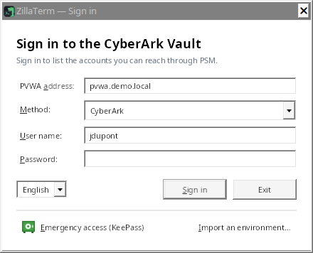

Enter the PVWA address (`pvwa.mydomain.local` is enough: `https://` and `/PasswordVault` are added), choose the
authentication method, then your user name and password. If the RADIUS server asks a question (OTP code), the window
shows it and waits for your answer.

The address, method and user name are remembered; **the password never is**.

The list at the bottom left changes the interface language (Français, English, Italiano); the window reopens right
away in the chosen language, keeping the address and user name you typed.

## 2. Find an account: "Available" tab

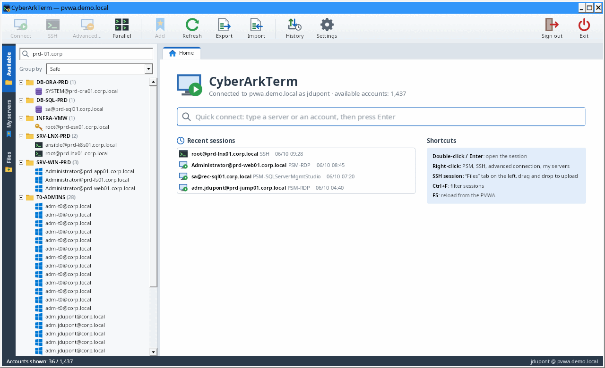

- The search box filters on every field (server, user, safe, platform, domain…), several words allowed (`prd sql`).
- "Group by" sorts accounts by safe, platform or target type.
- The "Export" toolbar button saves the accounts shown (filtered by the search) to CSV.
- **Safe members**: right-click an account (or a safe when accounts are grouped by safe, or a server in "My
  servers") → "Safe members". The window lists the users and groups of the safe with their rights (list, use,
  retrieve, add accounts, update, delete, manage members…), shows who can **add accounts**, and details every right
  of the selected member. The PVWA only gives this list to an account with the "View Safe Members" right on the
  safe. `Ctrl+A` then `Ctrl+C` copies the table. With the "Manage safe members" right, the "Add a member…", "Edit
  the rights…" (or double-click) and "Remove…" buttons manage the members: name, type (user or group), directory
  ("Vault" or the LDAP domain), optional end date and the 22 rights, grouped as in the PVWA.
- **Add an account**: right-click an account (or a safe when accounts are grouped by safe) → "Add an account to the
  safe…". Safe, platform, address and user name are required; logon domain, account name, password, allowed machines
  and CPM management are optional. The account you clicked is used as a template (safe, platform, domain). The
  account is created with the rights of your session: the "Add accounts" right on the safe is required, and usually
  "Update account content" to give the password. The list is then reloaded and the new account selected.
- **Import accounts (CSV)**: "Import" toolbar button, or right-click an account or a safe → "Import accounts
  (CSV)…". A small window asks for the file ("Save a template…" gives an example), the default safe and platform,
  and sums up what will be created; nothing is sent before "Import". Required columns: address and user name (plus
  safe and platform, otherwise the defaults); optional: name, domain, password, allowed machines, CPM management
  (yes/no), reason. Separator `;`, `,` or tab, column names in English, French or Italian; a file made with "Export"
  can be imported again. A second window then creates the accounts line by line and shows each line's status
  (created, refused with the PVWA message, not imported, not sent; "Stop" available). At the end it offers to save
  the result as CSV (without the passwords). The file's passwords are never shown; delete the file after the import.
- **Edit / delete an account**: right-click → "Edit the account…" (platform, address, user name, domain, name,
  allowed machines, CPM management; only the changed fields are sent) or "Delete the account…" (after confirmation).
  Rights "Update account properties" and "Delete accounts".
- **Password status (CPM)**: an account's tooltip tells whether the CPM manages it, and the date of the last change,
  verification and reconciliation; a **⚠** marks an account whose last CPM operation failed.
- **Right-click → "Password"** ("Available" accounts and "My servers" servers):
  - "Verify", "Change…", "Reconcile…" ask the CPM for the operation (confirmation to change and reconcile; right
    "Initiate CPM account management operations"). The CPM then handles it: `F5` shows the new status.
  - "Copy the password…": reason and ticket if the platform asks for them, then the password is copied to the
    clipboard for 20 seconds, **without being shown** ("Retrieve accounts" right; the retrieval is recorded in the
    vault audit).
- On the Home tab, **quick connect** finds a server as you type: press Enter to connect.

## 3. Open a PSM session (remote desktop)

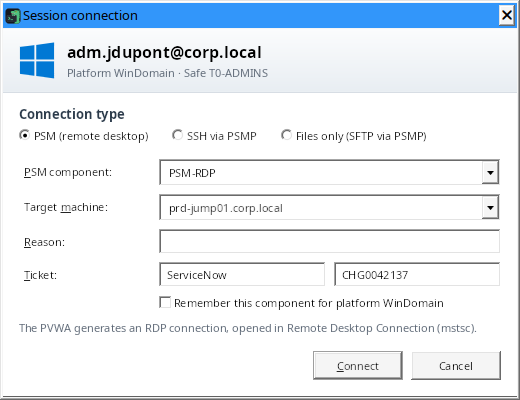

Double-click the account (or press Enter, or the "Connect" button); a Unix account opens over SSH through the PSMP
when its address is set (see 4.), and "Advanced connection…" then lets you choose the PSM. CyberArkTerm requests the
connection from the PVWA and opens the session in Windows **Remote Desktop Connection** (`mstsc`), exactly like the
PVWA "Connect" button: the PVWA's RDP file is handed over as is. A component that opens a remote application
(RemoteApp) opens its windows on this computer's desktop.

- **PSM component**: deduced from the platform (`PSM-RDP` for Windows, `PSM-SSH` for Unix and network,
  `PSM-SQLServerMgmtStudio`, `PSM-SQLPlus`…). Tick "Remember this component" to keep it for the whole platform. Your
  PVWA may name its components differently (for example `WIN-PSM`): enter the name its "Connect" button offers; the
  list then offers the components already used, the platform's first.
- **Domain accounts**: the window asks for the target machine, prefilled with the account's allowed machines.
- **Reason and ticket**: if the PVWA refuses the request (reason required, component not configured…), its message
  is shown and you can fix it and try again.
- The "Advanced…" button (or right-click → "Advanced connection…") opens this window on demand.

## 4. Open an SSH session through the PSMP

Set the PSMP address once in **Settings**: Unix accounts then open over SSH by default (double-click or Enter). For
another account, right-click → "Connect over SSH" (or the "SSH" button).

The session opens **in a CyberArkTerm tab**, with the standard PSMP login `<you>@<target account>[#domain]@<target
server>`. User names containing spaces (`John Smith`, `Local Admin`) are accepted.

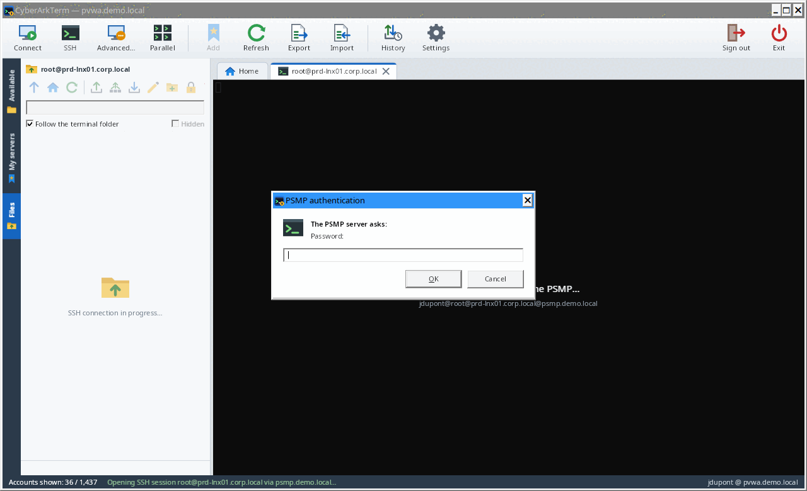 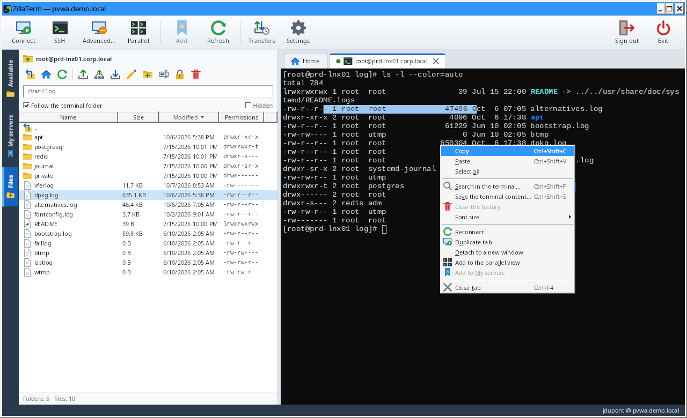

- **Authentication**: if the PVWA provides an "MFA caching" key, no question is asked. Otherwise the PSMP questions
  (password, MFA code) are shown; the password is reused for the SFTP and SCP connections of the same tab, never
  saved.
- **PSMP key**: on first connection, its SHA256 fingerprint is shown and must be accepted; if it changes later, a
  warning is shown.
- **Terminal**: selecting copies, the mouse wheel scrolls back, AltGr works on international keyboards. Close the
  tab with its cross or a middle click.
- **Right-click in the terminal** (or the keyboard's Menu key): copy, paste, select all, search, save the content,
  clear the history (on this computer only, nothing is sent to the server), font size, and the tab's actions
  (reconnect, duplicate, detach, parallel view, close). To paste with a plain right-click instead, tick "Right-click
  in the terminal pastes the clipboard" in Settings; Shift+right-click then opens the menu.
- **Appearance**: colour palette and font size in Settings (Campbell, One Half, Solarized, dark or light);
  `Ctrl+wheel` enlarges or shrinks a terminal, `Ctrl+0` goes back to the default size.
- **Search** in the terminal, history included: `Ctrl+Shift+F` (or right-click in the terminal or on the tab).
  Matches are highlighted; `Enter` goes up to older ones, `Shift+Enter` goes down, `Esc` closes.
- **Save the content** of the terminal (history and screen) to a text file: `Ctrl+Shift+S` (or right-click in the
  terminal or on the tab). Only when you ask: the file may contain sensitive information.
- **Detach a tab** (another screen): drag the SSH tab out of the window, or right-click → "Detach to a new window".
  The terminal moves to a separate window and the session goes on. The tab keeps its place ("Show the window",
  "Bring it back here") and the Files tab works on this session when it is selected. Closing the separate window
  brings the terminal back to its tab without closing the session. Remote desktop tabs do not detach (use "Full
  screen"); PSM sessions already open in Windows Remote Desktop Connection, a window of its own.
- **Parallel view** (up to 8 sessions on screen): "Parallel" toolbar button, or right-click an SSH tab → "Add to the
  parallel view". Tick the open SSH sessions to show together (8 at most): they are laid out as a grid in the
  "Parallel" tab, side by side up to 3, then on two rows. Each session has its title and state; "⤢" (or a
  double-click on the title) enlarges it alone, "✕" sends it back to its tab. The Files tab follows the session you
  work in. "Close the view" gives each terminal back to its tab without closing the sessions. Remote desktop
  sessions cannot go there.
  - **Simultaneous typing**: "Simultaneous typing" button of the view. What you type in a ticked session ("Receives
    the typing") is also sent to the other ticked, connected sessions: the same command on several servers. It is
    **off every time the view opens**; when on, an orange banner gives the number and names of the sessions
    receiving the typing, and an orange frame surrounds them. A session added while it is on is not ticked; what is
    typed in an unticked session only goes to it. Each key is encoded by the session that receives it (arrows work
    in a shell as in vim). The mouse wheel is not copied, and pasting several lines into several sessions asks
    first.
  - **From "My servers"**: right-click a folder → "Open in the parallel view" connects its SSH servers (subfolders
    included) and puts them straight in the view; or pick servers with `Ctrl+click` (`Shift+click` for a range),
    then right-click → "Open the N servers in the parallel view". Beyond the free places (8 at most), a window asks
    which ones to open; Windows (PSM) servers are left out. Each connection stays a separate PSMP session, with its
    usual questions.
  - **Separate window**: "Separate window" button of the view, right-click the "Parallel" tab, or drag the tab out
    of the window. Closing it brings the view back to its tab without closing the sessions.
  - **Send files** to the sessions of the view: "Send files…" button (see the Files tab).

## 5. Browse and upload files: "Files" tab

When an SSH session opens, the **Files** tab appears on the side and follows the active SSH tab.

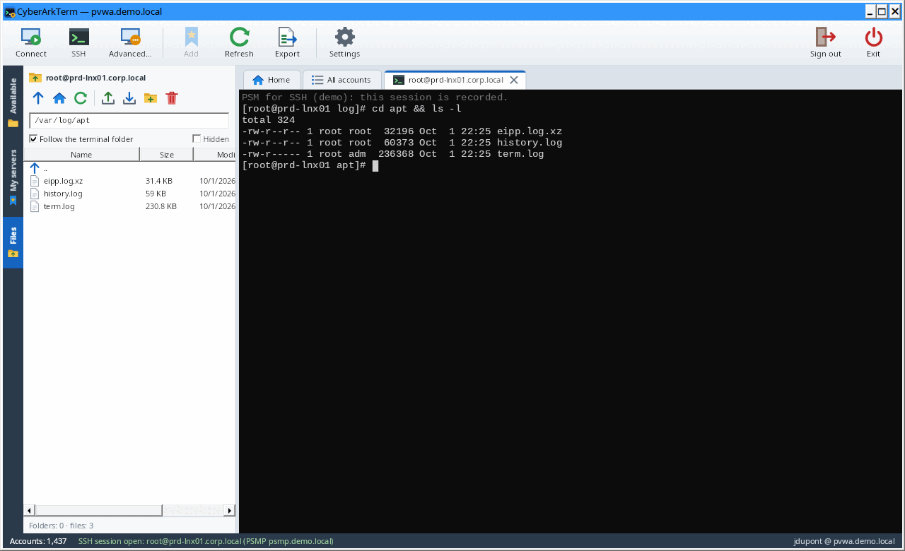

- **Path bar**: current path, editable (type a path, then Enter). Double-click a folder to enter it, `..` to go up,
  "parent folder" and "home folder" buttons.
- **Sort**: click a column header (Name, Size, Modified, Permissions); click it again to reverse the order (an arrow
  shows it). Size and date start with the largest and the newest. Folders stay on top; the sort is kept from one
  folder and one session to the next.
- **Upload files**: drag them from Explorer onto the list (or the "Upload" button). Sent over **SCP** by default
  (SFTP as an option), folders included; confirmation before overwriting an existing file.
- **Download by dragging**: drag files or folders from the list to Explorer or the desktop. Nothing is downloaded
  while dragging: on drop, a window shows the progress (Cancel stops it), then Explorer copies the files where you
  dropped them. Unix names are made valid for Windows (`\`, `:`, `..`, `CON`… replaced), never writing outside the
  drop folder; the temporary download folder is deleted afterwards.
- **Transfer queue**: uploads and downloads run one at a time, in the order requested; what you ask for during a
  transfer is added to the queue instead of being ignored. An upload goes to the folder shown when you dropped the
  files, and the overwrite confirmation also counts uploads still waiting. A panel above the status bar shows each
  item (waiting, progress and file n/N, check, result): ✕ removes a waiting item, "Cancel" stops the running one,
  "Cancel all" empties the queue. A stopped transfer deletes the file being transferred, which is incomplete (on the
  server for an upload, on this computer for a download); files already transferred stay. Beware: if the upload was
  replacing an existing file, its old content is lost. Over SCP, stopping ends only that transfer: the next items go
  on over the same connection; a transfer that no longer moves (server not reading) stops 2 s after "Cancel" and the next
  ones go on over a new connection. If the server closes the SCP channel before a file starts, CyberArkTerm tries once
  more on a new connection, then reports a clear error (SFTP uploads can be chosen in Settings). A file sent over
  SCP gets the upload date on the server (as `scp` without `-p`, and as over SFTP). An error is shown in the queue
  and the queue goes on; at the end, a single summary. Browsing, deleting, permissions, the editor and dragging to
  Explorer get in between two files. Closing the tab or the application with transfers running asks for
  confirmation.
- **Many files at once: .tar.gz archive**: from 200 dropped files (threshold in Settings, option "Offer a single
  .tar.gz archive"), CyberArkTerm offers to send them in a single archive: one file to transfer and check instead of
  thousands, much faster through the PSMP. The archive is made on this computer (in the queue, can be cancelled),
  sent and checked (SHA-256), then deleted from this computer; each dropped item is at the root of the archive
  (permissions 0644 and 0755). Nothing is run on the server: an orange box shows up at the bottom of the Files tab
  with the extraction command, for example `cd '/opt/app' && /usr/bin/gzip -dc './deploy.tar.gz' | tar xf - && rm -f
  './deploy.tar.gz'` (the archive is deleted from the server once extracted). "Copy the command", or "Type it in the
  terminal", which types it at the prompt of the session without running it: check it, then press Enter. The box
  stays (for that session) until you close it. "Send the files one by one" keeps the usual upload; "Don't offer
  again" turns the option off.
  - **Every Unix** (Red Hat 5 to 9, HP-UX 11.11 and 11.31, Solaris, AIX…): the archive is in the standard POSIX tar
    format (ustar), read by every tar, and the command uses `gzip` and `tar xf` separately, with no GNU tar specific
    option. It can be typed in any shell (sh, ksh, bash, zsh, csh, tcsh).
  - **gzip** is looked for on the server (through SFTP) where each system installs it: `/bin`, `/usr/bin`,
    `/usr/contrib/bin` (HP-UX), `/usr/local/bin`, `/opt/freeware/bin` (AIX), `/usr/sfw/bin` and `/opt/csw/bin`
    (Solaris). Not found: the archive is sent uncompressed (`.tar`), extracted by `tar` alone.
  - A name over 100 characters (folders excluded) or a file over 8 GB does not fit this format: the files are then
    sent one by one, with a message.
- **Send to several servers**: button (arrow to three servers) or right-click → "Send to several servers…". Pick the
  files or folders, the destination folder (`~` = the home folder of the account on each server, e.g. `~/deploy`)
  and the SSH sessions to send to. CyberArkTerm first checks on each server that the folder exists and what would be
  replaced (a single question for all), then queues one upload per server: same protocol, same SHA-256 check on each
  server, a single summary at the end.
- **Compare**: right-click a file → "Compare with…": the same path (or another one) on a server with an open SSH
  session, or a file of this computer; with two files selected, "Compare the 2 files". The files are read **in
  memory** (50 MB at most each), without a copy on this computer. The window shows the lines side by side: removed
  in red on the left, added in green on the right. `F7` / `Shift+F7`: next / previous difference; "Ignore spaces";
  "Only the differences"; "Save the diff…" in the `diff -u` format. A binary file (or one over 10 MB) is compared by
  its size and SHA-256 checksum. With a comparison tool chosen in Settings (WinMerge, VS Code…), "Open in …" gives
  it two temporary copies, deleted when the window closes.
- **Transfer history**: "History" toolbar button (up and down arrows with a clock, left of "Settings"), available
  even without a session. It lists the last 200 uploads and downloads (drag and drop included): date, direction,
  server, item, destination, number of files, result. "Uploads" / "Downloads" filter; "Checksums…" (or double-click)
  shows each file's size, SHA-256 checksums and result, and copies them in the `sha256sum -c` format to check again
  on the server; "Open the folder" for a download; "Clear the history".
- **Transfer check (SHA-256)**: every uploaded or downloaded file is checked. On upload (SCP or SFTP), the local
  file is hashed, then the file on the server is read again over SFTP and hashed. On download, the data received
  from the server is hashed, then the file written on this computer is read again. The status bar confirms "✓
  identical on both sides"; the checksums of each file are in the **History** (toolbar button). If a file differs,
  the error is shown and the details open by themselves; a drag-and-drop download fails rather than deliver a wrong
  copy. A file that cannot be read again (permissions) is reported as "not checked". Reading an upload again doubles
  the data exchanged with the server.
- **Delete**: select, then Del (or right-click → "Delete (rm)"), with confirmation. Folders must be empty.
- **Edit a file**: select it, then `F4` (or right-click → "Edit", or the pencil button). The file opens in the text
  editor chosen in Settings (Notepad by default). Every time you save, CyberArkTerm offers to send it back to the
  server: sent over SFTP, the file's permissions are kept. If the file changed on the server since you opened it, a
  warning asks before overwriting it.
- **Follow a file (tail -f)**: right-click one or several files → "Follow (tail -f)". A window shows the end of the
  file, then each new line as soon as it is written, like `tail -f`, reading the file over SFTP every second: no
  command runs on the server. A file truncated or replaced by a rotation is read again from the start; the last
  10,000 lines are kept.
  - **Colours and alerts**: errors (ERROR, FATAL, CRITICAL…) in red, warnings (WARN) in orange; words of your choice
    highlighted in yellow ("Highlight", separated by commas). "Alert on" (e.g. `ERROR, OutOfMemory, Connection
    refused`): every new line containing one of these words is marked, the "⚠ n alerts" counter goes up (a click
    goes to the next one) and the window's taskbar button flashes; a Windows notification can be shown, at most one
    every 30 s, with the number of lines and the file name only, **never the content of the lines** (it may show on
    the lock screen). These settings are kept for the next windows.
  - **Combined view**: several selected files open in a single window, and "Add to a follow window" adds a file from
    another tab, so from another server. Lines are interleaved in the order they arrive, prefixed and coloured by
    file (`[root@srv01 app.log]`); at the bottom, each file has its state and a button to stop following it.
  - **Filter and search**: filter (like `grep`), exclusion (like `grep -v`), context lines (like `grep -C 3`), as
    plain text or regular expressions. `Ctrl+F` searches the lines without filtering them (Enter / `F3`: next,
    `Shift+F3`: previous). Scrolling up stops following the end.
  - **Disconnections**: when the connection is lost, a marker says so; when the SSH tab reconnects (or with
    "Reconnect"), following resumes where it stopped, with the lines written in the meantime. Closing the tab stops
    following its files; the window keeps the lines received.
  - **Remembered files**: on a server of the "My servers" tab, followed files are remembered (the last 12); at the
    next connection, the follow button of the Files tab offers them: "Follow them all in one window" in one click,
    or a single one.
  - **Keep a trace**: "Save…" writes the displayed lines to a file on this computer; "Record continuously…" writes
    the lines already received, then each new line as it arrives, as long as the box is ticked; "Marker" inserts a
    `—— 14:32:05 ——` line to find a moment again (before a change, for example).
  - **Connection**: by default, following uses the SFTP connection of the Files tab; it then runs between two files
    of a transfer. The Settings option "Follow files (tail -f) in an independent session" gives it its own
    connection, one per window and server: it no longer waits for transfers, but it is one more PSMP session
    (recorded separately, and an MFA validation may be asked). It is closed with the window. A lost connection is
    never reopened in a loop.
- **Permissions**: right-click → "Permissions…" (or the padlock button). Read / write / execute boxes for owner,
  group and others, special bits (setuid, setgid, sticky) and the octal value (`644`, `1777`…), for one or several
  items. For a folder, "Apply to the folder contents too" propagates the permissions to subfolders and files; by
  default, execute (x) is only given to folders and to files that are already executable. Symbolic links are not
  followed and the owner is not changed.
- Also: new folder, download, copy path, show hidden files.
- **Follow the terminal folder**: when ticked, every `cd` in the terminal moves the browser to the same folder (see
  [How it works](#how-it-works)). After `sudo -i` or `su`, tick the box again at the shell prompt to re-enable
  tracking in that new shell.

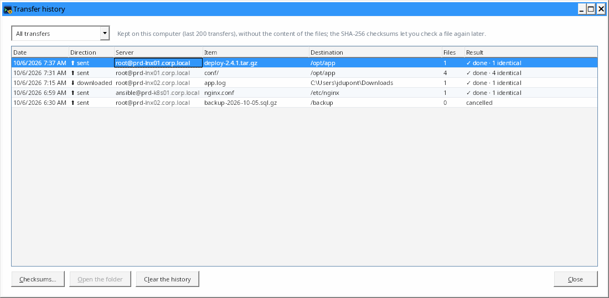

## 6. Organize your servers: "My servers" tab

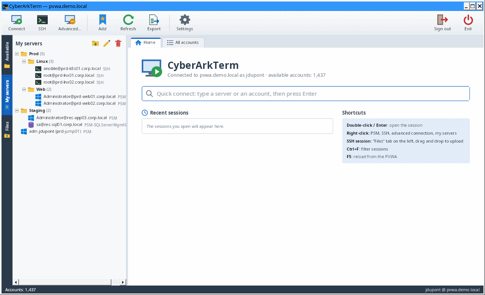

- **Add** an account: right-click in "Available" → "Add to my servers" then the folder you want, or drag the account
  onto the "My servers" tab, or the "Add" toolbar button.
- **Add a recent connection**: right-click in the recent sessions of the home page → "Add to my servers" then the
  folder you want. The server keeps the connection type (PSM or SSH), the PSM component and the target machine used.
- **Folders**: right-click → new folder or subfolder, rename, delete; drag servers and folders to move them.
- **Search**: box at the top of the tab (or `Ctrl+F` in the tab). It filters servers by name, server, user, folder,
  component, target machine, and the entries of unlocked KeePass vaults; the folders of the results are expanded.
  `Enter` or `↓` selects the first result, `Esc` clears.
- **Several servers at once**: `Ctrl+click` adds or removes a server (or all those of a folder), `Shift+click` picks
  a range of servers; `Esc` or a plain click cancels. Right-click one of them → "Open the N servers in the parallel
  view" or "Connect to the N servers" (one tab each). Right-click a folder → "Open in the parallel view" or "Connect
  to the N servers".
- **Settings of each server** (right-click → "Properties…"):

| Setting | Effect |
| --- | --- |
| Name, folder | Display and position in the tree. |
| PSM or SSH via PSMP | Connection type opened on double-click. |
| PSM component | Component to use (empty: deduced from the platform). |
| Target machine | Server to open the session on, for a domain account. |
| Default reason | Access reason sent automatically to the PVWA. |
| SFTP start folder | The terminal **and** the file browser open directly in this folder. |

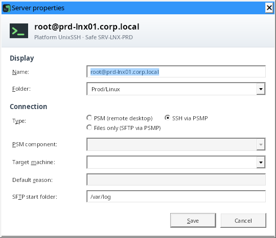

A server whose account is no longer visible in CyberArk is greyed out.

## 7. Emergency access outside CyberArk: KeePass vaults

When CyberArk is unavailable, CyberArkTerm opens your KeePass vaults (`.kdbx`) and connects **directly** to the
servers, over SSH or remote desktop, with the accounts they hold.

> These connections **do not go through the PSM**: no recording, no CyberArk rules. Every vault opening,
> connection and change is written to the local log `%APPDATA%\CyberArkTerm\urgence.log`.

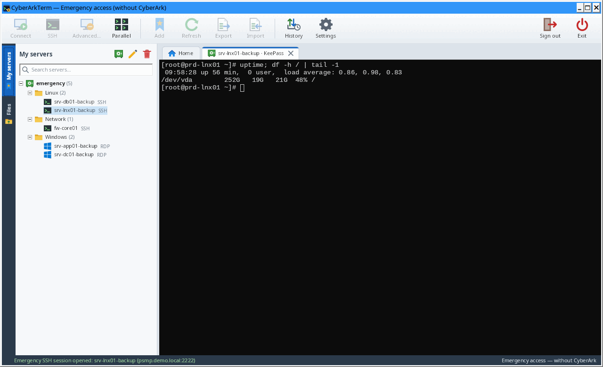

- **Without CyberArk**: on the sign-in screen, "Emergency access (KeePass)" opens the main window without the PVWA
  (only the KeePass vaults are shown). With CyberArk, the vaults also appear at the top of "My servers".
- **Add a vault**: vault button of the "My servers" tab (or right-click → "Add a KeePass vault…"): `.kdbx` file,
  name, optional key file.
- **Unlock**: double-click the vault. Master password and/or key file (every KeePass format). "Remember the master
  password in the local vault" saves typing it again (see below).
- **Connect**: double-click an entry. The protocol comes from its address (`ssh://server:22`, `rdp://server`,
  `server:3389`), a "Protocol" / "Port" field or an `ssh` / `rdp` tag; otherwise CyberArkTerm asks SSH or remote
  desktop. The entry's password is used directly (terminal + Files tabs over SSH, remote desktop tab over RDP); it
  is never shown or written to disk. The remote desktop tab follows its size (remote desktop resolution) and offers
  "Full screen" (`Ctrl+Alt+Break` to come back), "Disconnect" and "Reconnect".
- **Edit the vault**: right-click → "New entry…", "Edit…" (`F2`), "Delete" (`Del`, into the vault's recycle bin).
  The rest of the vault (attachments, fields, settings) is kept; the previous version of an entry goes to its
  history, like in KeePass.
- **Lock**: right-click → "Lock". Vaults also lock on sign-out, on exit and when **Windows is locked**.

**Local vault**: the master passwords you choose to remember are kept in `%APPDATA%\CyberArkTerm\coffre-local.dat`,
encrypted with a password of your own (asked when you unlock a KeePass vault whose password is remembered, "Later"
to type the vault password instead) and tied to your Windows account. Manage it in the **Settings**: create, unlock,
change the password, delete.

## Shortcuts

| Where | Action | Shortcut |
| --- | --- | --- |
| Everywhere | Reload the accounts from the PVWA | `F5` |
| Everywhere | Filter the accounts (in "My servers": search a server) | `Ctrl+F` |
| Lists and trees | Open the session | Double-click or `Enter` |
| Search | Clear the filter | `Esc` |
| My servers | Rename / remove or delete | `F2` / `Del` |
| My servers | Pick several servers (then right-click to open them together) | `Ctrl+click`, `Shift+click`; `Esc` cancels |
| Terminal | Copy | Mouse selection, or `Ctrl+Shift+C` |
| Terminal | Paste | `Shift+Insert` or `Ctrl+Shift+V` (right-click with the Settings option) |
| Terminal | Menu: copy, paste, select all, search, save, clear the history, font size, tab actions | Right-click or Menu key (Shift+right-click with the paste option) |
| Terminal | Scrollback | Mouse wheel, `Shift+Page Up` / `Shift+Page Down` |
| Terminal | Search (history included) | `Ctrl+Shift+F`, then `Enter` / `Shift+Enter` |
| Terminal | Save the content to a file | `Ctrl+Shift+S` |
| Terminal | Font size / default size | `Ctrl+wheel` / `Ctrl+0` |
| Comparison | Next / previous difference | `F7` / `Shift+F7` |
| SSH or remote desktop tab | Close | Tab cross or middle click |
| SSH or remote desktop tab | Reconnect, duplicate (another session on the same account or entry), detach (SSH), close, close the other tabs | Right-click on the tab |
| SSH tab | Detach to a separate window (another screen) | Drag the tab out of the window |
| SSH tab | Add to the parallel view, or take it out | Right-click the tab |
| Remote desktop | Full screen / back | `Ctrl+Alt+Break` |
| Files | Open / edit / parent folder / delete / refresh | `Enter` / `F4` / `Backspace` / `Del` / `F5` |
| Files | Sort by a column, then reverse | Click its header |
| KeePass vault | Connect / edit / delete an entry | Double-click or `Enter` / `F2` / `Del` |

## Settings and configuration file

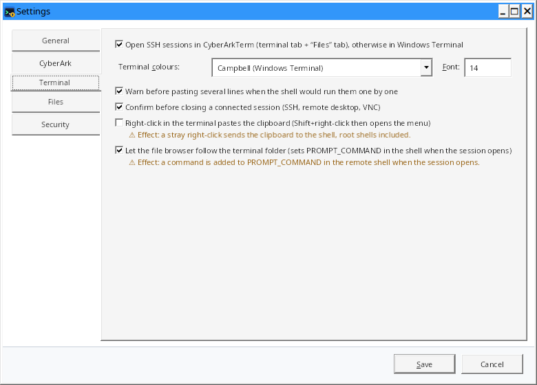

| Setting | Purpose | Default |
| --- | --- | --- |
| Interface language | Français, English, Italiano or system language; applied after signing out or at the next start | Windows language (English if it is not translated) |
| PSMP address and port | PSM for SSH server; when set, Unix accounts open over SSH by default; empty = SSH disabled | empty, 22 |
| Keep the PVWA session open | Light request every 4 minutes; paused while Windows is locked | yes |
| Look for a new version at startup | One request to GitHub at most once a day; a link in the status bar when a newer version exists | no |
| Local vault | Remembered KeePass master passwords: create, unlock, change password, delete | — |
| Debug log | Settings button menu: how connections unfold, in a file, without secrets (see [Security](#security)); "Show the debug log file" opens it in Explorer | no |
| SSH in CyberArkTerm | Built-in terminal and Files tab; otherwise Windows Terminal | yes |
| Follow the terminal folder | Allows setting up folder tracking in the shell | yes |
| File upload | SCP or SFTP | SCP |
| Text editor | Program opened by "Edit" in the Files tab | Notepad |
| Comparison tool | Program offered in the comparison window, with its arguments (`{0}` = left file, `{1}` = right file) | none |
| Terminal colours, font | Palette (Campbell, One Half, Solarized…) and font size of the SSH terminals | Campbell, 14 |
| Follow in an independent session | Following a file (tail -f) opens its own SFTP connection (one more PSMP session) | No |
| Accepted PSMP keys | Remembered fingerprints ("Forget keys" button) | — |
| Remembered components | PSM component chosen per platform ("Forget" button) | — |

All preferences are saved in `%APPDATA%\CyberArkTerm\settings.json`: language, PVWA address, sign-in method and user
name, the settings above, "My servers", their folders and the files followed on them (paths), recent sessions,
location of the KeePass vaults and of their key files. This file contains **no password, token or private key**. To
start from scratch, close the application and delete it. The transfer history of the Files tab is next to it, in
`transfers.json` (file names and paths, SHA-256 checksums, never their content).

## Security

- **HTTPS required** to the PVWA; certificate validation is never disabled.
- **No secret on disk**: CyberArk password, session token, MFA key and PSMP password stay in memory for the session.
  The PVWA session is closed (`Logoff`) on exit.
- PVWA session opened with `concurrentSession`: your PVWA web session, if any, is not closed.
- **Copying a password**: the PVWA response is read into a buffer wiped afterwards and decoded without going through
  a string; the password goes straight to the Windows clipboard, marked to be excluded from the history (`Win+V`),
  from cross-device sync and from clipboard monitoring tools, then cleared after 20 s if it is still there, and on
  sign-out, exit and Windows lock. It is never shown nor written to the debug log.
- **Adding an account**: the password is read from the masked box without going through a string, sent once to the
  PVWA over HTTPS, then wiped from memory; it is neither saved nor written to the debug log.
- **PSM sessions**: the PVWA's RDP file (one-time PSM token) is written to `%TEMP%\CyberArkTerm` for `mstsc`, which
  checks its signature, then deleted after 60 s or on exit.
- **Simultaneous typing** (parallel view): off every time the view opens, shown by an orange banner and frame that
  name the sessions concerned; an added session is not included by default, and pasting several lines into several
  sessions asks first. Each session stays a separate PSMP session, recorded as usual.
- **File comparison**: contents read in memory and wiped when the window closes; only the copies given to an
  external tool go through the disk (`%TEMP%\CyberArkTerm\compare`), deleted when the window closes and at the next
  start.
- **New version**: no request to the Internet without your action or the Settings option (off by default); only the
  addresses of the project repository are followed, the archive is kept only when its SHA-256 checksum is the one of
  `SHA256SUMS.txt`, and nothing is installed or started.
- **PSMP host keys pinned** on first use, with a warning if they change (the same for servers reached in emergency
  access).
- **PVWA session keep-alive**: it avoids the idle timeout; nothing is sent while Windows is locked, and the option
  can be turned off in the Settings if your policy requires it.
- **KeePass vaults**:
  - the master password is never saved, except in the local vault if you ask for it: Argon2id (64 MiB, 3 passes)
    then AES-256-GCM, key derivation settings authenticated, all protected by DPAPI (Windows account);
  - in memory, the vault key and the entry passwords stay masked and are only revealed when connecting; vaults lock
    on sign-out, on exit and when Windows is locked;
  - safe saving: the file is read again, the change is applied to its current version (changes made elsewhere are
    kept), the decrypted result is checked, a `.bak` copy is kept and the file is replaced in one step; an entry
    changed elsewhere in the meantime is not overwritten;
  - direct remote desktop: the password is only passed to the Remote Desktop control (no file, no credential
    manager), with network level authentication (NLA) and a warning if the server is not recognized;
  - `urgence.log`: date, Windows account, computer, action, vault, entry, target; never a password.
- **Debug log**, off by default (Settings button menu): `%LOCALAPPDATA%\CyberArkTerm\debug.log`, 5 MB at most plus
  one `.1` generation. It records how PVWA, PSM, remote desktop and SSH connections unfold: request addresses and
  statuses, .rdp file settings, Remote Desktop control events and codes, errors. It contains server and account
  names, but **never** a password, session token, PSM session request (`PSM@…` masked), signature, request header or
  body, nor session content. The status bar shows it while it is on. Read it before passing it on, and delete it
  once the problem is solved.
- **Edited files**: the local copy opened in the editor is stored in `%TEMP%\CyberArkTerm\edit` and deleted when the
  SSH tab closes; a warning shows if changes were not sent back.
- **No command injection**: SCP paths and start folders are quoted for the remote shell; `ssh` / Windows Terminal
  arguments are validated and passed without a shell.
- CSV export protected against Excel formula injection.
- PSM and PSMP sessions opened by CyberArkTerm are standard CyberArk sessions: they are recorded and audited by the
  PSM like the ones opened from the PVWA.

To report a vulnerability, see [SECURITY.md](../SECURITY.md) (private reporting, no public issue).

## How it works

### PVWA API calls

| Call | Purpose |
| --- | --- |
| `POST /PasswordVault/API/auth/{CyberArk\|LDAP\|RADIUS\|Windows}/Logon` | Sign in |
| `GET /PasswordVault/API/Accounts?offset=…&limit=1000` | Paged account list |
| `POST /PasswordVault/API/Accounts/{id}/PSMConnect` | RDP file of the PSM session |
| `POST /PasswordVault/API/Accounts` | Creates an account in a safe ("Add an account") |
| `POST /PasswordVault/API/Accounts` (once per line) | Imports accounts from a CSV |
| `PATCH` / `DELETE /PasswordVault/API/Accounts/{id}` | Edits (changed fields only) and deletes an account |
| `POST /PasswordVault/API/Accounts/{id}/Verify`, `/Change`, `/Reconcile` | Operations requested from the CPM |
| `POST /PasswordVault/API/Accounts/{id}/Password/Retrieve` | Copies the password (reason, ticket; "copy" usage in the audit) |
| `POST` / `PUT` / `DELETE /PasswordVault/API/Safes/{safe}/Members[/{member}]` | Adds a safe member, sets its rights, removes it |
| `GET /PasswordVault/API/Safes/{safe}/Members?offset=…&limit=1000` | Members of a safe and their rights ("Safe members" window) |
| `POST /PasswordVault/API/Users/Secret/SSHKeys/Cache` | Temporary "MFA caching" SSH key (if enabled) |
| `GET /PasswordVault/API/Accounts?offset=0&limit=1` | Session keep-alive (every 4 minutes) |
| `POST /PasswordVault/API/Auth/Logoff` | Sign out |

### KeePass vaults

Native reading and writing (no KeePass installed) of the **KDBX 3.1 and 4.x** formats: AES-256 or ChaCha20
encryption, AES-KDF (processor AES instructions) or Argon2d / Argon2id key derivation, XML 1.0 / 2.0 key files, 32
bytes, 64 hexadecimal characters or any file. The rewritten file keeps the original version, encryption and key
derivation, with new seeds on every save. The test vaults (`tests/CyberArkTerm.Core.Tests/KeePass/Vaults`) come from
KeePassXC and pykeepass, and files written by CyberArkTerm were checked in both tools.

### Remote desktop sessions

PSM sessions open with the RDP file returned by `PSMConnect`, handed as is to Remote Desktop Connection (`mstsc`):
it checks its signature and handles a desktop as well as a remote application (RemoteApp). The debug log records its
structure (token, signature and arguments masked). Versions 0.4 to 0.6 opened these sessions in a tab: a PSM that
only accepts remote applications did not work well there (place and size of the windows on the server, mouse), hence
the return to `mstsc`.

Remote desktop tabs (direct remote desktop from KeePass vaults) host the Windows ActiveX control (`mstscax.dll`, the
most recent `MsRdpClient` class available), set up as a direct connection: network level authentication (NLA),
warning if the server is not recognized, redirections off except the clipboard. The remote desktop resolution
follows the tab size. Session ends and connection errors are explained in the tab with the Windows message and codes
(reason, extended reason). An integration test (`rdp-integration` workflow) opens a real session on the CI machine.

**One thread per remote desktop connection.** The control, its window and its events live on a separate thread (STA,
with its own message loop); the interface never waits for it. The tab holds a window of the interface thread, in
which that thread places the control's window. Before releasing the control, it takes the window out: a slow
disconnection or release no longer freezes the application. If the thread stops responding for 5 s, the tab bar says
so, and the rest of the application stays usable. Limit: Windows shares keyboard and mouse input between a window
and the windows it contains, even from another thread; a control that is stuck for good can still hold up a click in
its area or a focus change.

### PSMP sessions

Each SSH tab opens up to three connections to the PSMP, with the same login `<you>@<account>[#domain]@<target>`: the
terminal, the SFTP connection of the Files tab, and an SCP connection on the first SCP upload. Each one is a PSMP
session, recorded by the PSM. Sending to the server (typing, terminal size) and closing connections happen off the
interface thread, in order: a server or PSMP that stops reading does not freeze the application.

### Following the terminal folder

When an SSH session opens (if the option is on), CyberArkTerm waits for the target server's shell to show its prompt
(up to 60 s: the PSMP sometimes takes several seconds to reach the target), then sends it a one-line command,
preceded by a space so it stays out of the history (bash, or zsh with `HIST_IGNORE_SPACE`). Nothing is sent if you
already started typing; the command can be sent again without duplicate effect (the "Follow" box):

- sets `PROMPT_COMMAND` (bash) or `precmd` (zsh) to emit the standard **OSC 7** sequence with the current folder at
  each prompt;
- with tcsh, the `cwdcmd` alias (only if it is not already defined), which emits the same sequence at each folder
  change;
- if a start folder is configured, a `cd` to that folder;
- erases the typed command so it does not stay on screen.

The built-in terminal decodes the OSC 7 sequence and the Files tab moves to that folder.

Every shell reads the command without error: each part runs only in the shell family it is written for. With csh,
ksh, sh or fish, following is not set up and nothing stays on screen.

## Troubleshooting

| Symptom | Likely cause and fix |
| --- | --- |
| "The PVWA has no connection component “PSM-RDP” for this account" (`EPVWA093E Failed to get the relevant connection component`) | The account's platform uses a component with another name (for example `WIN-PSM`): the one offered by the PVWA "Connect" button, or the name after `/c` in a `psm /u … /a … /c …` command. Enter it in "Component"; "Remember this component for platform" is ticked for the next connections. |
| "TLS connection refused: this computer does not trust the PVWA certificate" | The certificate (or its issuing authority) is not in the workstation's Windows store. |
| "The PVWA must be reached over HTTPS" | Type the address without `http://` (or with `https://`). |
| "Your CyberArk session has expired" | PVWA inactivity timeout reached: sign in again. |
| "Password" → "Copy": "The PVWA refused: … “Retrieve accounts” …" | Missing right on the safe, or reason / ticket required by the platform: type it. With dual control, make the request in the PVWA. |
| "Verify / Change / Reconcile": "The PVWA refused: … “Initiate CPM account management operations” …" | Ask for this right on the safe; "Safe members" shows your rights. |
| "Add an account": "The PVWA refused: your account needs the “Add accounts” right…" | Ask for this right on the safe (and "Update account content" to give the password), or create the account without a password. "Safe members" shows your rights. |
| "Safe members": "Your account cannot see the members of this safe" | The PVWA requires the "View Safe Members" right on the safe: ask a manager of the safe. |
| "Connection component … is not configured for platform …" | Choose the right component in "Advanced connection", tick "Remember" for the platform. |
| "You must specify a reason…" | Enter a reason in the window that opens (or a default reason in the server's properties). |
| The account does not show up | You lack the "List accounts" permission on its safe, or the list needs reloading (`F5`). |
| The PSMP password is asked for each tab | MFA caching is not enabled on the PVWA: expected behavior (once per tab). |
| The Files tab shows "SFTP connection failed" | SFTP is not allowed on the PSMP or for this account: ask your CyberArk team. |
| The browser does not follow `cd` | The remote shell is not bash, zsh or tcsh (or tcsh already has its own `cwdcmd` alias), the option is off in Settings, or the prompt was not recognized: tick "Follow the terminal folder" again at the shell prompt. |
| "The key of the PSMP has changed" warning | Only continue if your CyberArk team confirms a server change. |
| "Wrong master password or key file." | Check the password and the key file; a vault protected by a YubiKey is not supported. |
| The KeePass vault asks for the password despite "Remember" | Local vault locked ("Later" when unlocking) or master password changed elsewhere: type it, it is remembered again. |
| "The local vault file is damaged or was created by another Windows account." | The local vault does not follow a change of computer or account: delete it in the Settings and create it again. |
| "The entry … was changed or deleted in the vault in the meantime" | Someone changed the same entry elsewhere: the vault is reloaded, make the change again. |
| A Unix account opens with PSM, not SSH | PSMP address not set in the Settings, or account not recognized as Unix: right-click → "Connect over SSH". |
| Understanding a connection failure | Settings → Debug log, reproduce the problem, then Settings → "Show the debug log file". |
| A direct remote desktop tab (KeePass) shows "Remote Desktop control error" | Report the code shown (if the Remote Desktop control is missing from the computer, the connection goes through `mstsc`). |
